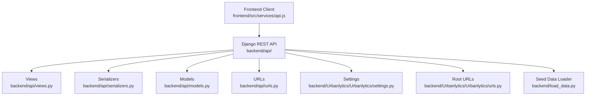
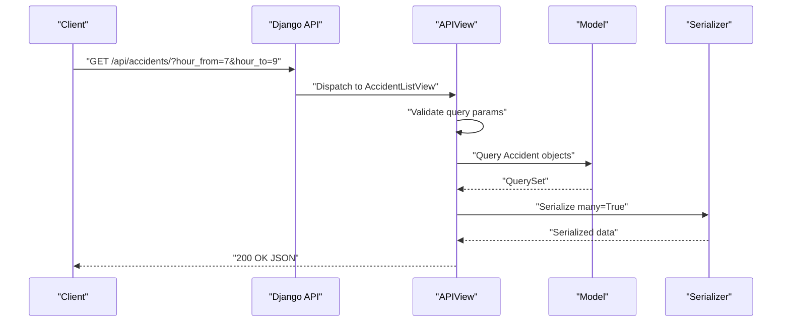
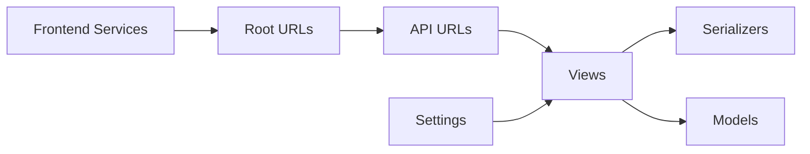

# API Reference

<cite>
**Referenced Files in This Document**
- [backend/api/models.py](file://backend/api/models.py)
- [backend/api/serializers.py](file://backend/api/serializers.py)
- [backend/api/views.py](file://backend/api/views.py)
- [backend/api/urls.py](file://backend/api/urls.py)
- [backend/Urbanlytics/Urbanlytics/settings.py](file://backend/Urbanlytics/Urbanlytics/settings.py)
- [backend/Urbanlytics/Urbanlytics/urls.py](file://backend/Urbanlytics/Urbanlytics/urls.py)
- [backend/load_data.py](file://backend/load_data.py)
- [frontend/src/services/api.js](file://frontend/src/services/api.js)
- [README.md](file://README.md)
</cite>

## Table of Contents
1. [Introduction](#introduction)
2. [Project Structure](#project-structure)
3. [Core Components](#core-components)
4. [Architecture Overview](#architecture-overview)
5. [Detailed Component Analysis](#detailed-component-analysis)
6. [Dependency Analysis](#dependency-analysis)
7. [Performance Considerations](#performance-considerations)
8. [Troubleshooting Guide](#troubleshooting-guide)
9. [Conclusion](#conclusion)
10. [Appendices](#appendices)

## Introduction
This document provides a complete API reference for the Django REST API powering traffic management and data services. It covers endpoints for accidents, zones, weather, and congestion prediction, including HTTP methods, URL patterns, request/response schemas, authentication, validation, error handling, and client integration guidance. It also outlines rate limiting, versioning considerations, caching strategies, and monitoring approaches.

## Project Structure
The API is implemented in the backend Django application and exposed under /api/. The frontend integrates via a dedicated service module that constructs requests and manages tokens.

**Diagram sources**
- [backend/api/views.py:1-574](file://backend/api/views.py#L1-L574)
- [backend/api/serializers.py:1-120](file://backend/api/serializers.py#L1-L120)
- [backend/api/models.py:1-50](file://backend/api/models.py#L1-L50)
- [backend/api/urls.py:1-42](file://backend/api/urls.py#L1-L42)
- [backend/Urbanlytics/Urbanlytics/settings.py:1-141](file://backend/Urbanlytics/Urbanlytics/settings.py#L1-L141)
- [backend/Urbanlytics/Urbanlytics/urls.py:1-8](file://backend/Urbanlytics/Urbanlytics/urls.py#L1-L8)
- [backend/load_data.py:1-160](file://backend/load_data.py#L1-L160)
- [frontend/src/services/api.js:1-177](file://frontend/src/services/api.js#L1-L177)

**Section sources**
- [backend/Urbanlytics/Urbanlytics/urls.py:1-8](file://backend/Urbanlytics/Urbanlytics/urls.py#L1-L8)
- [backend/api/urls.py:1-42](file://backend/api/urls.py#L1-L42)
- [backend/Urbanlytics/Urbanlytics/settings.py:124-128](file://backend/Urbanlytics/Urbanlytics/settings.py#L124-L128)
- [frontend/src/services/api.js:1-177](file://frontend/src/services/api.js#L1-L177)

## Core Components
- Authentication: Token-based authentication via DRF Token. Users log in to receive a token; subsequent requests include Authorization: Token <key>.
- Permission model:
  - AllowAny for public endpoints (login, root).
  - IsAuthenticated for protected endpoints (me, dashboard).
  - Admin-only endpoints require staff/superuser privileges.
- CORS: Enabled for localhost origins with credentials allowed.
- Data models:
  - Accident: lat, lng, intensity, hour, date.
  - Zone: name, risk_level, geometry (serialized GeoJSON).
  - WeatherRecord: location, condition, temperature, is_raining, recorded_at.
- Serializers:
  - Standard and admin serializers for Accident, Zone, User.
  - Login and Dashboard serializers for authentication and dashboard payloads.

**Section sources**
- [backend/api/views.py:89-130](file://backend/api/views.py#L89-L130)
- [backend/api/serializers.py:1-120](file://backend/api/serializers.py#L1-L120)
- [backend/api/models.py:5-50](file://backend/api/models.py#L5-L50)
- [backend/Urbanlytics/Urbanlytics/settings.py:124-136](file://backend/Urbanlytics/Urbanlytics/settings.py#L124-L136)

## Architecture Overview
High-level API flow: Frontend calls /api/* endpoints. Views process requests, apply permissions, and serialize responses. Admin endpoints enforce admin-only access.

**Diagram sources**
- [backend/api/views.py:365-381](file://backend/api/views.py#L365-L381)
- [backend/api/serializers.py:7-11](file://backend/api/serializers.py#L7-L11)
- [backend/api/models.py:5-16](file://backend/api/models.py#L5-L16)

## Detailed Component Analysis

### Authentication Endpoints
- POST /api/auth/login/
  - Purpose: Authenticate user and issue token.
  - Request: { username, password }
  - Response: { token, user, dashboard }
  - Errors: 401 Unauthorized for invalid credentials.
  - Notes: Uses DRF Token authentication.
- POST /api/auth/logout/
  - Purpose: Invalidate current session token.
  - Response: { detail }
  - Requires: IsAuthenticated.
- GET /api/auth/me/
  - Purpose: Fetch current user and dashboard summary.
  - Response: { user, dashboard }
  - Requires: IsAuthenticated.

Validation and error handling:
- Login validates presence of username/password; returns 401 for invalid credentials.
- Logout deletes the user’s token.
- Me returns current user profile and dashboard payload.

**Section sources**
- [backend/api/views.py:89-130](file://backend/api/views.py#L89-L130)
- [backend/api/serializers.py:19-47](file://backend/api/serializers.py#L19-L47)

### Dashboard Endpoint
- GET /api/dashboard/
  - Response: { role, greeting, summary, highlights }
  - Summary differs for admin vs user:
    - Admin: counts for accidents, zones, users, high-risk zones.
    - User: recommended zone, risk level, active alerts, visible accidents count.
  - Requires: IsAuthenticated.

**Section sources**
- [backend/api/views.py:133-137](file://backend/api/views.py#L133-L137)
- [backend/api/views.py:48-86](file://backend/api/views.py#L48-L86)

### Accidents Endpoints
- GET /api/accidents/
  - Query parameters:
    - hour_from: integer between 0–23
    - hour_to: integer between 0–23
  - Validation:
    - Non-integer values return 400 with message indicating allowed range.
    - Out-of-range values return 400.
  - Response: Array of accident objects with fields: id, lat, lng, intensity, hour, date.
  - Example request: GET /api/accidents/?hour_from=7&hour_to=9
  - Example response: Array of serialized accidents.

Success and error examples:
- Successful: Returns 200 with array of accidents matching filters.
- Error (invalid type): Returns 400 with message indicating allowed range.
- Error (out of range): Returns 400 with message indicating allowed range.

**Section sources**
- [backend/api/views.py:365-381](file://backend/api/views.py#L365-L381)
- [backend/api/serializers.py:7-11](file://backend/api/serializers.py#L7-L11)
- [backend/api/models.py:5-16](file://backend/api/models.py#L5-L16)

### Zones Endpoints
- GET /api/zones/
  - Response: Array of zone objects with fields: id, name, risk_level, geometry.
  - Example request: GET /api/zones/
  - Example response: Array of serialized zones.

**Section sources**
- [backend/api/views.py:383-386](file://backend/api/views.py#L383-L386)
- [backend/api/serializers.py:13-16](file://backend/api/serializers.py#L13-L16)
- [backend/api/models.py:19-38](file://backend/api/models.py#L19-L38)

### Weather Endpoints
- GET /api/weather/
  - Behavior:
    - If OPENWEATHER_API_KEY is set, fetches live weather from OpenWeatherMap.
    - Otherwise, returns simulated weather with source=fallback.
  - Response fields: location, condition, temperature, isRaining, source (+ detail on fallback).
  - Errors: On failure, returns fallback payload with detail included.

- GET /api/siata_weather/
  - Behavior:
    - If SIATA_WEATHER_API_URL is set, fetches from SIATA with optional Authorization header.
    - Otherwise, returns simulated payload with source=simulated.
  - Response fields: location, condition, temperature, humidity, wind_speed, source (+ detail on fallback).

- POST /api/simulate_rain/
  - Body: { isRaining: boolean or truthy string }
  - Behavior: Toggles internal rain state; returns current simulated weather.
  - Notes: isRaining defaults to toggling if omitted.

**Section sources**
- [backend/api/views.py:389-442](file://backend/api/views.py#L389-L442)
- [backend/api/views.py:444-509](file://backend/api/views.py#L444-L509)
- [backend/api/views.py:511-527](file://backend/api/views.py#L511-L527)

### Congestion Prediction Endpoint
- GET /api/congestion_prediction/
  - Query parameter:
    - hour: integer between 0–23; defaults to 8 if omitted or invalid.
  - Algorithm:
    - Computes hourly accident counts for 0–23 hours.
    - Predicts next 1–2 hours using linear regression if available; otherwise baseline.
  - Response fields:
    - base_hour, method, forecast[]
      - forecast[].hour, forecast[].predicted_accidents, forecast[].risk_level
  - Errors: Returns 400 if hour is not an integer in 0–23.

**Section sources**
- [backend/api/views.py:530-574](file://backend/api/views.py#L530-L574)

### Admin Endpoints (Staff/Superuser only)
- GET /api/admin/accidents/
  - Response: Array of all accidents with admin fields.
- POST /api/admin/accidents/
  - Request: Admin accident payload; creates and returns created object.
- GET /api/admin/accidents/{id}/
- PUT /api/admin/accidents/{id}/
- PATCH /api/admin/accidents/{id}/
- DELETE /api/admin/accidents/{id}/
  - Errors: 404 Not Found if resource missing; 403 Forbidden if not admin.
- GET /api/admin/zones/
- POST /api/admin/zones/
- GET /api/admin/zones/{id}/
- PUT /api/admin/zones/{id}/
- PATCH /api/admin/zones/{id}/
- DELETE /api/admin/zones/{id}/
- GET /api/admin/users/
- POST /api/admin/users/
- GET /api/admin/users/{id}/
- PUT /api/admin/users/{id}/
- PATCH /api/admin/users/{id}/
- DELETE /api/admin/users/{id}/
  - Special validations:
    - Cannot delete self.
    - Cannot delete the last admin.

**Section sources**
- [backend/api/views.py:149-216](file://backend/api/views.py#L149-L216)
- [backend/api/views.py:218-284](file://backend/api/views.py#L218-L284)
- [backend/api/views.py:287-363](file://backend/api/views.py#L287-L363)

## Dependency Analysis
- URL routing:
  - Root includes api.urls under /api/.
  - api.urls maps endpoints to views.
- Settings:
  - REST_FRAMEWORK allows any for public endpoints; authentication enforced per-view.
  - CORS configured for local origins with credentials.
- Models and serializers:
  - Views depend on models and serializers for validation and serialization.
- Frontend integration:
  - frontend/src/services/api.js constructs requests, injects Authorization header, and handles 204 responses.

**Diagram sources**
- [backend/Urbanlytics/Urbanlytics/urls.py:1-8](file://backend/Urbanlytics/Urbanlytics/urls.py#L1-L8)
- [backend/api/urls.py:1-42](file://backend/api/urls.py#L1-L42)
- [backend/api/views.py:1-574](file://backend/api/views.py#L1-L574)
- [backend/api/serializers.py:1-120](file://backend/api/serializers.py#L1-L120)
- [backend/api/models.py:1-50](file://backend/api/models.py#L1-L50)
- [backend/Urbanlytics/Urbanlytics/settings.py:124-136](file://backend/Urbanlytics/Urbanlytics/settings.py#L124-L136)
- [frontend/src/services/api.js:1-177](file://frontend/src/services/api.js#L1-L177)

**Section sources**
- [backend/Urbanlytics/Urbanlytics/urls.py:1-8](file://backend/Urbanlytics/Urbanlytics/urls.py#L1-L8)
- [backend/api/urls.py:1-42](file://backend/api/urls.py#L1-L42)
- [backend/Urbanlytics/Urbanlytics/settings.py:124-136](file://backend/Urbanlytics/Urbanlytics/settings.py#L124-L136)
- [frontend/src/services/api.js:1-177](file://frontend/src/services/api.js#L1-L177)

## Performance Considerations
- Caching strategies:
  - Cache frequent reads (zones, weather) using Redis or in-memory cache.
  - Cache dashboard summaries for anonymous/public access.
- Database optimization:
  - Use database indexes on frequently filtered fields (hour).
  - Paginate long lists for admin endpoints.
- Asynchronous tasks:
  - Offload weather ingestion and predictions to background workers (Celery).
- CDN and static assets:
  - Serve frontend via CDN; enable compression and caching headers.
- Monitoring:
  - Track response times, error rates, and token usage.
  - Log slow queries and repeated failures.

[No sources needed since this section provides general guidance]

## Troubleshooting Guide
Common issues and resolutions:
- 401 Unauthorized on protected endpoints:
  - Cause: Missing or invalid token.
  - Fix: Call /api/auth/login/ and store token; include Authorization: Token <key>.
- 403 Forbidden on admin endpoints:
  - Cause: Non-staff user.
  - Fix: Use admin credentials.
- 404 Not Found:
  - Cause: Non-existent resource ID.
  - Fix: Verify IDs for accident/zone/user.
- 400 Bad Request:
  - Accidents: hour_from/hour_to must be integers in 0–23.
  - Congestion prediction: hour must be integer in 0–23.
- Weather fallback:
  - Without API keys, responses are simulated; confirm environment variables for live data.

**Section sources**
- [backend/api/views.py:365-381](file://backend/api/views.py#L365-L381)
- [backend/api/views.py:530-574](file://backend/api/views.py#L530-L574)
- [backend/api/views.py:89-130](file://backend/api/views.py#L89-L130)
- [backend/api/views.py:149-216](file://backend/api/views.py#L149-L216)

## Conclusion
The API provides a clear, token-authenticated interface for traffic data, weather, and administrative controls. It supports flexible filtering, simulation capabilities, and admin-only mutation endpoints. For production, add rate limiting, robust caching, and background processing to scale effectively.

[No sources needed since this section summarizes without analyzing specific files]

## Appendices

### Authentication Methods and Token Management
- Method: DRF Token.
- Token storage: Frontend stores token after login; include in Authorization header for protected routes.
- Logout: Deletes the current token server-side.

**Section sources**
- [backend/api/views.py:89-130](file://backend/api/views.py#L89-L130)
- [frontend/src/services/api.js:23-31](file://frontend/src/services/api.js#L23-L31)

### Authorization Patterns by Role
- Users: Access to /api/accidents/, /api/zones/, /api/weather/, /api/congestion_prediction/, /api/dashboard/, /api/auth/me/, /api/auth/logout/.
- Admins (staff/superuser): Full CRUD access to /api/admin/* endpoints with stricter validations.

**Section sources**
- [backend/api/views.py:140-147](file://backend/api/views.py#L140-L147)
- [backend/api/views.py:287-363](file://backend/api/views.py#L287-L363)

### Rate Limiting Strategies
- Recommended: Per-endpoint limits using DRF Throttling or middleware; consider burst and sustained quotas.
- Scope by user/token to prevent abuse.

[No sources needed since this section provides general guidance]

### API Versioning and Backward Compatibility
- Versioning: No explicit versioning in current URL patterns.
- Recommendation: Prefix endpoints with /api/v1/, /api/v2/ to maintain compatibility during changes.

[No sources needed since this section provides general guidance]

### Client Implementation Guidelines
- Frontend integration:
  - Use frontend/src/services/api.js as a reference for constructing requests, injecting Authorization headers, and handling responses.
  - Environment configuration:
    - OPENWEATHER_API_KEY for live weather.
    - SIATA_WEATHER_API_URL and SIATA_API_KEY for SIATA data.
- External systems:
  - Set Authorization: Token <key> for authenticated endpoints.
  - Respect query parameter constraints and handle 204 No Content for deletions.

**Section sources**
- [frontend/src/services/api.js:1-177](file://frontend/src/services/api.js#L1-L177)
- [README.md:25-51](file://README.md#L25-L51)

### Testing Methodologies
- Unit tests for serializers and views.
- Integration tests for endpoints with mocked weather services.
- Load tests for congestion prediction and dashboard endpoints.
- Security tests for token exposure and admin endpoint access.

[No sources needed since this section provides general guidance]

### Data Seeding and Demo Accounts
- Seed data loader creates sample accidents, zones, and demo users (admin and user).
- Use demo credentials to test authentication and admin endpoints.

**Section sources**
- [backend/load_data.py:91-154](file://backend/load_data.py#L91-L154)