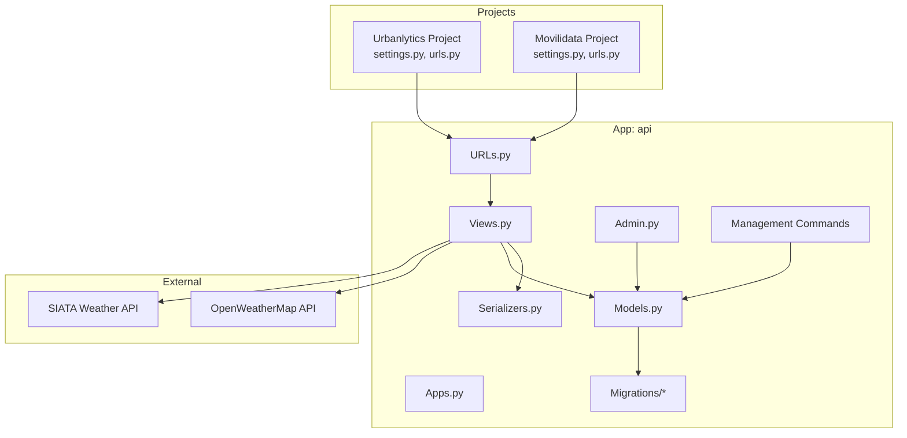
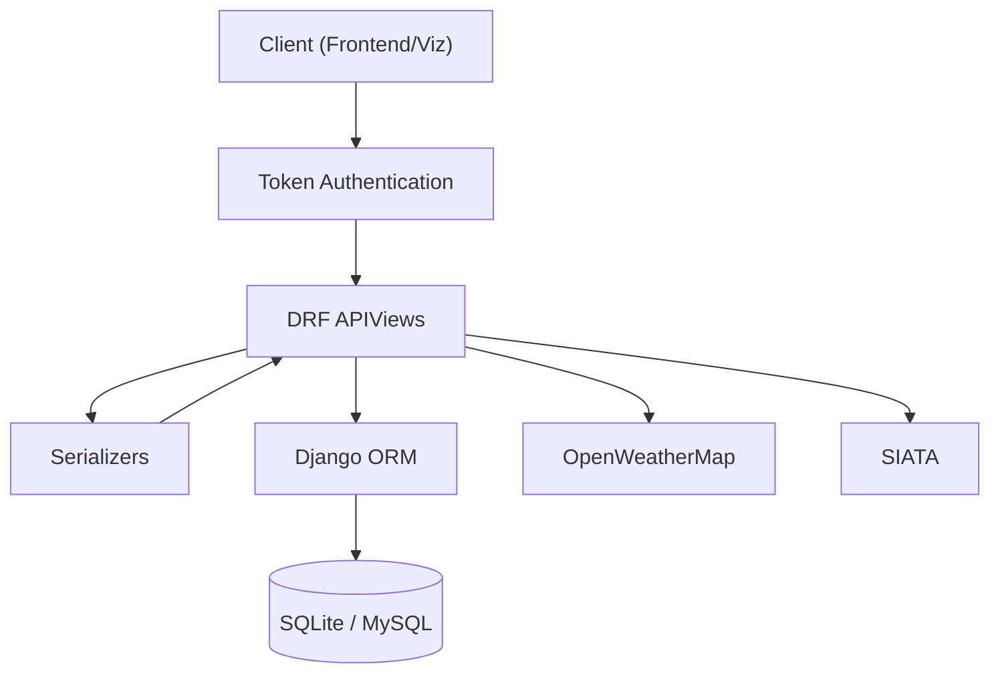
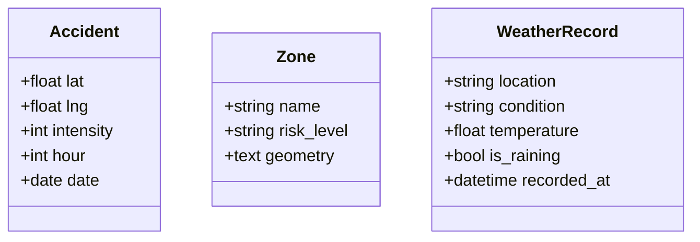
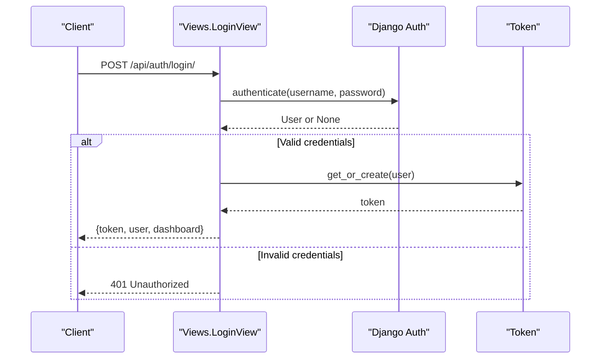
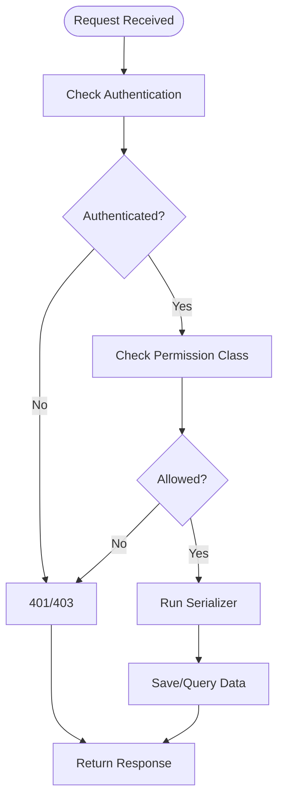
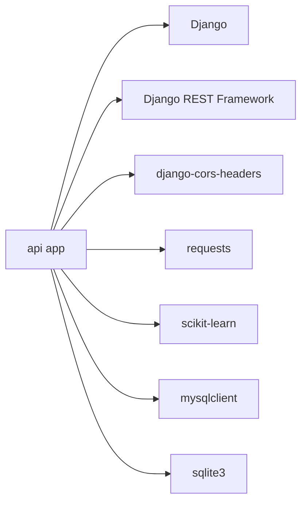
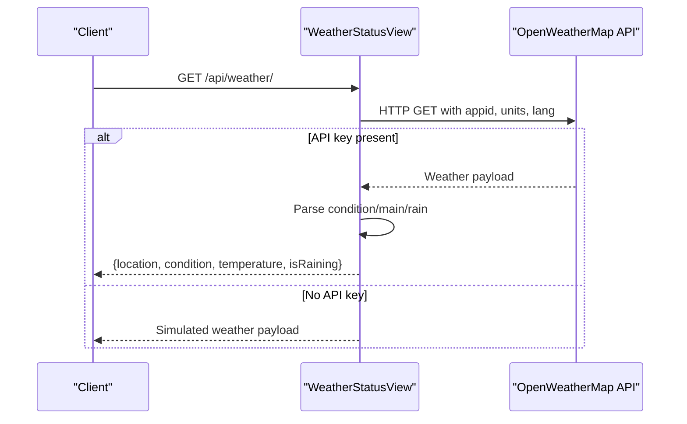
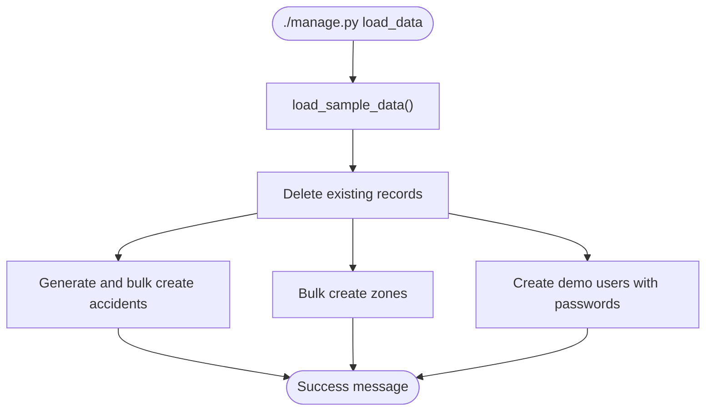

# Backend Architecture

<cite>
**Referenced Files in This Document**
- [settings.py](file://backend/Urbanlytics/Urbanlytics/settings.py)
- [urls.py](file://backend/Urbanlytics/Urbanlytics/urls.py)
- [settings.py](file://backend/movilidata/settings.py)
- [urls.py](file://backend/movilidata/urls.py)
- [manage.py](file://backend/Urbanlytics/manage.py)
- [models.py](file://backend/api/models.py)
- [views.py](file://backend/api/views.py)
- [serializers.py](file://backend/api/serializers.py)
- [urls.py](file://backend/api/urls.py)
- [admin.py](file://backend/api/admin.py)
- [apps.py](file://backend/api/apps.py)
- [0001_initial.py](file://backend/api/migrations/0001_initial.py)
- [0002_alter_accident_hour_alter_accident_intensity.py](file://backend/api/migrations/0002_alter_accident_hour_alter_accident_intensity.py)
- [load_data.py](file://backend/api/management/commands/load_data.py)
- [load_data.py](file://backend/load_data.py)
- [requirements.txt](file://backend/requirements.txt)
</cite>

## Table of Contents
1. [Introduction](#introduction)
2. [Project Structure](#project-structure)
3. [Core Components](#core-components)
4. [Architecture Overview](#architecture-overview)
5. [Detailed Component Analysis](#detailed-component-analysis)
6. [Dependency Analysis](#dependency-analysis)
7. [Performance Considerations](#performance-considerations)
8. [Security Measures](#security-measures)
9. [Infrastructure and Deployment](#infrastructure-and-deployment)
10. [External API Integrations](#external-api-integrations)
11. [Management Commands](#management-commands)
12. [Troubleshooting Guide](#troubleshooting-guide)
13. [Conclusion](#conclusion)

## Introduction
This document describes the backend architecture of the Django REST API for the Medellín Movilidata OS system. It follows Django’s Model-View-Template pattern adapted for API-first development, leveraging Django REST Framework (DRF) to expose JSON endpoints for clients. The backend defines three core data domains: accidents, zones, and weather records. It integrates with external weather services and provides simulation endpoints for rain conditions. The system supports token-based authentication, admin endpoints for managing data, and includes management commands for seeding data.

## Project Structure
The backend is organized into two Django projects:
- Urbanlytics: The primary project configuration and entry point for development and local runs.
- movilidata: A secondary project configuration tailored for runtime environments with environment-driven database selection.

Key modules:
- Settings: Configure installed apps, middleware, authentication, CORS, and database backends.
- URLs: Route API endpoints under /api/.
- Models: Define domain entities and their fields.
- Serializers: Transform model instances to/from JSON.
- Views: Implement API endpoints, authentication, and business logic.
- Admin: Register models for Django Admin interface.
- Migrations: Persist schema changes.
- Management commands: Seed data and support maintenance.

**Diagram sources**
- [settings.py:1-8](file://backend/Urbanlytics/Urbanlytics/urls.py#L1-L8)
- [urls.py:1-28](file://backend/movilidata/urls.py#L1-L28)
- [models.py:1-50](file://backend/api/models.py#L1-L50)
- [serializers.py:1-120](file://backend/api/serializers.py#L1-L120)
- [views.py:1-574](file://backend/api/views.py#L1-L574)
- [urls.py:1-42](file://backend/api/urls.py#L1-L42)
- [admin.py:1-8](file://backend/api/admin.py#L1-L8)
- [apps.py:1-7](file://backend/api/apps.py#L1-L7)
- [0001_initial.py:1-51](file://backend/api/migrations/0001_initial.py#L1-L51)
- [0002_alter_accident_hour_alter_accident_intensity.py:1-25](file://backend/api/migrations/0002_alter_accident_hour_alter_accident_intensity.py#L1-L25)

**Section sources**
- [settings.py:1-141](file://backend/Urbanlytics/Urbanlytics/settings.py#L1-L141)
- [urls.py:1-8](file://backend/Urbanlytics/Urbanlytics/urls.py#L1-L8)
- [settings.py:1-104](file://backend/movilidata/settings.py#L1-L104)
- [urls.py:1-28](file://backend/movilidata/urls.py#L1-L28)
- [manage.py:1-23](file://backend/Urbanlytics/manage.py#L1-L23)

## Core Components
- Models define the data schema for accidents, zones, and weather records. They include validation constraints and ordering metadata.
- Serializers convert model instances to JSON for API responses and validate incoming requests.
- Views implement endpoint logic, including authentication, permissions, and integration with external services.
- URL routing exposes endpoints under /api/, delegating to the api app.
- Admin registration enables CRUD operations via Django Admin.
- Migrations manage schema evolution.
- Management commands seed data and support maintenance tasks.

**Section sources**
- [models.py:1-50](file://backend/api/models.py#L1-L50)
- [serializers.py:1-120](file://backend/api/serializers.py#L1-L120)
- [views.py:1-574](file://backend/api/views.py#L1-L574)
- [urls.py:1-42](file://backend/api/urls.py#L1-L42)
- [admin.py:1-8](file://backend/api/admin.py#L1-L8)
- [0001_initial.py:1-51](file://backend/api/migrations/0001_initial.py#L1-L51)
- [0002_alter_accident_hour_alter_accident_intensity.py:1-25](file://backend/api/migrations/0002_alter_accident_hour_alter_accident_intensity.py#L1-L25)

## Architecture Overview
The backend follows a layered architecture:
- Presentation Layer: DRF APIViews and routers.
- Domain Layer: Models encapsulate business entities.
- Serialization Layer: DRF serializers transform data.
- Persistence Layer: Django ORM with SQLite by default and MySQL option.
- External Integration Layer: HTTP clients to OpenWeatherMap and SIATA.

**Diagram sources**
- [views.py:1-574](file://backend/api/views.py#L1-L574)
- [serializers.py:1-120](file://backend/api/serializers.py#L1-L120)
- [models.py:1-50](file://backend/api/models.py#L1-L50)
- [settings.py:54-76](file://backend/movilidata/settings.py#L54-L76)

## Detailed Component Analysis

### Data Models
The models define the core entities and their constraints:
- Accident: Geographic coordinates, intensity, hour, and optional date. Includes validators for hour and intensity ranges.
- Zone: Name, risk level with predefined choices, and serialized GeoJSON geometry.
- WeatherRecord: Location, weather condition, temperature, rain flag, and timestamp.

**Diagram sources**
- [models.py:5-16](file://backend/api/models.py#L5-L16)
- [models.py:19-38](file://backend/api/models.py#L19-L38)
- [models.py:41-49](file://backend/api/models.py#L41-L49)

**Section sources**
- [models.py:1-50](file://backend/api/models.py#L1-L50)
- [0001_initial.py:10-49](file://backend/api/migrations/0001_initial.py#L10-L49)
- [0002_alter_accident_hour_alter_accident_intensity.py:14-23](file://backend/api/migrations/0002_alter_accident_hour_alter_accident_intensity.py#L14-L23)

### API Endpoint Design
Endpoints are grouped under /api/ and include:
- Authentication: login, logout, current user profile.
- Dashboard: personalized summaries for admin and regular users.
- Accidents: list with optional hour filters.
- Zones: list of risk zones with geometry.
- Weather: current weather status from OpenWeatherMap or simulated fallback.
- SIATA weather: current weather from SIATA with flexible payload parsing.
- Congestion prediction: hourly accident forecasting using linear regression or baseline.
- Rain simulation: toggle simulated rain state.

**Diagram sources**
- [views.py:89-113](file://backend/api/views.py#L89-L113)
- [serializers.py:38-41](file://backend/api/serializers.py#L38-L41)

**Section sources**
- [urls.py:23-41](file://backend/api/urls.py#L23-L41)
- [views.py:27-45](file://backend/api/views.py#L27-L45)
- [views.py:89-130](file://backend/api/views.py#L89-L130)
- [views.py:365-380](file://backend/api/views.py#L365-L380)
- [views.py:389-442](file://backend/api/views.py#L389-L442)
- [views.py:444-508](file://backend/api/views.py#L444-L508)
- [views.py:530-573](file://backend/api/views.py#L530-L573)

### Request/Response Handling and Authentication
- Authentication: TokenAuthentication and SessionAuthentication are enabled. Login creates a token; logout deletes it.
- Permissions: AllowAny for most endpoints; IsAuthenticated enforced for protected views; Admin endpoints require staff/superuser.
- Serialization: DRF ModelSerializers for resource endpoints; custom serializers for login and dashboard payloads.

**Diagram sources**
- [views.py:89-130](file://backend/api/views.py#L89-L130)
- [serializers.py:19-36](file://backend/api/serializers.py#L19-L36)
- [serializers.py:43-48](file://backend/api/serializers.py#L43-L48)

**Section sources**
- [settings.py:88-96](file://backend/movilidata/settings.py#L88-L96)
- [views.py:140-147](file://backend/api/views.py#L140-L147)
- [views.py:287-362](file://backend/api/views.py#L287-L362)

## Dependency Analysis
The api app depends on Django, DRF, and optional external libraries. The project supports switching databases via environment variables.

**Diagram sources**
- [requirements.txt:1-7](file://backend/requirements.txt#L1-L7)
- [settings.py:54-76](file://backend/movilidata/settings.py#L54-L76)

**Section sources**
- [requirements.txt:1-7](file://backend/requirements.txt#L1-L7)
- [settings.py:54-76](file://backend/movilidata/settings.py#L54-L76)

## Performance Considerations
- Filtering: Hour-based filtering on accidents uses simple ORM queries; consider indexing hour for large datasets.
- Forecasting: Linear regression requires scikit-learn; ensure model training data is sufficient and cache predictions if reused frequently.
- External calls: Weather endpoints set timeouts and fall back gracefully; avoid repeated polling by caching responses at the client or gateway level.
- Database: SQLite is suitable for development; switch to MySQL for production with proper connection pooling and charset configuration.

[No sources needed since this section provides general guidance]

## Security Measures
- Authentication: Token-based authentication with DRF TokenAuthentication; session authentication also supported.
- CORS: Configured origins and credentials for frontend integration.
- Password validation: Disabled in the movilidata project settings; ensure production uses robust validators.
- Admin protection: Admin endpoints enforce staff/superuser checks.

**Section sources**
- [settings.py:88-103](file://backend/movilidata/settings.py#L88-L103)
- [views.py:140-147](file://backend/api/views.py#L140-L147)
- [settings.py:78-78](file://backend/movilidata/settings.py#L78-L78)

## Infrastructure and Deployment
- Database selection: Environment variable controls engine; defaults to SQLite; MySQL supported with host/port/user/password/name.
- Static files: Static URL configured; ensure serving in production.
- Timezone/Locale: Colombia timezone and locale configured.
- Entry point: manage.py sets DJANGO_SETTINGS_MODULE and executes commands.

**Section sources**
- [settings.py:54-86](file://backend/movilidata/settings.py#L54-L86)
- [manage.py:8-18](file://backend/Urbanlytics/manage.py#L8-L18)

## External API Integrations
- OpenWeatherMap: Fetches current weather for Medellín; parses condition, temperature, and rain detection; falls back to simulated rain state on failure.
- SIATA: Fetches weather observations via configurable endpoint and API key; normalizes keys across multiple payload formats.

**Diagram sources**
- [views.py:389-442](file://backend/api/views.py#L389-L442)

**Section sources**
- [views.py:389-442](file://backend/api/views.py#L389-L442)
- [views.py:444-508](file://backend/api/views.py#L444-L508)

## Management Commands
- load_data: Seeds the database with sample accidents, zones, and demo users. Uses a deterministic generator and bulk creation for efficiency.

**Diagram sources**
- [load_data.py:6-11](file://backend/api/management/commands/load_data.py#L6-L11)
- [load_data.py:91-154](file://backend/load_data.py#L91-L154)

**Section sources**
- [load_data.py:1-12](file://backend/api/management/commands/load_data.py#L1-L12)
- [load_data.py:1-160](file://backend/load_data.py#L1-L160)

## Troubleshooting Guide
- Authentication failures: Verify credentials and ensure tokens are included in Authorization headers for protected endpoints.
- CORS errors: Confirm frontend origins are whitelisted and credentials are allowed.
- Missing environment variables: Weather endpoints require API keys; missing keys trigger simulated responses.
- Admin restrictions: Non-staff users receive 403 on admin endpoints.
- Database connectivity: Ensure DATABASE_ENGINE and related environment variables are set correctly for MySQL.

**Section sources**
- [views.py:89-113](file://backend/api/views.py#L89-L113)
- [views.py:140-147](file://backend/api/views.py#L140-L147)
- [views.py:389-442](file://backend/api/views.py#L389-L442)
- [settings.py:98-103](file://backend/movilidata/settings.py#L98-L103)

## Conclusion
The backend provides a clean, modular architecture for an API-first Django application. It models core traffic and weather data, integrates with external services, and offers admin-managed endpoints alongside user-facing dashboards. With environment-driven configuration and management commands, it supports both development and production deployments, while maintaining clear separation of concerns across models, serializers, views, and URLs.