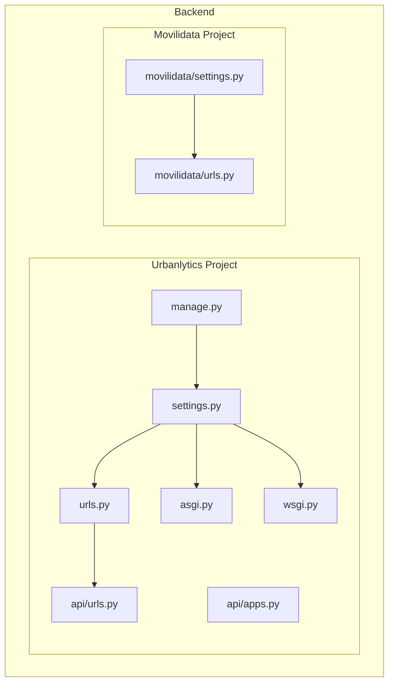
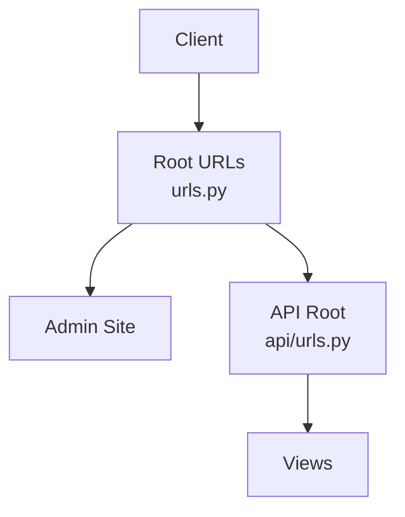
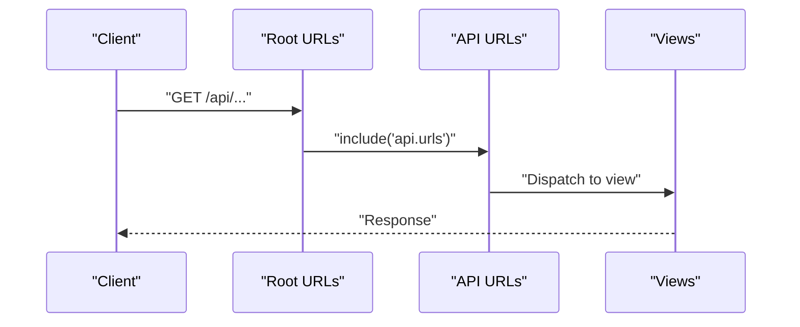
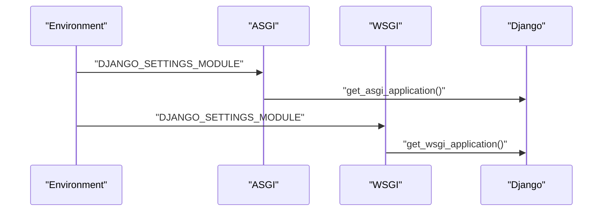
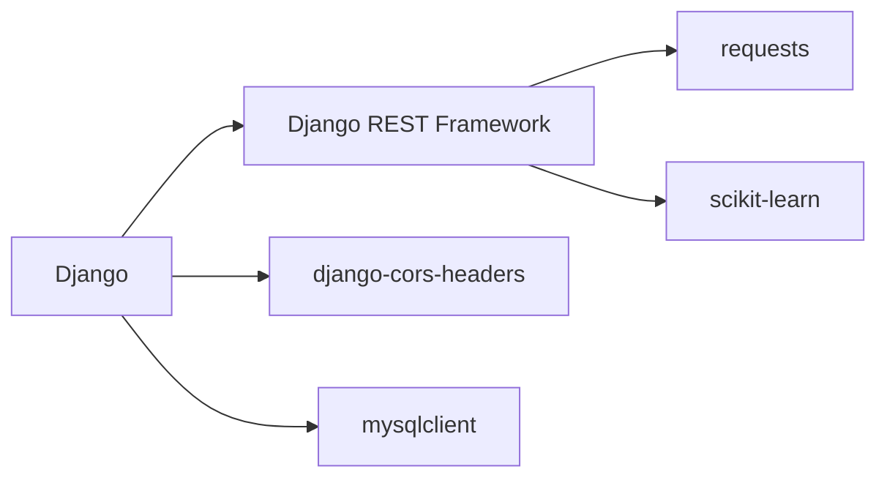

# Django Configuration

<cite>
**Referenced Files in This Document**
- [settings.py](file://backend/Urbanlytics/Urbanlytics/settings.py)
- [urls.py](file://backend/Urbanlytics/Urbanlytics/urls.py)
- [asgi.py](file://backend/Urbanlytics/Urbanlytics/asgi.py)
- [wsgi.py](file://backend/Urbanlytics/Urbanlytics/wsgi.py)
- [manage.py](file://backend/Urbanlytics/manage.py)
- [requirements.txt](file://backend/requirements.txt)
- [api/apps.py](file://backend/api/apps.py)
- [api/urls.py](file://backend/api/urls.py)
- [movilidata/settings.py](file://backend/movilidata/settings.py)
- [movilidata/urls.py](file://backend/movilidata/urls.py)
</cite>

## Table of Contents
1. [Introduction](#introduction)
2. [Project Structure](#project-structure)
3. [Core Components](#core-components)
4. [Architecture Overview](#architecture-overview)
5. [Detailed Component Analysis](#detailed-component-analysis)
6. [Dependency Analysis](#dependency-analysis)
7. [Performance Considerations](#performance-considerations)
8. [Troubleshooting Guide](#troubleshooting-guide)
9. [Conclusion](#conclusion)

## Introduction
This document explains the Django configuration and project setup for the backend. It covers settings.py configuration (installed applications, middleware, database, internationalization, CORS, REST framework defaults), URL routing structure and integration with the API app, ASGI and WSGI application configurations for development and deployment, security settings, static file configuration, environment-specific configurations, and troubleshooting tips. It also highlights differences between the Urbanlytics and Movilidata configurations.

## Project Structure
The backend is organized into two Django projects:
- Urbanlytics: a minimal configuration focused on local development and a single API app.
- Movilidata: a more complete configuration supporting environment-driven database selection and token-based authentication.

Key locations:
- Urbanlytics project settings, URLs, ASGI/WSGI, and manage.py
- API app configuration and URL patterns
- Movilidata project settings and URLs for an alternate deployment profile

**Diagram sources**
- [settings.py:1-141](file://backend/Urbanlytics/Urbanlytics/settings.py#L1-L141)
- [urls.py:1-8](file://backend/Urbanlytics/Urbanlytics/urls.py#L1-L8)
- [asgi.py:1-17](file://backend/Urbanlytics/Urbanlytics/asgi.py#L1-L17)
- [wsgi.py:1-17](file://backend/Urbanlytics/Urbanlytics/wsgi.py#L1-L17)
- [manage.py:1-23](file://backend/Urbanlytics/manage.py#L1-L23)
- [api/apps.py:1-7](file://backend/api/apps.py#L1-L7)
- [api/urls.py:1-42](file://backend/api/urls.py#L1-L42)
- [movilidata/settings.py:1-105](file://backend/movilidata/settings.py#L1-L105)
- [movilidata/urls.py:1-28](file://backend/movilidata/urls.py#L1-L28)

**Section sources**
- [settings.py:1-141](file://backend/Urbanlytics/Urbanlytics/settings.py#L1-L141)
- [urls.py:1-8](file://backend/Urbanlytics/Urbanlytics/urls.py#L1-L8)
- [asgi.py:1-17](file://backend/Urbanlytics/Urbanlytics/asgi.py#L1-L17)
- [wsgi.py:1-17](file://backend/Urbanlytics/Urbanlytics/wsgi.py#L1-L17)
- [manage.py:1-23](file://backend/Urbanlytics/manage.py#L1-L23)
- [requirements.txt:1-7](file://backend/requirements.txt#L1-L7)
- [api/apps.py:1-7](file://backend/api/apps.py#L1-L7)
- [api/urls.py:1-42](file://backend/api/urls.py#L1-L42)
- [movilidata/settings.py:1-105](file://backend/movilidata/settings.py#L1-L105)
- [movilidata/urls.py:1-28](file://backend/movilidata/urls.py#L1-L28)

## Core Components
- Settings and environment
  - Secret key, debug mode, allowed hosts
  - Installed apps, middleware stack, templates, WSGI/ASGI application binding
  - Database configuration (SQLite by default)
  - Authentication validators, internationalization, static files, default auto field
  - REST framework defaults and CORS configuration
- URL routing
  - Root URL patterns include the admin and the API app
  - API app URL patterns define endpoints for authentication, dashboard, administration, and data services
- ASGI/WSGI applications
  - Both expose the Django application via environment variable DJANGO_SETTINGS_MODULE
- Management entry point
  - manage.py sets Python path and DJANGO_SETTINGS_MODULE, then executes Django’s CLI

**Section sources**
- [settings.py:22-28](file://backend/Urbanlytics/Urbanlytics/settings.py#L22-L28)
- [settings.py:33-43](file://backend/Urbanlytics/Urbanlytics/settings.py#L33-L43)
- [settings.py:45-54](file://backend/Urbanlytics/Urbanlytics/settings.py#L45-L54)
- [settings.py:77-85](file://backend/Urbanlytics/Urbanlytics/settings.py#L77-L85)
- [settings.py:88-104](file://backend/Urbanlytics/Urbanlytics/settings.py#L88-L104)
- [settings.py:107-116](file://backend/Urbanlytics/Urbanlytics/settings.py#L107-L116)
- [settings.py:119-128](file://backend/Urbanlytics/Urbanlytics/settings.py#L119-L128)
- [settings.py:130-135](file://backend/Urbanlytics/Urbanlytics/settings.py#L130-L135)
- [urls.py:4-7](file://backend/Urbanlytics/Urbanlytics/urls.py#L4-L7)
- [api/urls.py:23-41](file://backend/api/urls.py#L23-L41)
- [asgi.py:10-16](file://backend/Urbanlytics/Urbanlytics/asgi.py#L10-L16)
- [wsgi.py:10-16](file://backend/Urbanlytics/Urbanlytics/wsgi.py#L10-L16)
- [manage.py:8-18](file://backend/Urbanlytics/manage.py#L8-L18)

## Architecture Overview
The Django application is configured to serve the API app under the /api/ path. Requests flow from the root URL resolver to the API app URL resolver, which maps to views. The application can be served via WSGI (for standard HTTP servers) or ASGI (for async-capable deployments).

**Diagram sources**
- [urls.py:4-7](file://backend/Urbanlytics/Urbanlytics/urls.py#L4-L7)
- [api/urls.py:23-41](file://backend/api/urls.py#L23-L41)

**Section sources**
- [urls.py:4-7](file://backend/Urbanlytics/Urbanlytics/urls.py#L4-L7)
- [api/urls.py:23-41](file://backend/api/urls.py#L23-L41)

## Detailed Component Analysis

### Settings Configuration (Urbanlytics)
- Security and runtime
  - Secret key and debug mode are set for development
  - Allowed hosts include localhost, 127.0.0.1, and testserver
- Installed applications
  - Core Django apps, corsheaders, djangorestframework, and the api app
- Middleware stack
  - CORS middleware first, followed by security, sessions, CSRF, auth, messages, and clickjacking protection
- Templates and WSGI/ASGI
  - Templates configured with app discovery
  - WSGI application bound to the Urbanlytics settings module
- Database
  - SQLite default database with a path derived from BASE_DIR
- Authentication validators
  - Standard validators enabled
- Internationalization
  - Language set to es-co, timezone to America/Bogota, i18n enabled, UTC conversion enabled
- Static files
  - STATIC_URL defined
- REST framework defaults
  - DEFAULT_PERMISSION_CLASSES allows any
- CORS configuration
  - CORS_ALLOWED_ORIGINS lists development origins
  - CORS_ALLOW_CREDENTIALS enabled

**Section sources**
- [settings.py:22-28](file://backend/Urbanlytics/Urbanlytics/settings.py#L22-L28)
- [settings.py:33-43](file://backend/Urbanlytics/Urbanlytics/settings.py#L33-L43)
- [settings.py:45-54](file://backend/Urbanlytics/Urbanlytics/settings.py#L45-L54)
- [settings.py:58-72](file://backend/Urbanlytics/Urbanlytics/settings.py#L58-L72)
- [settings.py:77-85](file://backend/Urbanlytics/Urbanlytics/settings.py#L77-L85)
- [settings.py:88-104](file://backend/Urbanlytics/Urbanlytics/settings.py#L88-L104)
- [settings.py:107-116](file://backend/Urbanlytics/Urbanlytics/settings.py#L107-L116)
- [settings.py:119-128](file://backend/Urbanlytics/Urbanlytics/settings.py#L119-L128)
- [settings.py:130-135](file://backend/Urbanlytics/Urbanlytics/settings.py#L130-L135)

### Settings Configuration (Movilidata)
- Environment-driven database selection
  - Reads DATABASE_ENGINE from environment; defaults to sqlite
  - MySQL configuration uses MYSQL_* environment variables for NAME, USER, PASSWORD, HOST, PORT
  - SQLite configuration uses SQLITE_NAME or falls back to BASE_DIR/db.sqlite3
- Authentication and permissions
  - REST_FRAMEWORK includes TokenAuthentication and SessionAuthentication
  - AUTH_PASSWORD_VALIDATORS explicitly empty (disabled)
- CORS and internationalization
  - CORS_ALLOWED_ORIGINS includes localhost and 127.0.0.1 variants
  - CORS_ALLOW_CREDENTIALS enabled
  - LANGUAGE_CODE, TIME_ZONE, USE_I18N, USE_TZ configured

**Section sources**
- [movilidata/settings.py:54-76](file://backend/movilidata/settings.py#L54-L76)
- [movilidata/settings.py:88-96](file://backend/movilidata/settings.py#L88-L96)
- [movilidata/settings.py:78-78](file://backend/movilidata/settings.py#L78-L78)
- [movilidata/settings.py:98-104](file://backend/movilidata/settings.py#L98-L104)
- [movilidata/settings.py:80-83](file://backend/movilidata/settings.py#L80-L83)

### URL Routing and API Integration
- Root URL patterns
  - Admin site at admin/
  - API app included at api/
- API app URL patterns
  - Authentication endpoints: login, logout, current user
  - Dashboard and administrative endpoints for accidents, zones, and users
  - Data endpoints: weather, SIATA weather, congestion prediction, rain simulation
  - Root endpoint returns a JSON summary of available endpoints

**Diagram sources**
- [urls.py:4-7](file://backend/Urbanlytics/Urbanlytics/urls.py#L4-L7)
- [api/urls.py:23-41](file://backend/api/urls.py#L23-L41)

**Section sources**
- [urls.py:4-7](file://backend/Urbanlytics/Urbanlytics/urls.py#L4-L7)
- [api/urls.py:23-41](file://backend/api/urls.py#L23-L41)
- [movilidata/urls.py:7-20](file://backend/movilidata/urls.py#L7-L20)

### ASGI and WSGI Applications
- Both applications set DJANGO_SETTINGS_MODULE to the appropriate settings module and delegate to Django’s factory functions
- ASGI application for async-capable deployments
- WSGI application for standard HTTP servers

**Diagram sources**
- [asgi.py:10-16](file://backend/Urbanlytics/Urbanlytics/asgi.py#L10-L16)
- [wsgi.py:10-16](file://backend/Urbanlytics/Urbanlytics/wsgi.py#L10-L16)

**Section sources**
- [asgi.py:10-16](file://backend/Urbanlytics/Urbanlytics/asgi.py#L10-L16)
- [wsgi.py:10-16](file://backend/Urbanlytics/Urbanlytics/wsgi.py#L10-L16)

### Management Entry Point
- manage.py inserts the project base directory into sys.path and sets DJANGO_SETTINGS_MODULE
- Executes Django’s command-line interface with parsed arguments

**Section sources**
- [manage.py:8-18](file://backend/Urbanlytics/manage.py#L8-L18)

### API App Configuration
- App configuration defines the app label and default auto field
- URL patterns define the API surface area for authentication, administration, and data services

**Section sources**
- [api/apps.py:4-6](file://backend/api/apps.py#L4-L6)
- [api/urls.py:23-41](file://backend/api/urls.py#L23-L41)

## Dependency Analysis
External dependencies are declared in requirements.txt. These include Django, Django REST Framework, django-cors-headers, mysqlclient, requests, and scikit-learn.

**Diagram sources**
- [requirements.txt:1-7](file://backend/requirements.txt#L1-L7)

**Section sources**
- [requirements.txt:1-7](file://backend/requirements.txt#L1-L7)

## Performance Considerations
- Database choice
  - SQLite is suitable for development; consider MySQL in production with proper connection pooling and indexing strategies
- Middleware order
  - CORS middleware is first; ensure it remains before session/security middleware to avoid unnecessary processing
- Static files
  - For production, serve static files via a CDN or web server and configure collectstatic appropriately
- REST framework
  - Review permission and authentication classes for production hardening

[No sources needed since this section provides general guidance]

## Troubleshooting Guide
Common configuration issues and resolutions:
- Import errors during management commands
  - Ensure DJANGO_SETTINGS_MODULE is correctly set and the Python path includes the project root
- CORS errors in development
  - Verify CORS_ALLOWED_ORIGINS includes the frontend origin and that credentials are allowed if needed
- Database connectivity
  - For SQLite, confirm the path exists; for MySQL, check host, port, user, and password environment variables
- Static files not served
  - Confirm STATIC_URL and that the development server serves static files from the configured directories
- Authentication failures
  - Compare REST framework settings between Urbanlytics and Movilidata; ensure authentication classes match your deployment needs

**Section sources**
- [manage.py:12-18](file://backend/Urbanlytics/manage.py#L12-L18)
- [settings.py:130-135](file://backend/Urbanlytics/Urbanlytics/settings.py#L130-L135)
- [movilidata/settings.py:54-76](file://backend/movilidata/settings.py#L54-L76)
- [movilidata/settings.py:88-96](file://backend/movilidata/settings.py#L88-L96)

## Conclusion
The backend is structured around two Django projects with distinct profiles. Urbanlytics provides a minimal development configuration with SQLite and permissive CORS/permissions for quick iteration. Movilidata adds environment-driven database selection, token-based authentication, and stricter separation of concerns. The URL routing cleanly integrates the API app under /api/, while ASGI/WSGI applications expose the Django application for different deployment scenarios. Use the troubleshooting tips to resolve common setup issues and adapt the configuration for production-grade deployments.