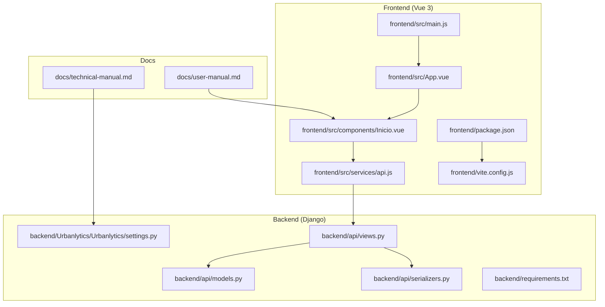
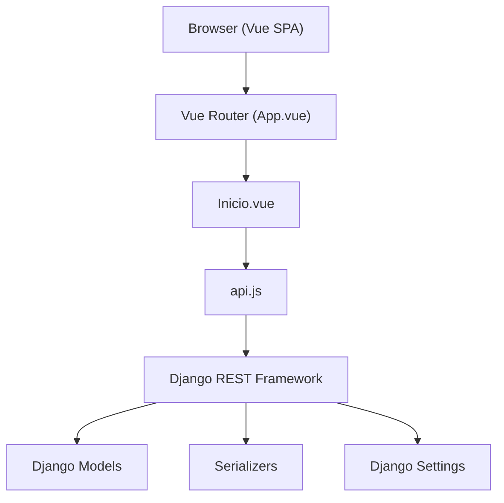

# Contributing and Development Guidelines

<cite>
**Referenced Files in This Document**
- [README.md](file://README.md)
- [package.json](file://frontend/package.json)
- [vite.config.js](file://frontend/vite.config.js)
- [main.js](file://frontend/src/main.js)
- [App.vue](file://frontend/src/App.vue)
- [Inicio.vue](file://frontend/src/components/Inicio.vue)
- [api.js](file://frontend/src/services/api.js)
- [technical-manual.md](file://docs/technical-manual.md)
- [user-manual.md](file://docs/user-manual.md)
- [settings.py](file://backend/Urbanlytics/Urbanlytics/settings.py)
- [models.py](file://backend/api/models.py)
- [views.py](file://backend/api/views.py)
- [serializers.py](file://backend/api/serializers.py)
- [requirements.txt](file://backend/requirements.txt)
- [requeriments.txt](file://backend/requeriments.txt)
</cite>

## Table of Contents
1. [Introduction](#introduction)
2. [Project Structure](#project-structure)
3. [Core Components](#core-components)
4. [Architecture Overview](#architecture-overview)
5. [Development Workflow](#development-workflow)
6. [Code Standards and Conventions](#code-standards-and-conventions)
7. [Testing Requirements](#testing-requirements)
8. [Documentation Standards](#documentation-standards)
9. [Development Environment Setup](#development-environment-setup)
10. [Debugging Tools and Best Practices](#debugging-tools-and-best-practices)
11. [Code Review Process and Quality Gates](#code-review-process-and-quality-gates)
12. [Continuous Integration Requirements](#continuous-integration-requirements)
13. [Contributing New Features and Bug Fixes](#contributing-new-features-and-bug-fixes)
14. [Project Governance and Community Engagement](#project-governance-and-community-engagement)
15. [Troubleshooting Guide](#troubleshooting-guide)
16. [Conclusion](#conclusion)

## Introduction
This document defines the contributing and development guidelines for the Urbanlytics project. It establishes collaborative development practices, code quality standards, and operational procedures for both frontend (Vue 3 + Vite) and backend (Django + Django REST Framework) components. It also covers branching strategies, commit conventions, pull request procedures, testing, documentation, environment setup, debugging, code review, quality gates, CI requirements, and community governance.

## Project Structure
The project follows a full-stack structure with:
- Frontend: Vue 3 single-page application built with Vite, PWA support, and modular components/services.
- Backend: Django project with an API app exposing REST endpoints via Django REST Framework.
- Documentation: Technical manual, user manual, and branding guide.
- Shared data: JSON fixtures under public assets for demonstration.

**Diagram sources**
- [main.js:1-8](file://frontend/src/main.js#L1-L8)
- [App.vue:1-129](file://frontend/src/App.vue#L1-L129)
- [Inicio.vue:1-568](file://frontend/src/components/Inicio.vue#L1-L568)
- [api.js:1-177](file://frontend/src/services/api.js#L1-L177)
- [settings.py:1-141](file://backend/Urbanlytics/Urbanlytics/settings.py#L1-L141)
- [models.py:1-50](file://backend/api/models.py#L1-L50)
- [serializers.py:1-120](file://backend/api/serializers.py#L1-L120)
- [views.py:1-574](file://backend/api/views.py#L1-L574)
- [requirements.txt:1-7](file://backend/requirements.txt#L1-L7)
- [technical-manual.md:1-42](file://docs/technical-manual.md#L1-L42)
- [user-manual.md:1-28](file://docs/user-manual.md#L1-L28)

**Section sources**
- [README.md:1-82](file://README.md#L1-L82)
- [technical-manual.md:1-42](file://docs/technical-manual.md#L1-L42)
- [user-manual.md:1-28](file://docs/user-manual.md#L1-L28)

## Core Components
- Frontend entrypoint initializes Vue app and imports styles.
- App shell manages navigation tabs and layout.
- Dashboard component renders map, charts, alerts, and filters.
- API service encapsulates HTTP calls to backend endpoints.
- Backend exposes REST endpoints for accidents, zones, weather, congestion prediction, and admin operations.
- Settings configure CORS, static files, internationalization, and REST framework defaults.

Key implementation references:
- Frontend initialization and routing: [main.js:1-8](file://frontend/src/main.js#L1-L8), [App.vue:1-129](file://frontend/src/App.vue#L1-L129)
- Dashboard rendering and data fetching: [Inicio.vue:1-568](file://frontend/src/components/Inicio.vue#L1-L568)
- API client: [api.js:1-177](file://frontend/src/services/api.js#L1-L177)
- Backend endpoints and permissions: [views.py:1-574](file://backend/api/views.py#L1-L574)
- Models and serializers: [models.py:1-50](file://backend/api/models.py#L1-L50), [serializers.py:1-120](file://backend/api/serializers.py#L1-L120)
- Django settings and CORS: [settings.py:1-141](file://backend/Urbanlytics/Urbanlytics/settings.py#L1-L141)
- Dependencies: [package.json:1-25](file://frontend/package.json#L1-L25), [requirements.txt:1-7](file://backend/requirements.txt#L1-L7)

**Section sources**
- [main.js:1-8](file://frontend/src/main.js#L1-L8)
- [App.vue:1-129](file://frontend/src/App.vue#L1-L129)
- [Inicio.vue:1-568](file://frontend/src/components/Inicio.vue#L1-L568)
- [api.js:1-177](file://frontend/src/services/api.js#L1-L177)
- [views.py:1-574](file://backend/api/views.py#L1-L574)
- [models.py:1-50](file://backend/api/models.py#L1-L50)
- [serializers.py:1-120](file://backend/api/serializers.py#L1-L120)
- [settings.py:1-141](file://backend/Urbanlytics/Urbanlytics/settings.py#L1-L141)
- [package.json:1-25](file://frontend/package.json#L1-L25)
- [requirements.txt:1-7](file://backend/requirements.txt#L1-L7)

## Architecture Overview
The system follows a classic MVC/MVT pattern:
- Model (Django): Defines Accident, Zone, and WeatherRecord entities.
- Controller (DRF): Exposes REST endpoints for clients.
- View (Vue 3): Renders dashboards, maps, charts, and interactive UI.

**Diagram sources**
- [App.vue:1-129](file://frontend/src/App.vue#L1-L129)
- [Inicio.vue:1-568](file://frontend/src/components/Inicio.vue#L1-L568)
- [api.js:1-177](file://frontend/src/services/api.js#L1-L177)
- [views.py:1-574](file://backend/api/views.py#L1-L574)
- [models.py:1-50](file://backend/api/models.py#L1-L50)
- [serializers.py:1-120](file://backend/api/serializers.py#L1-L120)
- [settings.py:1-141](file://backend/Urbanlytics/Urbanlytics/settings.py#L1-L141)

**Section sources**
- [technical-manual.md:1-42](file://docs/technical-manual.md#L1-L42)

## Development Workflow
- Branching strategy: Use feature branches prefixed with feature/, fix/, or chore/. Merge via pull requests after review.
- Commit messages: Use imperative mood, concise subject, optional body with rationale and links to issues.
- Pull requests: Include summary, changes, testing notes, and screenshots for UI changes. Assign reviewers and ensure checks pass.

[No sources needed since this section provides general guidance]

## Code Standards and Conventions

### Frontend (Vue 3 + Vite)
- Naming: Components PascalCase (e.g., Inicio.vue), services camelCase (e.g., api.js), constants UPPER_SNAKE_CASE.
- File organization: src/components, src/services, src/assets, src/composables, main.js, App.vue.
- Composition API: Prefer script setup and reactive refs/computed.
- Styles: Scoped styles per component; avoid global overrides.
- PWA: Manifest and service worker configured via vite.config.js.

References:
- Component structure and composition: [App.vue:1-129](file://frontend/src/App.vue#L1-L129), [Inicio.vue:1-568](file://frontend/src/components/Inicio.vue#L1-L568)
- Services and API client: [api.js:1-177](file://frontend/src/services/api.js#L1-L177)
- PWA configuration: [vite.config.js:1-44](file://frontend/vite.config.js#L1-L44)
- Package scripts and dependencies: [package.json:1-25](file://frontend/package.json#L1-L25)

**Section sources**
- [App.vue:1-129](file://frontend/src/App.vue#L1-L129)
- [Inicio.vue:1-568](file://frontend/src/components/Inicio.vue#L1-L568)
- [api.js:1-177](file://frontend/src/services/api.js#L1-L177)
- [vite.config.js:1-44](file://frontend/vite.config.js#L1-L44)
- [package.json:1-25](file://frontend/package.json#L1-L25)

### Backend (Django + DRF)
- Naming: Models in singular, views as ViewSet or APIView classes, serializers named XSerializer.
- File organization: app/api with models.py, views.py, serializers.py, urls.py; project-level settings.py.
- Permissions: Use AllowAny for public endpoints; IsAuthenticated for protected; custom AdminBaseAPIView for admin routes.
- Validation: Use serializers and validators; raise explicit HTTP status codes for errors.
- Environment: DATABASES default to sqlite3; MySQL supported via environment variables.

References:
- Views and endpoints: [views.py:1-574](file://backend/api/views.py#L1-L574)
- Models: [models.py:1-50](file://backend/api/models.py#L1-L50)
- Serializers: [serializers.py:1-120](file://backend/api/serializers.py#L1-L120)
- Settings and CORS: [settings.py:1-141](file://backend/Urbanlytics/Urbanlytics/settings.py#L1-L141)
- Requirements: [requirements.txt:1-7](file://backend/requirements.txt#L1-L7), [requeriments.txt:1-1](file://backend/requeriments.txt#L1-L1)

**Section sources**
- [views.py:1-574](file://backend/api/views.py#L1-L574)
- [models.py:1-50](file://backend/api/models.py#L1-L50)
- [serializers.py:1-120](file://backend/api/serializers.py#L1-L120)
- [settings.py:1-141](file://backend/Urbanlytics/Urbanlytics/settings.py#L1-L141)
- [requirements.txt:1-7](file://backend/requirements.txt#L1-L7)
- [requeriments.txt:1-1](file://backend/requeriments.txt#L1-L1)

## Testing Requirements
Current repository does not include unit, integration, or end-to-end test suites. Contributors should add tests aligned with:
- Frontend: Unit tests for composables and services using a testing framework; integration tests for API flows.
- Backend: Unit tests for serializers and views; integration tests for endpoints; mock external APIs (OpenWeather/SIATA) during tests.
- E2E: Use Playwright/Cypress to validate user journeys (login, filtering, PWA offline behavior).

[No sources needed since this section provides general guidance]

## Documentation Standards
- Inline comments: Explain “why” and complex logic; avoid stating the obvious.
- API documentation: Document endpoints, parameters, responses, and errors in the technical manual.
- User guides: Keep user-manual.md concise and scenario-driven.
- Architecture docs: Reference technical-manual.md for backend/frontend flows.

References:
- Technical manual: [technical-manual.md:1-42](file://docs/technical-manual.md#L1-L42)
- User manual: [user-manual.md:1-28](file://docs/user-manual.md#L1-L28)

**Section sources**
- [technical-manual.md:1-42](file://docs/technical-manual.md#L1-L42)
- [user-manual.md:1-28](file://docs/user-manual.md#L1-L28)

## Development Environment Setup
- Prerequisites: Node.js 20+, npm 10+; Python 3.x; virtual environment recommended.
- Frontend:
  - Install dependencies from frontend/package.json.
  - Run dev server; ensure Vite PWA manifest is generated.
- Backend:
  - Install Python dependencies from requirements.txt.
  - Configure environment variables for weather APIs and database engine.
  - Run Django development server.
- Data:
  - Replace JSON files under public/assets/data with real Medellín datasets while preserving keys.

References:
- Setup and environment variables: [README.md:21-58](file://README.md#L21-L58)
- Frontend scripts and dependencies: [package.json:1-25](file://frontend/package.json#L1-L25)
- PWA configuration: [vite.config.js:1-44](file://frontend/vite.config.js#L1-L44)
- Backend dependencies: [requirements.txt:1-7](file://backend/requirements.txt#L1-L7)
- Django settings: [settings.py:1-141](file://backend/Urbanlytics/Urbanlytics/settings.py#L1-L141)

**Section sources**
- [README.md:21-58](file://README.md#L21-L58)
- [package.json:1-25](file://frontend/package.json#L1-L25)
- [vite.config.js:1-44](file://frontend/vite.config.js#L1-L44)
- [requirements.txt:1-7](file://backend/requirements.txt#L1-L7)
- [settings.py:1-141](file://backend/Urbanlytics/Urbanlytics/settings.py#L1-L141)

## Debugging Tools and Best Practices
- Frontend:
  - Use Vue DevTools; enable strict mode in development; log API responses and errors.
  - Validate chart and map rendering; check network tab for 4xx/5xx responses.
- Backend:
  - Enable DEBUG=True locally; inspect logs for permission errors and serialization issues.
  - Test CORS origins and credentials; verify database connectivity.
- PWA:
  - Inspect service worker registration and cache updates; test offline fallback.

[No sources needed since this section provides general guidance]

## Code Review Process and Quality Gates
- Reviewers: Assign at least one maintainer; ensure parity with style guides and documentation.
- Quality gates:
  - Passing linters/formatters (ESLint/Prettier for frontend; flake8/black/isort for backend).
  - Tests included and passing.
  - No hardcoded secrets; environment variables documented.
  - Clear PR description with scope, rationale, and testing steps.

[No sources needed since this section provides general guidance]

## Continuous Integration Requirements
- Build and lint:
  - Frontend: npm run build; ensure PWA assets are present.
  - Backend: python -m pip install -r requirements.txt; run migrations if applicable.
- Security:
  - Scan dependencies for vulnerabilities.
- Deployment:
  - Follow deployment instructions in README for Netlify/GitHub Pages.

[No sources needed since this section provides general guidance]

## Contributing New Features and Bug Fixes
- Feature contributions:
  - Create feature branch; implement incrementally; add/update tests and documentation.
  - Link related issues; keep commits focused.
- Bug fixes:
  - Reproduce locally; add regression tests; update user manual if UX changes.
- Admin features:
  - Use AdminBaseAPIView pattern; ensure role checks; document CRUD operations.

[No sources needed since this section provides general guidance]

## Project Governance and Community Engagement
- Maintainers: Approve PRs, enforce standards, triage issues.
- Community:
  - Use clear issue templates; encourage reproducible bug reports with screenshots.
  - Recognize contributions in README acknowledgments.

[No sources needed since this section provides general guidance]

## Troubleshooting Guide
Common issues and remedies:
- Frontend cannot connect to backend:
  - Verify VITE_API_BASE_URL and CORS settings; ensure backend runs on http://localhost:8000.
- Weather API failures:
  - Set OPENWEATHER_API_KEY or SIATA environment variables; fallback responses are returned otherwise.
- PWA offline behavior:
  - Confirm manifest generation and offline.html inclusion; check Workbox caching.
- Django database errors:
  - Confirm DATABASES configuration; migrate if schema changes occur.

References:
- Environment variables and fallbacks: [README.md:25-58](file://README.md#L25-L58)
- API client base URL: [api.js:1-2](file://frontend/src/services/api.js#L1-L2)
- CORS and origins: [settings.py:130-136](file://backend/Urbanlytics/Urbanlytics/settings.py#L130-L136)
- PWA configuration: [vite.config.js:1-44](file://frontend/vite.config.js#L1-L44)

**Section sources**
- [README.md:25-58](file://README.md#L25-L58)
- [api.js:1-2](file://frontend/src/services/api.js#L1-L2)
- [settings.py:130-136](file://backend/Urbanlytics/Urbanlytics/settings.py#L130-L136)
- [vite.config.js:1-44](file://frontend/vite.config.js#L1-L44)

## Conclusion
These guidelines establish a consistent, scalable path for contributing to Urbanlytics. By adhering to the workflow, standards, testing, documentation, and governance outlined here, contributors can collaborate effectively and deliver high-quality features for Medellín’s mobility insights.