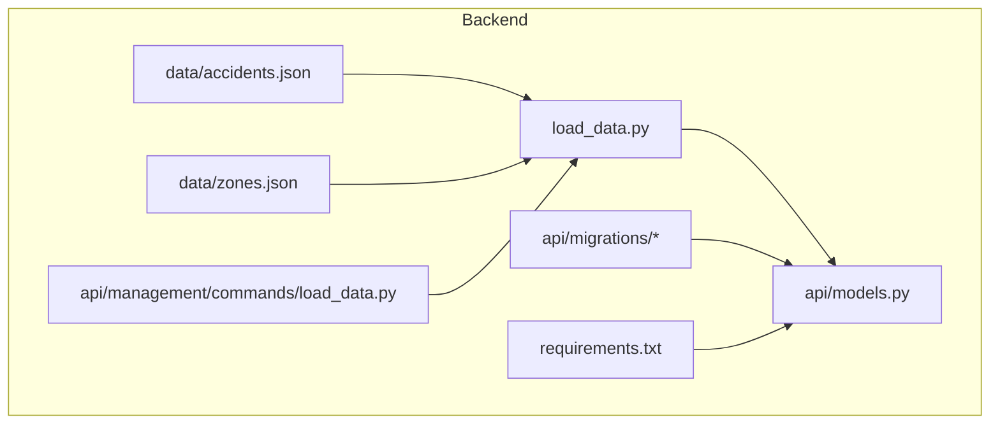
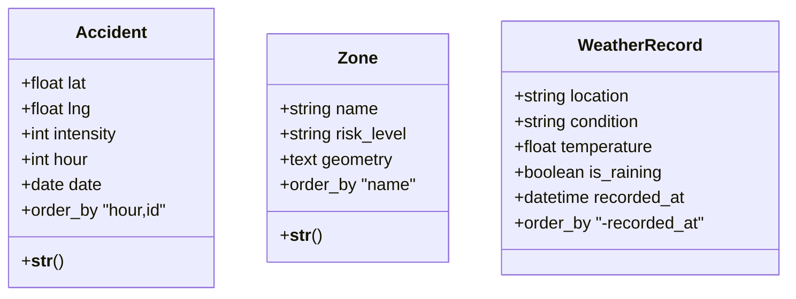
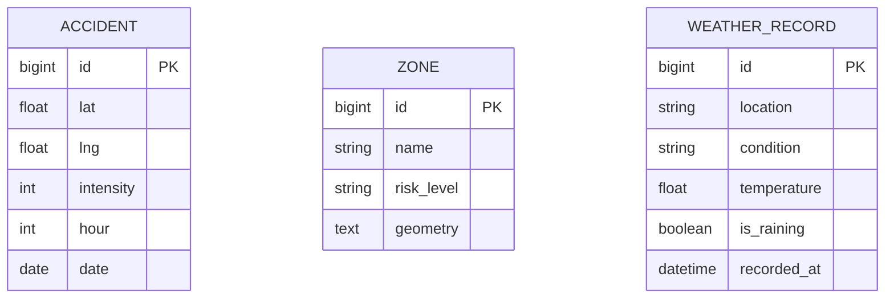
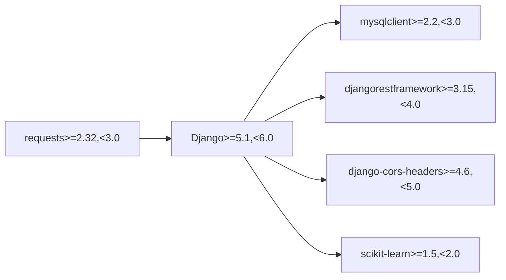

# Data Management

<cite>
**Referenced Files in This Document**
- [models.py](file://backend/api/models.py)
- [0001_initial.py](file://backend/api/migrations/0001_initial.py)
- [0002_alter_accident_hour_alter_accident_intensity.py](file://backend/api/migrations/0002_alter_accident_hour_alter_accident_intensity.py)
- [load_data.py (management command)](file://backend/api/management/commands/load_data.py)
- [load_data.py (loader)](file://backend/load_data.py)
- [accidents.json](file://backend/data/accidents.json)
- [zones.json](file://backend/data/zones.json)
- [requirements.txt](file://backend/requirements.txt)
</cite>

## Table of Contents
1. [Introduction](#introduction)
2. [Project Structure](#project-structure)
3. [Core Components](#core-components)
4. [Architecture Overview](#architecture-overview)
5. [Detailed Component Analysis](#detailed-component-analysis)
6. [Dependency Analysis](#dependency-analysis)
7. [Performance Considerations](#performance-considerations)
8. [Troubleshooting Guide](#troubleshooting-guide)
9. [Conclusion](#conclusion)
10. [Appendices](#appendices)

## Introduction
This document provides comprehensive data model documentation for the Urbanlytics database schema focused on traffic, accident, and weather data management. It explains entity definitions, field specifications, validation rules, and Django ORM model characteristics. It also documents data loading procedures, sample JSON datasets, and operational guidance for import/export, caching, performance tuning, lifecycle management, and security considerations.

## Project Structure
The data-related components are primarily located under the backend/api module and supporting loader scripts. The dataset samples reside under backend/data.

**Diagram sources**
- [models.py:1-50](file://backend/api/models.py#L1-L50)
- [0001_initial.py:1-51](file://backend/api/migrations/0001_initial.py#L1-L51)
- [0002_alter_accident_hour_alter_accident_intensity.py:1-25](file://backend/api/migrations/0002_alter_accident_hour_alter_accident_intensity.py#L1-L25)
- [load_data.py (management command):1-12](file://backend/api/management/commands/load_data.py#L1-L12)
- [load_data.py (loader):1-160](file://backend/load_data.py#L1-L160)
- [accidents.json:1-14](file://backend/data/accidents.json#L1-L14)
- [zones.json:1-17](file://backend/data/zones.json#L1-L17)
- [requirements.txt:1-7](file://backend/requirements.txt#L1-L7)

**Section sources**
- [models.py:1-50](file://backend/api/models.py#L1-L50)
- [0001_initial.py:1-51](file://backend/api/migrations/0001_initial.py#L1-L51)
- [0002_alter_accident_hour_alter_accident_intensity.py:1-25](file://backend/api/migrations/0002_alter_accident_hour_alter_accident_intensity.py#L1-L25)
- [load_data.py (management command):1-12](file://backend/api/management/commands/load_data.py#L1-L12)
- [load_data.py (loader):1-160](file://backend/load_data.py#L1-L160)
- [accidents.json:1-14](file://backend/data/accidents.json#L1-L14)
- [zones.json:1-17](file://backend/data/zones.json#L1-L17)
- [requirements.txt:1-7](file://backend/requirements.txt#L1-L7)

## Core Components
This section defines the three primary entities and their relationships, constraints, and validation rules.

- Accident
  - Purpose: Stores traffic incident reports with spatial coordinates, temporal attributes, and severity metrics.
  - Key fields and constraints:
    - lat: Float; latitude coordinate.
    - lng: Float; longitude coordinate.
    - intensity: Integer; validated to be within 1–10 inclusive.
    - hour: Integer; validated to be within 0–23 inclusive.
    - date: Date; nullable and optional.
  - Ordering: hour, id.
  - String representation: Accident ID with formatted hour.

- Zone
  - Purpose: Defines administrative or risk zones with GeoJSON polygon geometry stored as serialized text.
  - Key fields and constraints:
    - name: Char; up to 120 characters.
    - risk_level: Char; choice among alta (high), media (medium), baja (low).
    - geometry: Text; serialized GeoJSON polygon string.
  - Ordering: name.
  - String representation: Zone name.

- WeatherRecord
  - Purpose: Captures weather observations for situational awareness.
  - Key fields and constraints:
    - location: Char; default value set to a city identifier.
    - condition: Char; weather condition description.
    - temperature: Float; temperature measurement.
    - is_raining: Boolean; default false.
    - recorded_at: DateTime; auto-populated on creation.
  - Ordering: recorded_at descending.

Entity relationships:
- Accident and Zone: No explicit foreign key exists in the current schema. They can be joined programmatically via spatial operations or application logic using Zone.geometry and Accident.lat/lng.
- WeatherRecord: Independent entity; no direct relationship to Accident or Zone in the current schema.

Validation and integrity:
- Numeric ranges enforced via validators for intensity and hour.
- Ordering metadata ensures predictable query results.
- Geometry stored as serialized text; application logic should validate GeoJSON structure before saving.

**Section sources**
- [models.py:5-16](file://backend/api/models.py#L5-L16)
- [models.py:19-38](file://backend/api/models.py#L19-L38)
- [models.py:41-50](file://backend/api/models.py#L41-L50)

## Architecture Overview
The data model is implemented in Django ORM with migrations defining the initial schema and subsequent alterations adding validators. Data loading is performed by a dedicated loader script invoked via a Django management command.

**Diagram sources**
- [models.py:5-16](file://backend/api/models.py#L5-L16)
- [models.py:19-38](file://backend/api/models.py#L19-L38)
- [models.py:41-50](file://backend/api/models.py#L41-L50)

## Detailed Component Analysis

### Data Model Definitions and Constraints
- Primary keys: Auto-incrementing BigAutoField for all models.
- Indexes and ordering:
  - Accident: ordered by hour, id.
  - Zone: ordered by name.
  - WeatherRecord: ordered by recorded_at descending.
- Validators:
  - Accident.intensity constrained to 1..10.
  - Accident.hour constrained to 0..23.
- Geometry storage:
  - Zone.geometry stored as serialized text; recommended to parse/store as proper spatial types for advanced queries.

**Diagram sources**
- [0001_initial.py:10-23](file://backend/api/migrations/0001_initial.py#L10-L23)
- [0001_initial.py:24-35](file://backend/api/migrations/0001_initial.py#L24-L35)
- [0001_initial.py:36-49](file://backend/api/migrations/0001_initial.py#L36-L49)
- [0002_alter_accident_hour_alter_accident_intensity.py:14-23](file://backend/api/migrations/0002_alter_accident_hour_alter_accident_intensity.py#L14-L23)

**Section sources**
- [0001_initial.py:1-51](file://backend/api/migrations/0001_initial.py#L1-L51)
- [0002_alter_accident_hour_alter_accident_intensity.py:1-25](file://backend/api/migrations/0002_alter_accident_hour_alter_accident_intensity.py#L1-L25)
- [models.py:12-16](file://backend/api/models.py#L12-L16)
- [models.py:34-35](file://backend/api/models.py#L34-L35)
- [models.py:48-50](file://backend/api/models.py#L48-L50)

### Data Validation Patterns and Business Rules
- Intensity and hour validation ensure realistic and bounded values for accident reports.
- Risk level uses predefined choices to maintain data consistency.
- Location defaults in WeatherRecord simplify ingestion where region is implicit.
- Ordering metadata supports efficient pagination and time-series retrieval.

**Section sources**
- [models.py:8-9](file://backend/api/models.py#L8-L9)
- [models.py:24-28](file://backend/api/models.py#L24-L28)
- [models.py:42-46](file://backend/api/models.py#L42-L46)

### Data Access Patterns and Caching Strategies
- Access patterns:
  - Filter by hour ranges for rush-hour analytics.
  - Group by risk_level for zone-based insights.
  - Order by recorded_at for recent weather trends.
- Suggested caching:
  - Use application-level caches for frequently accessed aggregations (e.g., hourly counts per zone).
  - Cache GeoJSON geometry lookups keyed by zone name.
  - Cache recent weather snapshots to reduce repeated reads.

[No sources needed since this section provides general guidance]

### Sample Data Examples
- Accident sample structure:
  - Fields: lat, lng, hour, intensity, date.
  - Example entries demonstrate varying hours, intensities, and dates.
- Zone sample structure:
  - Fields: name, risk_level, geometry (serialized GeoJSON polygon).
  - Example entries show polygon coordinates for representative areas.

**Section sources**
- [accidents.json:1-14](file://backend/data/accidents.json#L1-L14)
- [zones.json:1-17](file://backend/data/zones.json#L1-L17)

### Data Import/Export Procedures and Bulk Operations
- Import pipeline:
  - Loader script prepares synthetic data and writes to models using bulk_create for efficiency.
  - Management command invokes the loader and prints summary statistics.
- Export:
  - Serialize model instances to JSON for downstream consumption.
  - Use Django serializers or custom encoders to produce GeoJSON for zones.

**Section sources**
- [load_data.py (management command):1-12](file://backend/api/management/commands/load_data.py#L1-L12)
- [load_data.py (loader):91-154](file://backend/load_data.py#L91-L154)

### Data Lifecycle Management, Retention, and Migration Strategies
- Lifecycle:
  - Accidents: ingest historical series; maintain rolling window for active dashboards.
  - Zones: static reference data; update only on administrative changes.
  - WeatherRecords: short-term trend monitoring; purge older entries periodically.
- Retention:
  - Define retention periods per entity (e.g., 90 days for accidents, 30 days for weather).
- Migrations:
  - Use Django migrations to evolve schema safely; validators were added post-initialization.

**Section sources**
- [0001_initial.py:1-51](file://backend/api/migrations/0001_initial.py#L1-L51)
- [0002_alter_accident_hour_alter_accident_intensity.py:1-25](file://backend/api/migrations/0002_alter_accident_hour_alter_accident_intensity.py#L1-L25)

### Security, Privacy, and Access Control
- Authentication and authorization:
  - Demo users are provisioned with distinct roles; enforce permissions at the view level for protected endpoints.
- Data privacy:
  - Avoid storing sensitive personal identifiers in open-access datasets.
  - Apply data minimization and anonymization techniques for public dashboards.
- Transport and storage:
  - Enforce HTTPS and secure database connections.
  - Restrict file system access to data directories.

[No sources needed since this section provides general guidance]

### Backup and Recovery Processes
- Database backups:
  - Schedule regular logical backups of the relational database.
  - Verify restore procedures periodically.
- Application data:
  - Back up JSON fixtures and migration files.
  - Maintain immutable artifacts for reproducible environments.

[No sources needed since this section provides general guidance]

## Dependency Analysis
External dependencies relevant to data management include Django, REST framework, CORS, MySQL client, requests, and scikit-learn.

**Diagram sources**
- [requirements.txt:1-7](file://backend/requirements.txt#L1-L7)

**Section sources**
- [requirements.txt:1-7](file://backend/requirements.txt#L1-L7)

## Performance Considerations
- Database tuning:
  - Add indexes on frequently filtered fields (e.g., date, hour, risk_level).
  - Normalize geometry handling; consider spatial indexes if using a spatial backend.
- Application-level:
  - Use bulk_create for large inserts.
  - Paginate querysets and leverage ordering metadata.
  - Cache hotspots and precompute aggregates.
- Network and I/O:
  - Stream large JSON exports.
  - Compress backups and limit concurrent bulk operations.

[No sources needed since this section provides general guidance]

## Troubleshooting Guide
- Validation errors:
  - Ensure intensity and hour values fall within configured bounds.
- Geometry parsing:
  - Validate GeoJSON structure before saving Zone.geometry.
- Data loading:
  - Confirm Django settings are loaded prior to ORM operations.
  - Use bulk_create to avoid individual INSERT overhead.
- Command execution:
  - Run the management command from the project root with the appropriate Python environment activated.

**Section sources**
- [models.py:8-9](file://backend/api/models.py#L8-L9)
- [models.py](file://backend/api/models.py#L32)
- [load_data.py (loader):91-154](file://backend/load_data.py#L91-L154)
- [load_data.py (management command):1-12](file://backend/api/management/commands/load_data.py#L1-L12)

## Conclusion
The Urbanlytics data model centers on three core entities with clear validation rules and ordering semantics. The loader and management command streamline seed data provisioning, while migrations capture schema evolution. Operational guidance covers import/export, caching, performance, lifecycle, and security. Extending the model with spatial indexes and explicit foreign keys would further strengthen analytical and integrity capabilities.

## Appendices

### Appendix A: Data Loading Management Commands
- Command name: load_data
- Description: Loads seed data for accidents, zones, and demo users.
- Usage pattern:
  - Invoke the management command from the project root after activating the virtual environment.
  - The command prints a success message indicating the number of records created.

**Section sources**
- [load_data.py (management command):1-12](file://backend/api/management/commands/load_data.py#L1-L12)