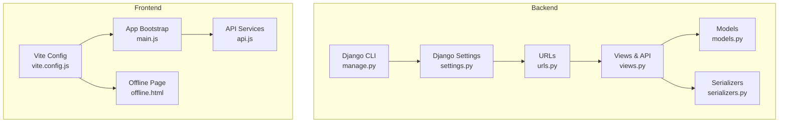
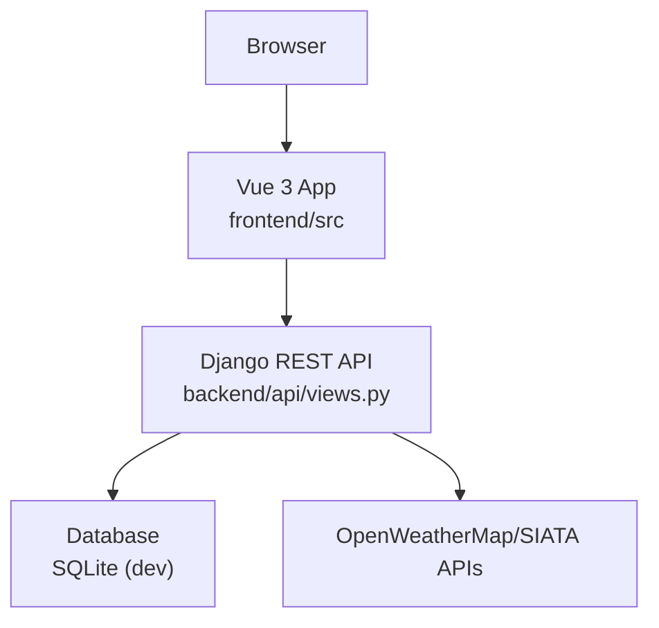
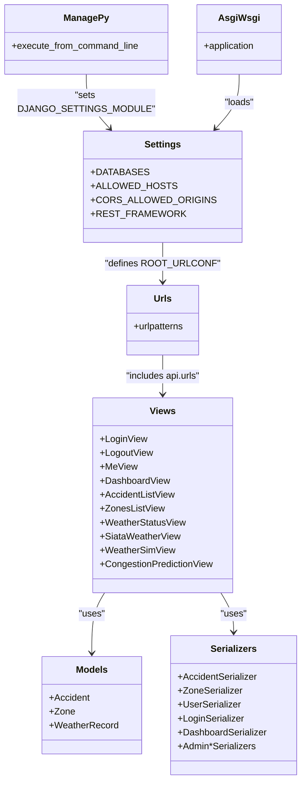
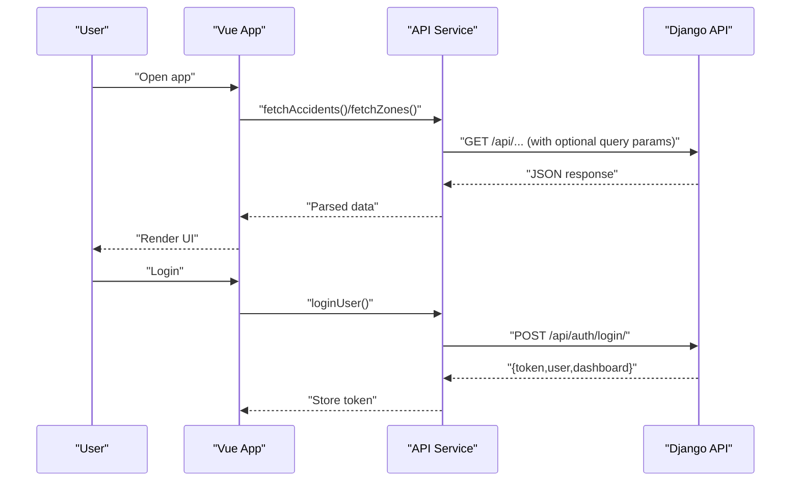
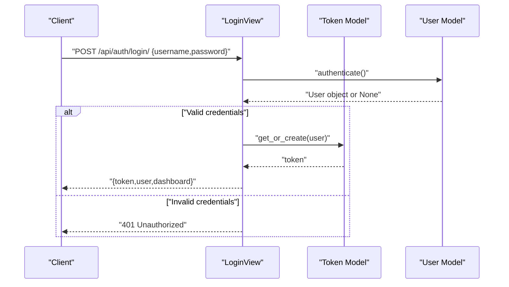
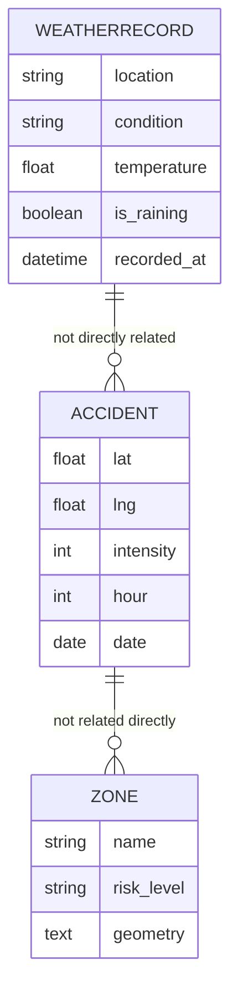
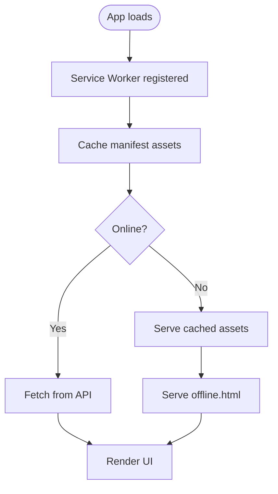
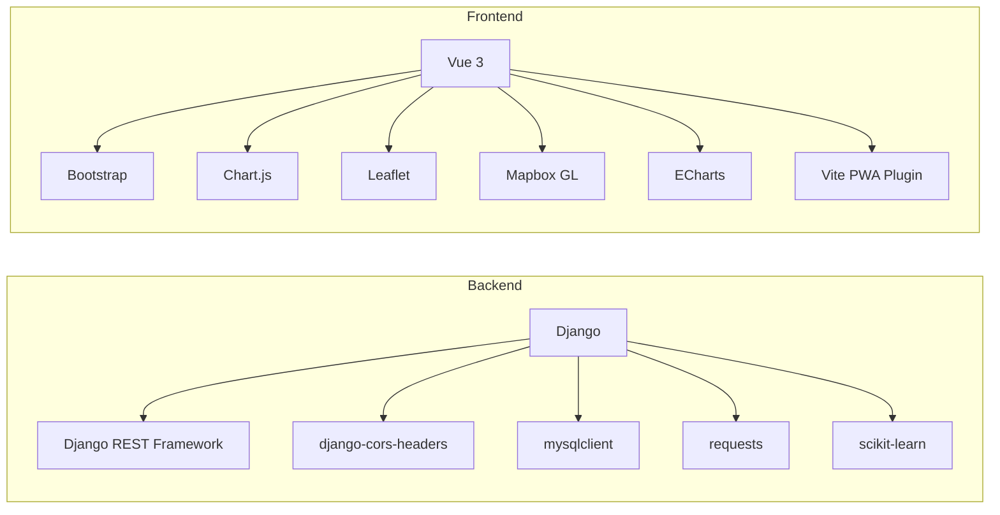

# Deployment and Operations

<cite>
**Referenced Files in This Document**
- [requirements.txt](file://backend/requirements.txt)
- [manage.py](file://backend/Urbanlytics/manage.py)
- [settings.py](file://backend/Urbanlytics/Urbanlytics/settings.py)
- [urls.py](file://backend/Urbanlytics/Urbanlytics/urls.py)
- [asgi.py](file://backend/Urbanlytics/Urbanlytics/asgi.py)
- [wsgi.py](file://backend/Urbanlytics/Urbanlytics/wsgi.py)
- [models.py](file://backend/api/models.py)
- [views.py](file://backend/api/views.py)
- [serializers.py](file://backend/api/serializers.py)
- [load_data.py](file://backend/api/management/commands/load_data.py)
- [package.json](file://frontend/package.json)
- [vite.config.js](file://frontend/vite.config.js)
- [main.js](file://frontend/src/main.js)
- [api.js](file://frontend/src/services/api.js)
- [offline.html](file://frontend/public/offline.html)
- [package.json](file://package.json)
- [README.md](file://README.md)
</cite>

## Table of Contents
1. [Introduction](#introduction)
2. [Project Structure](#project-structure)
3. [Core Components](#core-components)
4. [Architecture Overview](#architecture-overview)
5. [Detailed Component Analysis](#detailed-component-analysis)
6. [Dependency Analysis](#dependency-analysis)
7. [Performance Considerations](#performance-considerations)
8. [Troubleshooting Guide](#troubleshooting-guide)
9. [Conclusion](#conclusion)
10. [Appendices](#appendices)

## Introduction
This document provides comprehensive deployment and operations guidance for the Urbanlytics system with a focus on production readiness and operational excellence. It covers build processes for frontend and backend, environment-specific configurations, asset optimization, server and database setup, dependency management, deployment strategies for static hosting platforms, CI/CD pipeline setup, monitoring and logging, performance optimization, security hardening, backup and disaster recovery, troubleshooting, and PWA offline functionality verification.

## Project Structure
The project is organized into distinct areas:
- Backend: Django application with REST APIs, models, serializers, and management commands.
- Frontend: Vue 3 application built with Vite, including PWA configuration.
- Shared assets and public resources for both frontend and root-level distribution.
- Documentation and root-level configuration files.

**Diagram sources**
- [settings.py:1-141](file://backend/Urbanlytics/Urbanlytics/settings.py#L1-L141)
- [urls.py:1-8](file://backend/Urbanlytics/Urbanlytics/urls.py#L1-L8)
- [models.py:1-50](file://backend/api/models.py#L1-L50)
- [views.py:1-574](file://backend/api/views.py#L1-L574)
- [serializers.py:1-120](file://backend/api/serializers.py#L1-L120)
- [manage.py:1-23](file://backend/Urbanlytics/manage.py#L1-L23)
- [vite.config.js:1-44](file://frontend/vite.config.js#L1-L44)
- [main.js:1-8](file://frontend/src/main.js#L1-L8)
- [api.js:1-177](file://frontend/src/services/api.js#L1-L177)
- [offline.html:1-50](file://frontend/public/offline.html#L1-L50)

**Section sources**
- [settings.py:1-141](file://backend/Urbanlytics/Urbanlytics/settings.py#L1-L141)
- [urls.py:1-8](file://backend/Urbanlytics/Urbanlytics/urls.py#L1-L8)
- [models.py:1-50](file://backend/api/models.py#L1-L50)
- [views.py:1-574](file://backend/api/views.py#L1-L574)
- [serializers.py:1-120](file://backend/api/serializers.py#L1-L120)
- [manage.py:1-23](file://backend/Urbanlytics/manage.py#L1-L23)
- [vite.config.js:1-44](file://frontend/vite.config.js#L1-L44)
- [main.js:1-8](file://frontend/src/main.js#L1-L8)
- [api.js:1-177](file://frontend/src/services/api.js#L1-L177)
- [offline.html:1-50](file://frontend/public/offline.html#L1-L50)

## Core Components
- Backend Django application with REST endpoints for authentication, dashboard, accidents, zones, weather, congestion prediction, and admin management.
- Frontend Vue 3 application with PWA support via Vite PWA plugin, including offline page and service worker configuration.
- Environment-driven configuration for API base URL and third-party integrations.

Key production considerations:
- Database defaults to SQLite for development; production requires a robust relational database engine.
- CORS and CSRF settings must be adapted for production domains.
- Static files and media handling must be configured for production servers.
- Environment variables for external APIs must be set securely.

**Section sources**
- [requirements.txt:1-7](file://backend/requirements.txt#L1-L7)
- [settings.py:1-141](file://backend/Urbanlytics/Urbanlytics/settings.py#L1-L141)
- [views.py:1-574](file://backend/api/views.py#L1-L574)
- [vite.config.js:1-44](file://frontend/vite.config.js#L1-L44)
- [api.js:1-177](file://frontend/src/services/api.js#L1-L177)

## Architecture Overview
The system follows a classic web application architecture with a Python/Django backend serving a Vue 3 frontend. The frontend consumes REST endpoints exposed by the backend, while the backend persists data using Django ORM and integrates with external weather APIs.

**Diagram sources**
- [views.py:1-574](file://backend/api/views.py#L1-L574)
- [settings.py:77-85](file://backend/Urbanlytics/Urbanlytics/settings.py#L77-L85)
- [api.js:1-177](file://frontend/src/services/api.js#L1-L177)

## Detailed Component Analysis

### Backend Django Application
- Settings and middleware: Development defaults include SQLite, local hosts, and permissive CORS for local dev. Production requires stricter security, allowed hosts, and a production database.
- URLs: Route prefix for API endpoints and admin interface.
- ASGI/WSGI: Standard Django entry points for ASGI/WSGI servers.
- Models: Data models for accidents, zones, and weather records.
- Views: REST endpoints for authentication, dashboard, accidents, zones, weather, congestion prediction, and admin CRUD operations.
- Serializers: Data serialization for models and custom dashboard payload.
- Management command: Data loading command for initial datasets.

**Diagram sources**
- [settings.py:1-141](file://backend/Urbanlytics/Urbanlytics/settings.py#L1-L141)
- [urls.py:1-8](file://backend/Urbanlytics/Urbanlytics/urls.py#L1-L8)
- [asgi.py:1-17](file://backend/Urbanlytics/Urbanlytics/asgi.py#L1-L17)
- [wsgi.py:1-17](file://backend/Urbanlytics/Urbanlytics/wsgi.py#L1-L17)
- [models.py:1-50](file://backend/api/models.py#L1-L50)
- [views.py:1-574](file://backend/api/views.py#L1-L574)
- [serializers.py:1-120](file://backend/api/serializers.py#L1-L120)
- [manage.py:1-23](file://backend/Urbanlytics/manage.py#L1-L23)

**Section sources**
- [settings.py:1-141](file://backend/Urbanlytics/Urbanlytics/settings.py#L1-L141)
- [urls.py:1-8](file://backend/Urbanlytics/Urbanlytics/urls.py#L1-L8)
- [asgi.py:1-17](file://backend/Urbanlytics/Urbanlytics/asgi.py#L1-L17)
- [wsgi.py:1-17](file://backend/Urbanlytics/Urbanlytics/wsgi.py#L1-L17)
- [models.py:1-50](file://backend/api/models.py#L1-L50)
- [views.py:1-574](file://backend/api/views.py#L1-L574)
- [serializers.py:1-120](file://backend/api/serializers.py#L1-L120)
- [manage.py:1-23](file://backend/Urbanlytics/manage.py#L1-L23)

### Frontend Vue 3 Application
- Vite configuration enables PWA with auto-update registration, manifest generation, offline fallback, and asset caching limits.
- API service module centralizes HTTP requests to the backend with token-based authentication and query parameter handling.
- Offline HTML page provides a friendly message when the app is offline, leveraging cached PWA assets.

**Diagram sources**
- [vite.config.js:1-44](file://frontend/vite.config.js#L1-L44)
- [api.js:1-177](file://frontend/src/services/api.js#L1-L177)
- [views.py:89-137](file://backend/api/views.py#L89-L137)

**Section sources**
- [vite.config.js:1-44](file://frontend/vite.config.js#L1-L44)
- [api.js:1-177](file://frontend/src/services/api.js#L1-L177)
- [offline.html:1-50](file://frontend/public/offline.html#L1-L50)

### Authentication and Authorization Flow

**Diagram sources**
- [views.py:89-113](file://backend/api/views.py#L89-L113)
- [serializers.py:38-41](file://backend/api/serializers.py#L38-L41)

**Section sources**
- [views.py:89-113](file://backend/api/views.py#L89-L113)
- [serializers.py:38-41](file://backend/api/serializers.py#L38-L41)

### Data Models and Relationships

**Diagram sources**
- [models.py:5-50](file://backend/api/models.py#L5-L50)

**Section sources**
- [models.py:1-50](file://backend/api/models.py#L1-L50)

### PWA and Offline Functionality
- PWA manifest and service worker are generated by Vite PWA plugin with auto-update registration and offline fallback.
- Offline page is cached and served when network is unavailable.
- Asset caching limits are configured to balance storage and performance.

**Diagram sources**
- [vite.config.js:8-41](file://frontend/vite.config.js#L8-L41)
- [offline.html:1-50](file://frontend/public/offline.html#L1-L50)

**Section sources**
- [vite.config.js:1-44](file://frontend/vite.config.js#L1-L44)
- [offline.html:1-50](file://frontend/public/offline.html#L1-L50)

## Dependency Analysis
- Backend dependencies include Django, Django REST Framework, django-cors-headers, mysqlclient, requests, and scikit-learn.
- Frontend dependencies include Vue 3, Bootstrap, Chart.js, Leaflet, Mapbox GL, ECharts, and Vite PWA plugin.

**Diagram sources**
- [requirements.txt:1-7](file://backend/requirements.txt#L1-L7)
- [package.json:1-25](file://frontend/package.json#L1-L25)
- [package.json:1-28](file://package.json#L1-L28)

**Section sources**
- [requirements.txt:1-7](file://backend/requirements.txt#L1-L7)
- [package.json:1-25](file://frontend/package.json#L1-L25)
- [package.json:1-28](file://package.json#L1-L28)

## Performance Considerations
- Database: Replace SQLite with a production-grade database engine and configure connection pooling and read replicas as needed.
- Caching: Introduce application-level caching for frequently accessed endpoints and static assets.
- Asset optimization: Enable compression and cache headers on the web server; consider CDN for static assets.
- Background tasks: Offload long-running tasks (e.g., data processing) to async workers.
- Monitoring: Instrument endpoints and background jobs to track latency, throughput, and error rates.
- Scaling: Horizontal scaling via multiple application instances behind a load balancer; ensure shared session storage or stateless design.

[No sources needed since this section provides general guidance]

## Troubleshooting Guide
Common deployment and operational issues:
- CORS errors: Ensure ALLOWED_HOSTS and CORS_ALLOWED_ORIGINS include production domains.
- Database connectivity: Verify credentials and connection string; confirm the database is reachable from the application host.
- Static files not served: Configure static root and collect static assets in production deployments.
- Missing environment variables: Validate OPENWEATHER_API_KEY and SIATA_* variables are present and correct.
- PWA offline behavior: Confirm service worker registration and offline.html are cached and accessible.

**Section sources**
- [settings.py:23-28](file://backend/Urbanlytics/Urbanlytics/settings.py#L23-L28)
- [settings.py:130-136](file://backend/Urbanlytics/Urbanlytics/settings.py#L130-L136)
- [views.py:389-442](file://backend/api/views.py#L389-L442)
- [views.py:444-509](file://backend/api/views.py#L444-L509)
- [vite.config.js:8-41](file://frontend/vite.config.js#L8-L41)

## Conclusion
This guide outlines a production-ready deployment strategy for the Urbanlytics system, covering backend and frontend build processes, environment configuration, database setup, dependency management, static hosting deployment, CI/CD pipeline setup, monitoring/logging, performance optimization, security hardening, backups, and disaster recovery. By following these practices and continuously validating configurations, the system can achieve operational excellence and reliable performance in production.

[No sources needed since this section summarizes without analyzing specific files]

## Appendices

### Build and Optimization Strategies
- Backend
  - Install dependencies using the requirements file.
  - Prepare database migrations and collect static assets for production.
  - Configure WSGI/ASGI server (e.g., Gunicorn/uWSGI) and reverse proxy (e.g., Nginx).
- Frontend
  - Build with Vite for production; ensure PWA assets are included in the build output.
  - Optimize images and fonts; enable compression on the web server.

**Section sources**
- [requirements.txt:1-7](file://backend/requirements.txt#L1-L7)
- [manage.py:1-23](file://backend/Urbanlytics/manage.py#L1-L23)
- [vite.config.js:1-44](file://frontend/vite.config.js#L1-L44)

### Server Configuration Requirements
- Web server: Serve static files and proxy API requests to the Django application.
- Reverse proxy: Terminate TLS, enforce HTTPS, and forward headers appropriately.
- Application server: Run Django via WSGI/ASGI with appropriate concurrency and resource limits.

[No sources needed since this section provides general guidance]

### Database Setup Procedures
- Choose a production database engine and configure credentials.
- Apply migrations and seed initial data using management commands.
- Set up read replicas and backups according to RPO/RTO targets.

**Section sources**
- [models.py:1-50](file://backend/api/models.py#L1-L50)
- [load_data.py](file://backend/api/management/commands/load_data.py)

### Environment-Specific Configuration
- Backend: Override sensitive settings via environment variables and separate settings files for environments.
- Frontend: Use Vite environment variables for API base URL and feature flags.

**Section sources**
- [settings.py:23-28](file://backend/Urbanlytics/Urbanlytics/settings.py#L23-L28)
- [api.js:1-1](file://frontend/src/services/api.js#L1-L1)

### Asset Optimization
- Compress and cache static assets; leverage browser caching headers.
- Optimize images and vector graphics; minimize bundle size with tree-shaking.

[No sources needed since this section provides general guidance]

### Deployment Strategies for Static Hosting
- Netlify/GitHub Pages
  - Build command: Use the frontend build script.
  - Publish directory: Output directory produced by Vite.
  - Environment variables: Configure via platform dashboards or CI secrets.

[No sources needed since this section provides general guidance]

### CI/CD Pipeline Setup
- Automated testing: Include unit and integration tests in pipeline stages.
- Release management: Tag releases, automate builds, and deploy to staging and production environments.

[No sources needed since this section provides general guidance]

### Monitoring and Logging
- Endpoint metrics: Track response times, error rates, and throughput.
- Logs: Centralize application logs and correlate with request IDs.

[No sources needed since this section provides general guidance]

### Security Hardening Measures
- Secrets management: Store API keys and database passwords in secure vaults.
- Network security: Restrict inbound traffic, enforce HTTPS, and apply rate limiting.
- Access control: Enforce strong authentication and authorization policies.

[No sources needed since this section provides general guidance]

### Backup and Disaster Recovery
- Database backups: Schedule regular snapshots and test restoration procedures.
- Artifact retention: Keep previous builds and manifests for rollback.

[No sources needed since this section provides general guidance]

### PWA Deployment Considerations and Offline Verification
- Manifest and service worker: Ensure they are generated and deployed with the build.
- Offline page: Verify availability and caching behavior.
- Testing: Simulate offline scenarios and verify fallback rendering.

**Section sources**
- [vite.config.js:8-41](file://frontend/vite.config.js#L8-L41)
- [offline.html:1-50](file://frontend/public/offline.html#L1-L50)