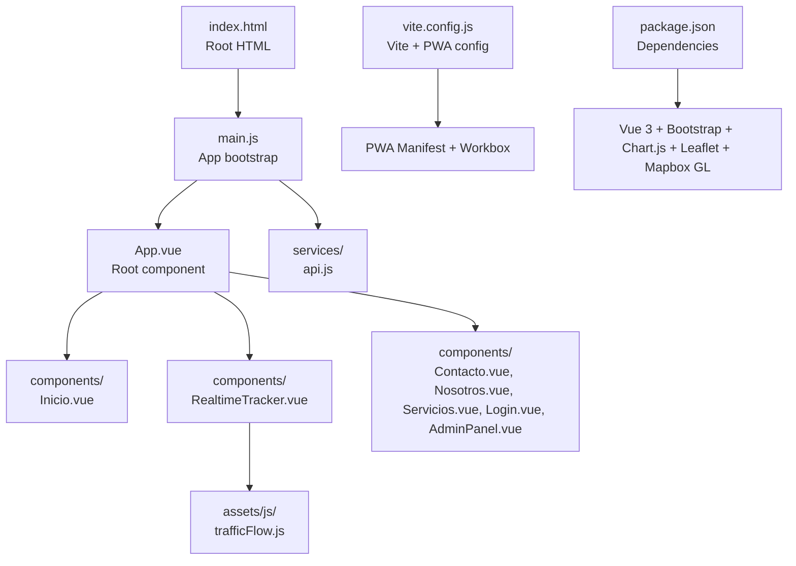
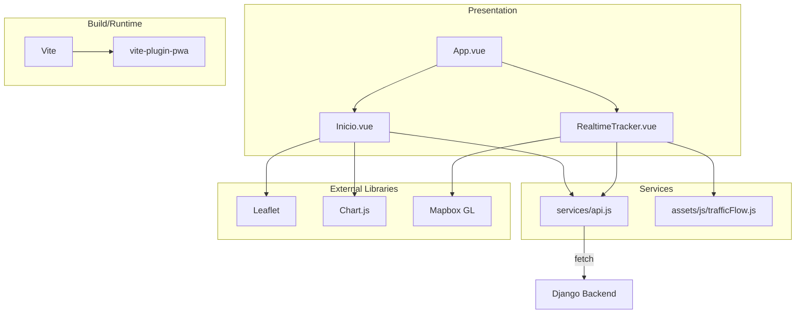
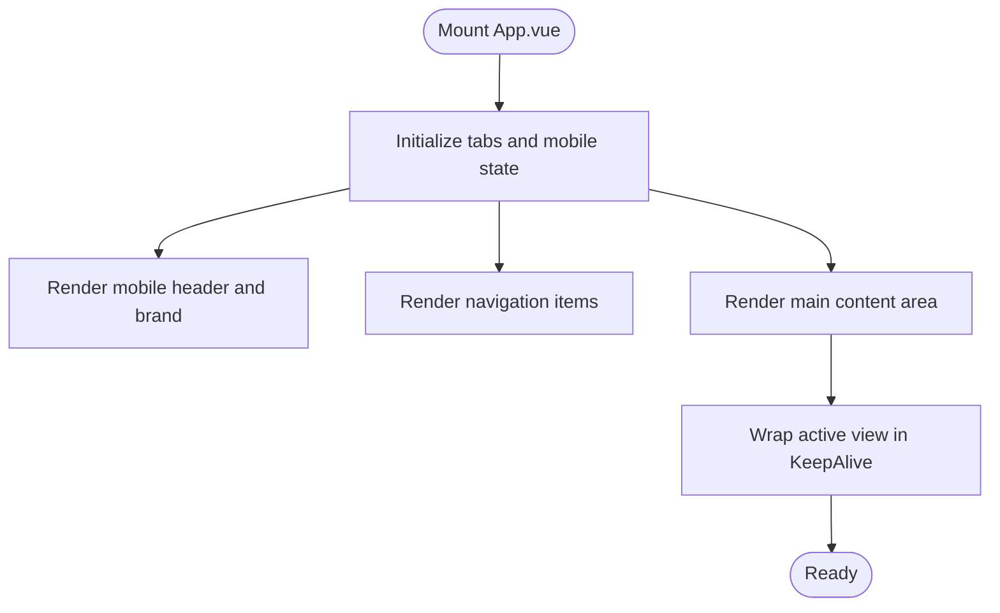
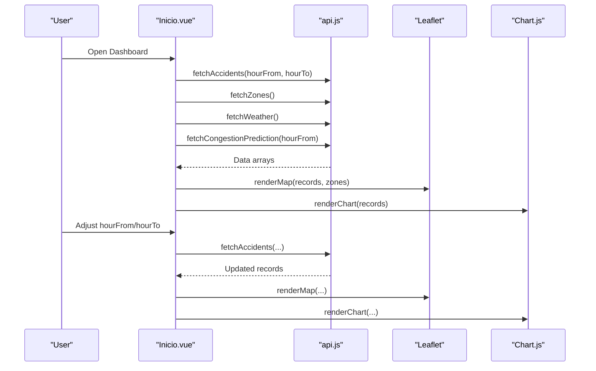
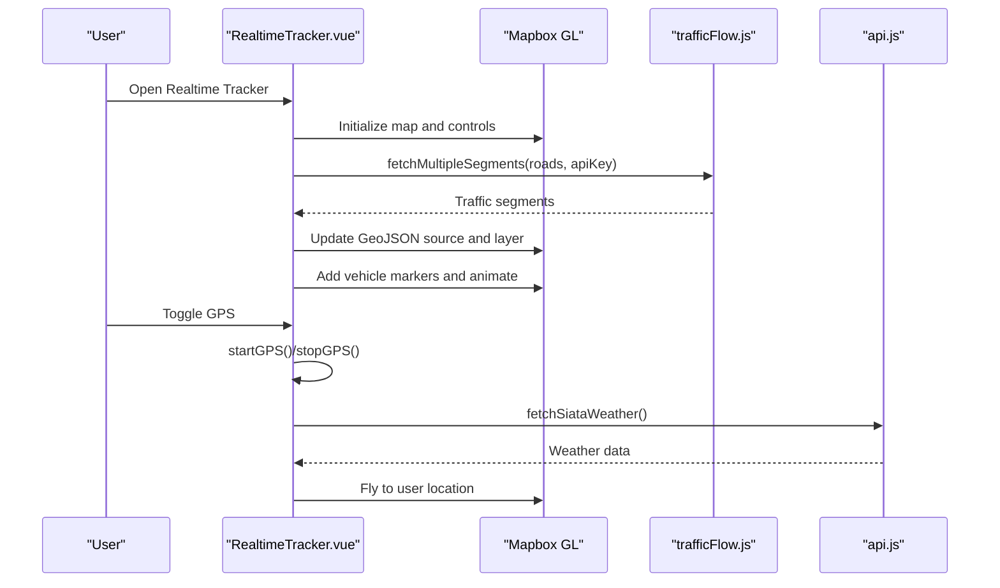
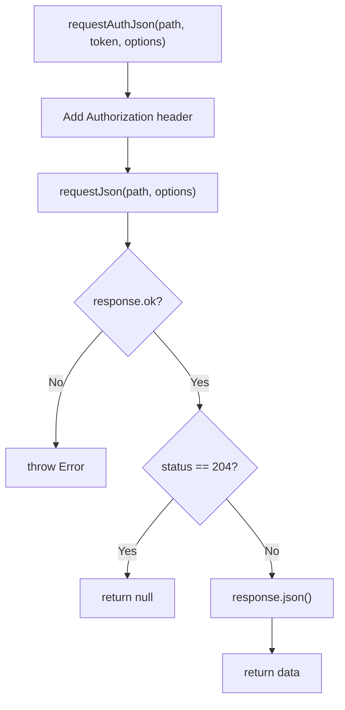
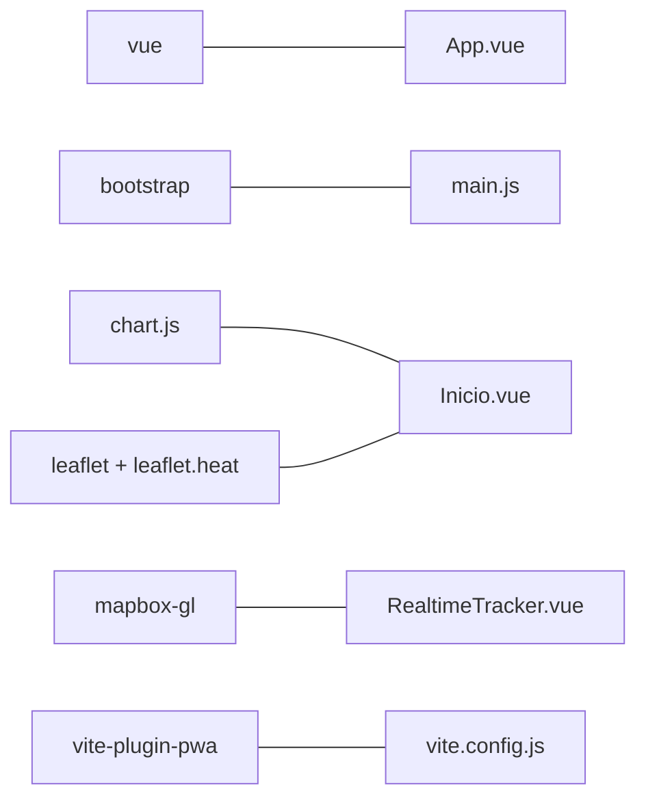

# Frontend Architecture

<cite>
**Referenced Files in This Document**
- [package.json](file://frontend/package.json)
- [vite.config.js](file://frontend/vite.config.js)
- [index.html](file://frontend/index.html)
- [main.js](file://frontend/src/main.js)
- [App.vue](file://frontend/src/App.vue)
- [api.js](file://frontend/src/services/api.js)
- [Inicio.vue](file://frontend/src/components/Inicio.vue)
- [RealtimeTracker.vue](file://frontend/src/components/RealtimeTracker.vue)
- [trafficFlow.js](file://frontend/src/assets/js/trafficFlow.js)
</cite>

## Table of Contents
1. [Introduction](#introduction)
2. [Project Structure](#project-structure)
3. [Core Components](#core-components)
4. [Architecture Overview](#architecture-overview)
5. [Detailed Component Analysis](#detailed-component-analysis)
6. [Dependency Analysis](#dependency-analysis)
7. [Performance Considerations](#performance-considerations)
8. [Troubleshooting Guide](#troubleshooting-guide)
9. [Conclusion](#conclusion)
10. [Appendices](#appendices)

## Introduction
This document describes the frontend architecture for the Medellín Movilidata OS platform. It focuses on the Vue 3 application built with Vite, a component-based design, and Progressive Web App (PWA) capabilities. The system integrates external libraries for maps and visualizations, uses Composition API and composables for state management, and exposes a clean API service layer. The document also covers build and deployment preparation, offline support, responsive design, performance optimization, and browser compatibility.

## Project Structure
The frontend is organized around a Vue 3 application bootstrapped with Vite. Key elements include:
- Application entry point and mounting logic
- Root component orchestrating navigation and content
- Feature components for dashboard and real-time tracking
- API service module for backend communication
- Asset utilities for traffic data and third-party integrations
- Vite configuration enabling PWA and plugin pipeline

**Diagram sources**
- [index.html:1-14](file://frontend/index.html#L1-L14)
- [main.js:1-8](file://frontend/src/main.js#L1-L8)
- [App.vue:1-129](file://frontend/src/App.vue#L1-L129)
- [api.js:1-177](file://frontend/src/services/api.js#L1-L177)
- [trafficFlow.js:1-106](file://frontend/src/assets/js/trafficFlow.js#L1-L106)
- [vite.config.js:1-44](file://frontend/vite.config.js#L1-L44)
- [package.json:1-25](file://frontend/package.json#L1-L25)

**Section sources**
- [index.html:1-14](file://frontend/index.html#L1-L14)
- [main.js:1-8](file://frontend/src/main.js#L1-L8)
- [App.vue:1-129](file://frontend/src/App.vue#L1-L129)
- [vite.config.js:1-44](file://frontend/vite.config.js#L1-L44)
- [package.json:1-25](file://frontend/package.json#L1-L25)

## Core Components
- App.vue: Central orchestrator managing navigation tabs, sidebar, and dynamic content via a keep-alive wrapper. It defines the tabbed interface and maintains reactive state for the active view and mobile sidebar.
- Inicio.vue: Dashboard component integrating Leaflet maps, Chart.js charts, and backend APIs for accidents, zones, weather, and congestion predictions. Implements responsive layouts and interactive filters.
- RealtimeTracker.vue: Live tracking component using Mapbox GL for base maps, TomTom Traffic raster and vector overlays, simulated vehicles, and device GPS. Includes SIATA weather integration and traffic layer toggling.
- api.js: Centralized API client encapsulating HTTP requests, authentication headers, and endpoint-specific helpers for accidents, zones, weather, and admin operations.
- trafficFlow.js: Utility module for fetching TomTom traffic data, computing traffic levels and colors, and batching requests to avoid rate limits.

**Section sources**
- [App.vue:1-129](file://frontend/src/App.vue#L1-L129)
- [Inicio.vue:1-568](file://frontend/src/components/Inicio.vue#L1-L568)
- [RealtimeTracker.vue:1-776](file://frontend/src/components/RealtimeTracker.vue#L1-L776)
- [api.js:1-177](file://frontend/src/services/api.js#L1-L177)
- [trafficFlow.js:1-106](file://frontend/src/assets/js/trafficFlow.js#L1-L106)

## Architecture Overview
The application follows a layered architecture:
- Presentation Layer: Vue 3 components (App.vue, feature components) using Composition API and templates.
- Service Layer: API service module abstracting HTTP calls and authentication.
- Integration Layer: Third-party libraries (Leaflet, Chart.js, Mapbox GL) integrated via component lifecycle hooks.
- Build and Runtime: Vite dev server and build pipeline with PWA plugin for offline caching and service worker generation.

**Diagram sources**
- [App.vue:1-129](file://frontend/src/App.vue#L1-L129)
- [Inicio.vue:1-568](file://frontend/src/components/Inicio.vue#L1-L568)
- [RealtimeTracker.vue:1-776](file://frontend/src/components/RealtimeTracker.vue#L1-L776)
- [api.js:1-177](file://frontend/src/services/api.js#L1-L177)
- [trafficFlow.js:1-106](file://frontend/src/assets/js/trafficFlow.js#L1-L106)
- [vite.config.js:1-44](file://frontend/vite.config.js#L1-L44)

## Detailed Component Analysis

### App.vue: Root Component and Navigation
App.vue serves as the application shell:
- Declares a tab-based navigation model and a mobile sidebar.
- Uses a reactive mapping of tab identifiers to component constructors.
- Manages the active tab and mobile sidebar state.
- Renders a keep-alive wrapper around the active view to preserve component state during navigation.

**Diagram sources**
- [App.vue:1-129](file://frontend/src/App.vue#L1-L129)

**Section sources**
- [App.vue:1-129](file://frontend/src/App.vue#L1-L129)

### Inicio.vue: Dashboard with Maps and Charts
Inicio.vue integrates:
- Leaflet map rendering with tile layers, heat layer, and GeoJSON overlays for zones.
- Chart.js line charts for hourly accident counts and intensity.
- API service calls for accidents, zones, weather, and congestion prediction.
- Reactive filters for time ranges and computed alerts based on weather and risk.

**Diagram sources**
- [Inicio.vue:1-568](file://frontend/src/components/Inicio.vue#L1-L568)
- [api.js:1-177](file://frontend/src/services/api.js#L1-L177)

**Section sources**
- [Inicio.vue:1-568](file://frontend/src/components/Inicio.vue#L1-L568)
- [api.js:1-177](file://frontend/src/services/api.js#L1-L177)

### RealtimeTracker.vue: Live Tracking and GPS
RealtimeTracker.vue provides:
- Mapbox GL initialization with navigation controls.
- Optional TomTom traffic raster overlay and dynamic GeoJSON traffic segments.
- Simulated vehicles moving along predefined routes.
- Device GPS tracking with live marker updates and fly-to camera movement.
- SIATA weather retrieval and display.

**Diagram sources**
- [RealtimeTracker.vue:1-776](file://frontend/src/components/RealtimeTracker.vue#L1-L776)
- [trafficFlow.js:1-106](file://frontend/src/assets/js/trafficFlow.js#L1-L106)
- [api.js:1-177](file://frontend/src/services/api.js#L1-L177)

**Section sources**
- [RealtimeTracker.vue:1-776](file://frontend/src/components/RealtimeTracker.vue#L1-L776)
- [trafficFlow.js:1-106](file://frontend/src/assets/js/trafficFlow.js#L1-L106)
- [api.js:1-177](file://frontend/src/services/api.js#L1-L177)

### API Service Architecture
The API service module centralizes HTTP interactions:
- Base URL resolution via environment variable with sensible fallback.
- Generic request helper handling JSON parsing and error propagation.
- Authentication helper adding bearer tokens to protected endpoints.
- Endpoint-specific functions for accidents, zones, weather, congestion prediction, and admin operations.

**Diagram sources**
- [api.js:1-177](file://frontend/src/services/api.js#L1-L177)

**Section sources**
- [api.js:1-177](file://frontend/src/services/api.js#L1-L177)

### Asset Management Strategies
- Static assets: Public assets under frontend/public and frontend/src/assets are served as-is; examples include map road data and images.
- Dynamic assets: Traffic data is fetched from local assets for offline-friendly scenarios.
- Styles: Bootstrap is imported globally; custom styles reside under frontend/src/assets/css.

**Section sources**
- [RealtimeTracker.vue:423-424](file://frontend/src/components/RealtimeTracker.vue#L423-L424)
- [main.js:2-4](file://frontend/src/main.js#L2-L4)

## Dependency Analysis
The frontend depends on:
- Vue 3 runtime and compiler for component composition and rendering.
- Bootstrap for responsive UI primitives and JavaScript components.
- Chart.js for line charts and scales registration.
- Leaflet and related plugins for maps and heat layer.
- Mapbox GL for advanced vector/raster maps and traffic overlays.
- vite-plugin-pwa for PWA manifest and service worker generation.

**Diagram sources**
- [package.json:11-18](file://frontend/package.json#L11-L18)
- [main.js:2-4](file://frontend/src/main.js#L2-L4)
- [vite.config.js:1-44](file://frontend/vite.config.js#L1-L44)

**Section sources**
- [package.json:1-25](file://frontend/package.json#L1-L25)
- [main.js:1-8](file://frontend/src/main.js#L1-L8)
- [vite.config.js:1-44](file://frontend/vite.config.js#L1-L44)

## Performance Considerations
- Lazy loading and keep-alive: App.vue wraps active views in KeepAlive to preserve state and avoid reinitialization.
- Asynchronous rendering: Inicio.vue defers map and chart creation until after DOM updates using nextTick.
- Concurrency control: RealtimeTracker.vue batches TomTom requests with controlled concurrency to balance responsiveness and rate limits.
- Responsive design: Components adapt to viewport sizes with scoped styles and Bootstrap utilities.
- Resource limits: PWA configuration increases maximum file size for caching to accommodate larger assets.

**Section sources**
- [App.vue:105-107](file://frontend/src/App.vue#L105-L107)
- [Inicio.vue:266-268](file://frontend/src/components/Inicio.vue#L266-L268)
- [RealtimeTracker.vue:87-104](file://frontend/src/components/RealtimeTracker.vue#L87-L104)
- [vite.config.js:36-40](file://frontend/vite.config.js#L36-L40)

## Troubleshooting Guide
Common issues and remedies:
- Missing environment variables:
  - Mapbox access token: Configure VITE_MAPBOX_ACCESS_TOKEN; otherwise, Mapbox may fail to initialize.
  - TomTom API key: Configure VITE_TOMTOM_API_KEY; traffic raster layer will be disabled without it.
  - Backend base URL: Configure VITE_API_BASE_URL; defaults to http://localhost:8000/api.
- CORS and backend connectivity: Ensure the Django backend is running and accessible at the configured base URL.
- Offline behavior: Verify PWA manifest and Workbox caching configuration; confirm offline.html presence.
- Map rendering errors: Confirm Leaflet and Mapbox CSS imports are present and network resources are reachable.

**Section sources**
- [RealtimeTracker.vue:205-209](file://frontend/src/components/RealtimeTracker.vue#L205-L209)
- [RealtimeTracker.vue:221-236](file://frontend/src/components/RealtimeTracker.vue#L221-L236)
- [api.js:1-1](file://frontend/src/services/api.js#L1-L1)
- [vite.config.js:8-41](file://frontend/vite.config.js#L8-L41)

## Conclusion
The frontend architecture leverages Vue 3’s Composition API, Vite’s efficient build pipeline, and a set of specialized libraries to deliver an interactive, responsive, and offline-capable transportation monitoring platform. The modular component design, centralized API service, and PWA configuration provide a robust foundation for development and production deployment.

## Appendices

### Build Process and Deployment Preparation
- Development: Run the Vite dev server using the configured scripts.
- Production build: Generate optimized static assets for deployment.
- Preview: Serve the production build locally to validate performance and PWA behavior.
- Environment variables: Set VITE_API_BASE_URL, VITE_MAPBOX_ACCESS_TOKEN, and VITE_TOMTOM_API_KEY as needed.

**Section sources**
- [package.json:6-10](file://frontend/package.json#L6-L10)
- [vite.config.js:1-44](file://frontend/vite.config.js#L1-L44)

### PWA Configuration and Offline Functionality
- Manifest: Defines app metadata, theme colors, display mode, and icons.
- Workbox: Configures navigation fallback to offline.html, cache patterns, and maximum file size.
- Assets: Includes offline.html and logo assets for offline scenarios.

**Section sources**
- [vite.config.js:8-41](file://frontend/vite.config.js#L8-L41)
- [index.html:1-14](file://frontend/index.html#L1-L14)