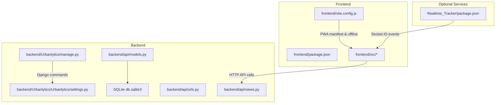
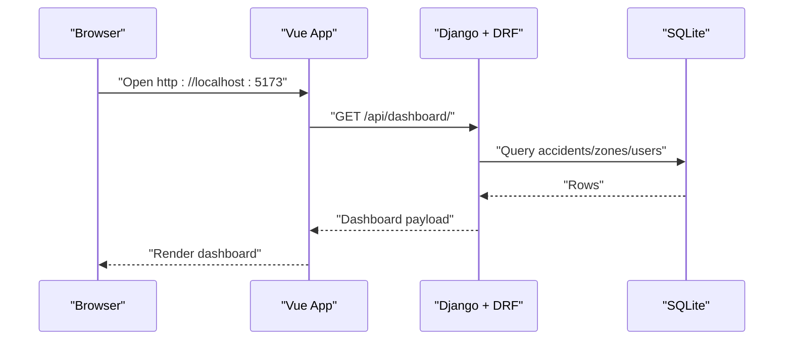
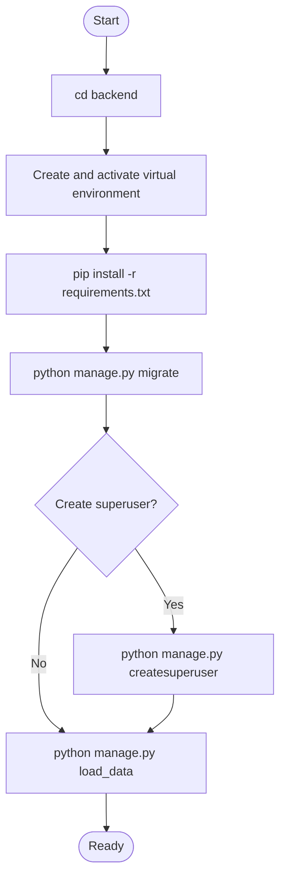
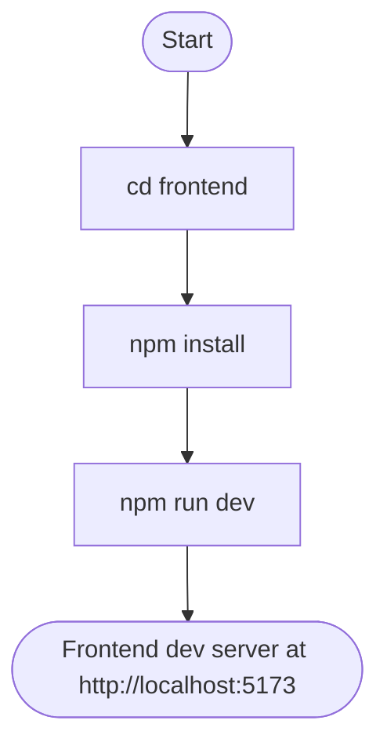
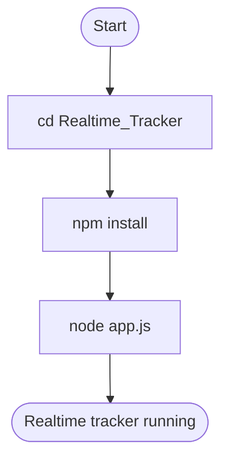
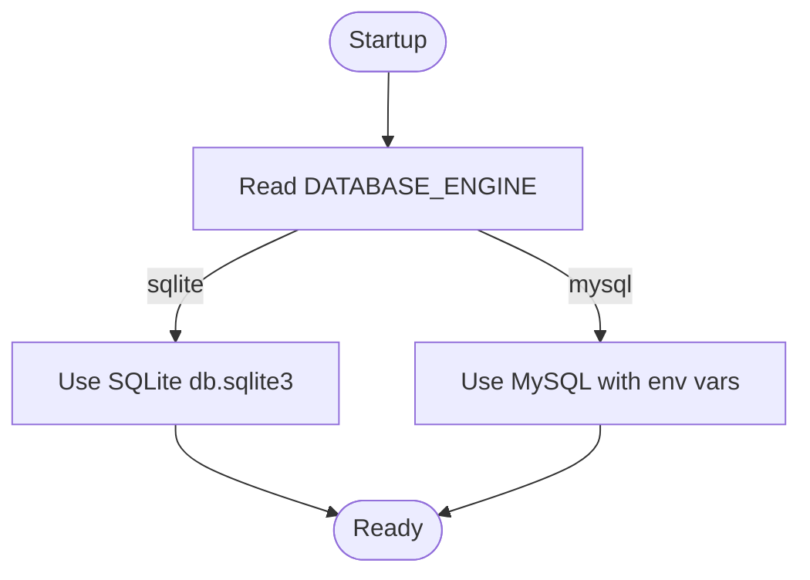
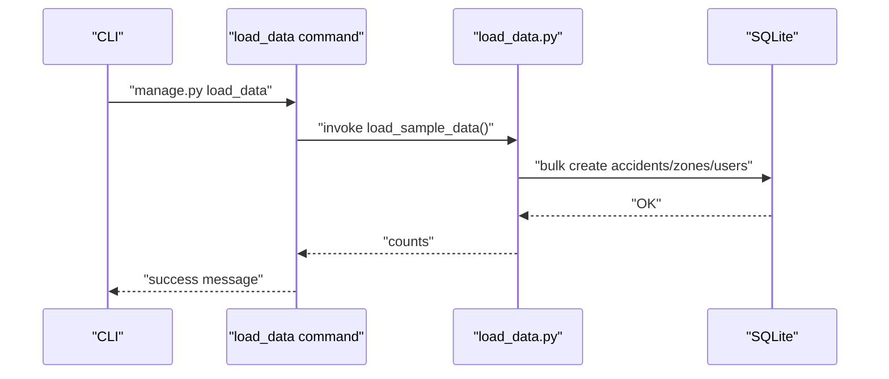
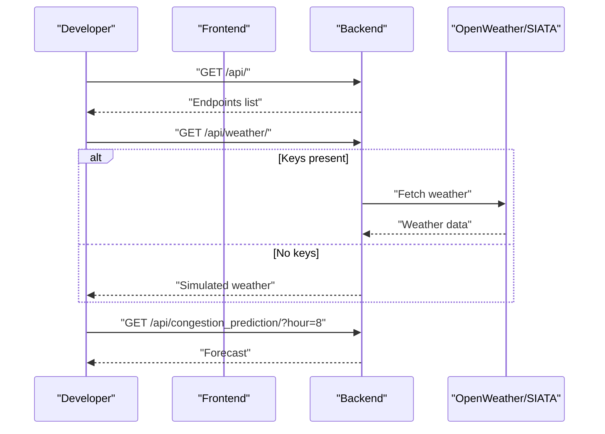
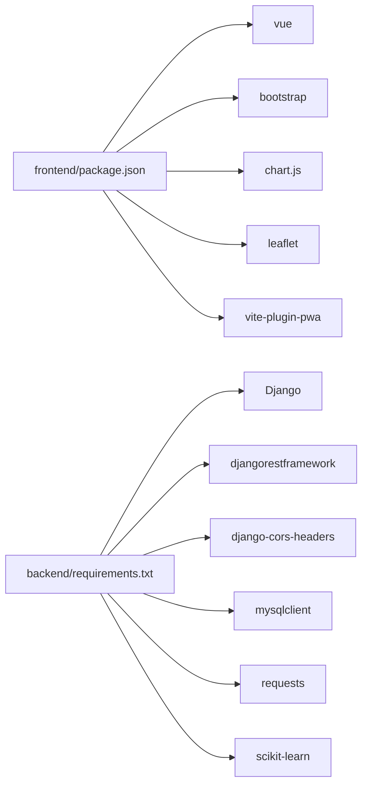

# Getting Started

<cite>
**Referenced Files in This Document**
- [README.md](file://README.md)
- [requirements.txt](file://backend/requirements.txt)
- [requeriments.txt](file://backend/requeriments.txt)
- [package.json](file://frontend/package.json)
- [vite.config.js](file://frontend/vite.config.js)
- [package.json](file://Realtime_Tracker/package.json)
- [settings.py](file://backend/Urbanlytics/Urbanlytics/settings.py)
- [settings.py](file://backend/movilidata/settings.py)
- [models.py](file://backend/api/models.py)
- [views.py](file://backend/api/views.py)
- [urls.py](file://backend/api/urls.py)
- [load_data.py](file://backend/api/management/commands/load_data.py)
- [load_data.py](file://backend/load_data.py)
</cite>

## Table of Contents
1. [Introduction](#introduction)
2. [Project Structure](#project-structure)
3. [Core Components](#core-components)
4. [Architecture Overview](#architecture-overview)
5. [Detailed Component Analysis](#detailed-component-analysis)
6. [Dependency Analysis](#dependency-analysis)
7. [Performance Considerations](#performance-considerations)
8. [Troubleshooting Guide](#troubleshooting-guide)
9. [Conclusion](#conclusion)
10. [Appendices](#appendices)

## Introduction
This guide helps you set up and run the Urbanlytics project locally. It covers prerequisites, environment configuration, installation steps for frontend and backend, database setup, initial data loading, and how to verify the system works. It also includes troubleshooting tips for common environment issues.

## Project Structure
The project is a full-stack application composed of:
- Frontend built with Vue 3 and Vite, including PWA support
- Backend built with Django and Django REST Framework
- Optional real-time tracking service using Express and Socket.IO
- Sample datasets and static assets for Medellín

**Diagram sources**
- [package.json:1-25](file://frontend/package.json#L1-L25)
- [vite.config.js:1-44](file://frontend/vite.config.js#L1-L44)
- [manage.py:1-23](file://backend/Urbanlytics/manage.py#L1-L23)
- [settings.py:77-85](file://backend/Urbanlytics/Urbanlytics/settings.py#L77-L85)
- [models.py:1-50](file://backend/api/models.py#L1-L50)
- [views.py:1-574](file://backend/api/views.py#L1-L574)
- [urls.py:1-42](file://backend/api/urls.py#L1-L42)
- [package.json:1-18](file://Realtime_Tracker/package.json#L1-L18)

**Section sources**
- [README.md:1-82](file://README.md#L1-L82)
- [package.json:1-25](file://frontend/package.json#L1-L25)
- [vite.config.js:1-44](file://frontend/vite.config.js#L1-L44)
- [manage.py:1-23](file://backend/Urbanlytics/manage.py#L1-L23)
- [settings.py:77-85](file://backend/Urbanlytics/Urbanlytics/settings.py#L77-L85)
- [models.py:1-50](file://backend/api/models.py#L1-L50)
- [views.py:1-574](file://backend/api/views.py#L1-L574)
- [urls.py:1-42](file://backend/api/urls.py#L1-L42)
- [package.json:1-18](file://Realtime_Tracker/package.json#L1-L18)

## Core Components
- Frontend: Vue 3 SPA with Vite, Bootstrap 5, Chart.js, Leaflet, and PWA via vite-plugin-pwa
- Backend: Django + DRF providing REST endpoints for accidents, zones, weather, congestion prediction, and admin
- Database: SQLite by default for development; MySQL supported via environment variables
- Optional real-time tracker: Express + Socket.IO for live updates

Key capabilities:
- Dashboard with user/admin roles
- Weather integration (OpenWeatherMap and SIATA)
- Congestion prediction using scikit-learn
- Admin endpoints to manage accidents, zones, and users

**Section sources**
- [README.md:1-82](file://README.md#L1-L82)
- [package.json:1-25](file://frontend/package.json#L1-L25)
- [vite.config.js:1-44](file://frontend/vite.config.js#L1-L44)
- [settings.py:77-85](file://backend/Urbanlytics/Urbanlytics/settings.py#L77-L85)
- [settings.py:54-76](file://backend/movilidata/settings.py#L54-L76)
- [models.py:1-50](file://backend/api/models.py#L1-L50)
- [views.py:27-46](file://backend/api/views.py#L27-L46)
- [urls.py:23-41](file://backend/api/urls.py#L23-L41)

## Architecture Overview
High-level flow:
- Frontend runs on Vite dev server and builds to a static site with PWA support
- Backend exposes REST endpoints; CORS is configured for local development origins
- SQLite stores development data; initial seed data can be loaded via Django management command
- Weather endpoints optionally integrate with OpenWeatherMap or SIATA

**Diagram sources**
- [views.py:133-137](file://backend/api/views.py#L133-L137)
- [settings.py:130-133](file://backend/Urbanlytics/Urbanlytics/settings.py#L130-L133)
- [settings.py:80-85](file://backend/Urbanlytics/Urbanlytics/settings.py#L80-L85)

## Detailed Component Analysis

### Prerequisites
- Node.js 20+
- npm 10+
- Python 3.x
- Virtual environment recommended for Python packages

Notes:
- The project’s frontend requires Node.js 20+ and npm 10+ as per the repository’s README.
- Backend dependencies are managed via pip and declared in requirements.txt.

**Section sources**
- [README.md:21-24](file://README.md#L21-L24)
- [requirements.txt:1-7](file://backend/requirements.txt#L1-L7)
- [requeriments.txt:1-1](file://backend/requeriments.txt#L1-L1)

### Environment Setup
- Frontend environment variables:
  - Create a .env or .env.local file in the frontend directory with:
    - VITE_OPENWEATHER_API_KEY for OpenWeatherMap
    - SIATA_WEATHER_API_URL and SIATA_API_KEY for SIATA integration
- Backend environment variables:
  - OPENWEATHER_API_KEY for OpenWeatherMap
  - Optional: SIATA_WEATHER_API_URL and SIATA_API_KEY
  - For MySQL migration, set DATABASE_ENGINE=mysql and configure MYSQL_* variables

**Section sources**
- [README.md:42-51](file://README.md#L42-L51)
- [views.py:389-442](file://backend/api/views.py#L389-L442)
- [views.py:444-508](file://backend/api/views.py#L444-L508)
- [settings.py:54-76](file://backend/movilidata/settings.py#L54-L76)

### Installation Steps

#### Backend (Django + DRF)
1. Navigate to the backend directory.
2. Create and activate a Python virtual environment.
3. Install dependencies:
   - pip install -r requirements.txt
4. Apply migrations:
   - python manage.py migrate
5. Create a superuser (optional):
   - python manage.py createsuperuser
6. Load initial data:
   - python manage.py load_data

**Diagram sources**
- [requirements.txt:1-7](file://backend/requirements.txt#L1-L7)
- [manage.py:1-23](file://backend/Urbanlytics/manage.py#L1-L23)
- [load_data.py:6-11](file://backend/api/management/commands/load_data.py#L6-L11)

**Section sources**
- [requirements.txt:1-7](file://backend/requirements.txt#L1-L7)
- [manage.py:1-23](file://backend/Urbanlytics/manage.py#L1-L23)
- [load_data.py:6-11](file://backend/api/management/commands/load_data.py#L6-L11)

#### Frontend (Vue 3 + Vite)
1. Navigate to the frontend directory.
2. Install dependencies:
   - npm install
3. Start the development server:
   - npm run dev

**Diagram sources**
- [package.json:6-10](file://frontend/package.json#L6-L10)

**Section sources**
- [package.json:1-25](file://frontend/package.json#L1-L25)

#### Optional Realtime Tracker
1. Navigate to the Realtime_Tracker directory.
2. Install dependencies:
   - npm install
3. Run the tracker service:
   - node app.js (use appropriate Node.js runtime)

**Diagram sources**
- [package.json:1-18](file://Realtime_Tracker/package.json#L1-L18)

**Section sources**
- [package.json:1-18](file://Realtime_Tracker/package.json#L1-L18)

### Database Configuration
- Development: SQLite is enabled by default.
- Production-like migration: Set DATABASE_ENGINE=mysql and provide MYSQL_* environment variables to switch to MySQL.

**Diagram sources**
- [settings.py:54-76](file://backend/movilidata/settings.py#L54-L76)

**Section sources**
- [settings.py:80-85](file://backend/Urbanlytics/Urbanlytics/settings.py#L80-L85)
- [settings.py:54-76](file://backend/movilidata/settings.py#L54-L76)

### Initial Data Loading
- Seed data includes sample accidents, zones, and demo users.
- Load via Django management command:
  - python manage.py load_data
- Alternatively, run the standalone loader script:
  - python backend/load_data.py

**Diagram sources**
- [load_data.py:6-11](file://backend/api/management/commands/load_data.py#L6-L11)
- [load_data.py:91-154](file://backend/load_data.py#L91-L154)

**Section sources**
- [load_data.py:6-11](file://backend/api/management/commands/load_data.py#L6-L11)
- [load_data.py:91-154](file://backend/load_data.py#L91-L154)

### Running Locally and Verifying Functionality
- Start the backend:
  - python manage.py runserver
- Start the frontend:
  - npm run dev
- Access the dashboard:
  - Open http://localhost:5173 in your browser
- Verify endpoints:
  - Backend root lists available endpoints
  - Weather endpoints return simulated data if API keys are missing
  - Congestion prediction endpoint returns forecasts

**Diagram sources**
- [views.py:27-46](file://backend/api/views.py#L27-L46)
- [views.py:389-442](file://backend/api/views.py#L389-L442)
- [views.py:530-573](file://backend/api/views.py#L530-L573)

**Section sources**
- [README.md:25-34](file://README.md#L25-L34)
- [views.py:27-46](file://backend/api/views.py#L27-L46)
- [views.py:389-442](file://backend/api/views.py#L389-L442)
- [views.py:530-573](file://backend/api/views.py#L530-L573)

## Dependency Analysis
- Frontend depends on Vue 3, Bootstrap 5, Chart.js, Leaflet, and vite-plugin-pwa.
- Backend depends on Django, DRF, django-cors-headers, mysqlclient, requests, and scikit-learn.
- The loader script depends on Django and standard libraries.

**Diagram sources**
- [package.json:11-23](file://frontend/package.json#L11-L23)
- [requirements.txt:1-7](file://backend/requirements.txt#L1-L7)

**Section sources**
- [package.json:1-25](file://frontend/package.json#L1-L25)
- [requirements.txt:1-7](file://backend/requirements.txt#L1-L7)

## Performance Considerations
- SQLite is suitable for development; consider migrating to MySQL/PostgreSQL for production-scale data.
- Weather and SIATA endpoints use HTTP requests with timeouts; ensure network stability during development.
- PWA caching improves offline experience; verify cache behavior after building.

[No sources needed since this section provides general guidance]

## Troubleshooting Guide
Common issues and resolutions:
- Node/npm version mismatch:
  - Ensure Node.js 20+ and npm 10+ are installed.
- Python environment errors:
  - Use a virtual environment and reinstall dependencies from requirements.txt.
- Django import or path errors:
  - Confirm manage.py is executed from the correct backend directory and PYTHONPATH includes the project root.
- CORS errors in development:
  - Verify ALLOWED_HOSTS and CORS_ALLOWED_ORIGINS include localhost:5173 and localhost:8000.
- Weather endpoints failing:
  - Provide OPENWEATHER_API_KEY or configure SIATA variables; otherwise, endpoints return simulated data.
- Database engine mismatch:
  - Set DATABASE_ENGINE=sqlite for development or DATABASE_ENGINE=mysql with proper MYSQL_* variables for production-like testing.

**Section sources**
- [README.md:21-24](file://README.md#L21-L24)
- [manage.py:8-18](file://backend/Urbanlytics/manage.py#L8-L18)
- [settings.py:28-28](file://backend/Urbanlytics/Urbanlytics/settings.py#L28-L28)
- [settings.py:130-133](file://backend/Urbanlytics/Urbanlytics/settings.py#L130-L133)
- [settings.py:54-76](file://backend/movilidata/settings.py#L54-L76)
- [views.py:389-442](file://backend/api/views.py#L389-L442)
- [views.py:444-508](file://backend/api/views.py#L444-L508)

## Conclusion
You now have the prerequisites, environment configuration, and step-by-step instructions to run Urbanlytics locally. Start the backend and frontend servers, load initial data, and explore the dashboard. Use the troubleshooting section to resolve common environment issues.

[No sources needed since this section summarizes without analyzing specific files]

## Appendices

### API Endpoints Overview
- Root: GET /
- Authentication: POST /api/auth/login/, POST /api/auth/logout/, GET /api/auth/me/
- Dashboard: GET /api/dashboard/
- Accidents: GET /api/accidents/ (supports hour_from and hour_to)
- Zones: GET /api/zones/
- Weather: GET /api/weather/ (OpenWeatherMap or simulated)
- SIATA Weather: GET /api/siata_weather/
- Congestion Prediction: GET /api/congestion_prediction/?hour=8
- Simulate Rain: POST /api/simulate_rain/

**Section sources**
- [urls.py:23-41](file://backend/api/urls.py#L23-L41)
- [views.py:27-46](file://backend/api/views.py#L27-L46)
- [views.py:365-380](file://backend/api/views.py#L365-L380)
- [views.py:389-442](file://backend/api/views.py#L389-L442)
- [views.py:444-508](file://backend/api/views.py#L444-L508)
- [views.py:530-573](file://backend/api/views.py#L530-L573)