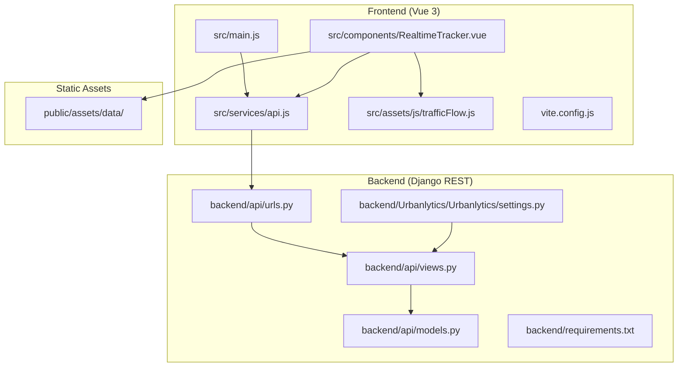
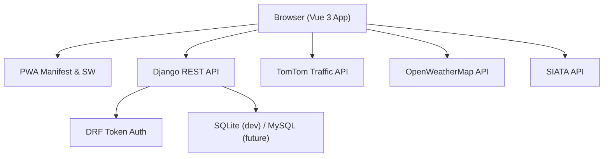
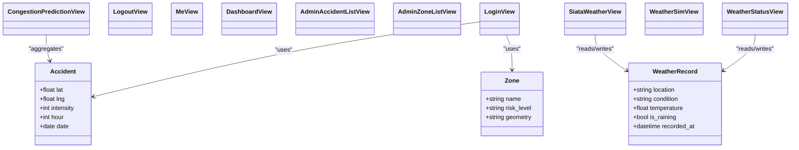
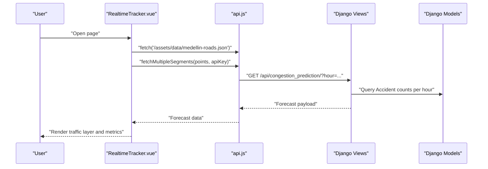
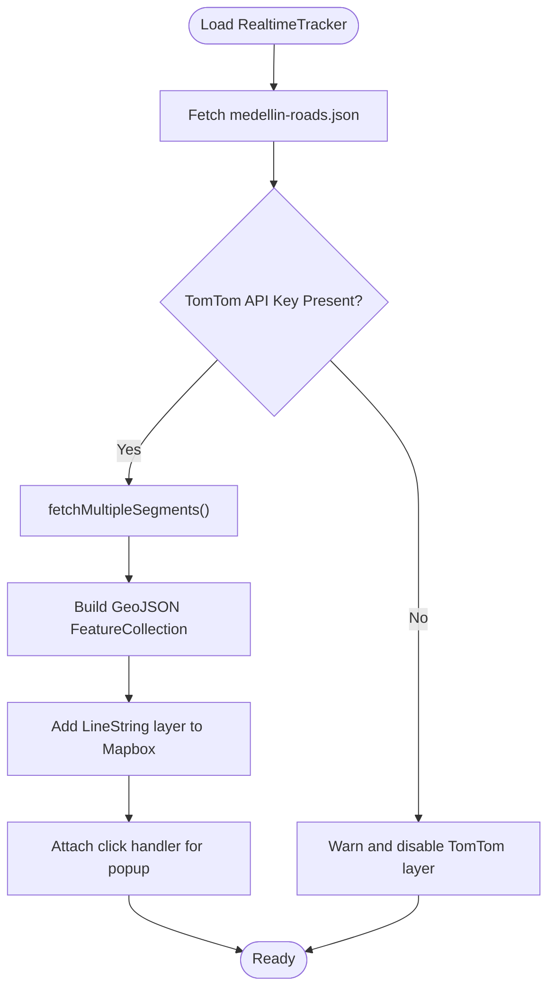
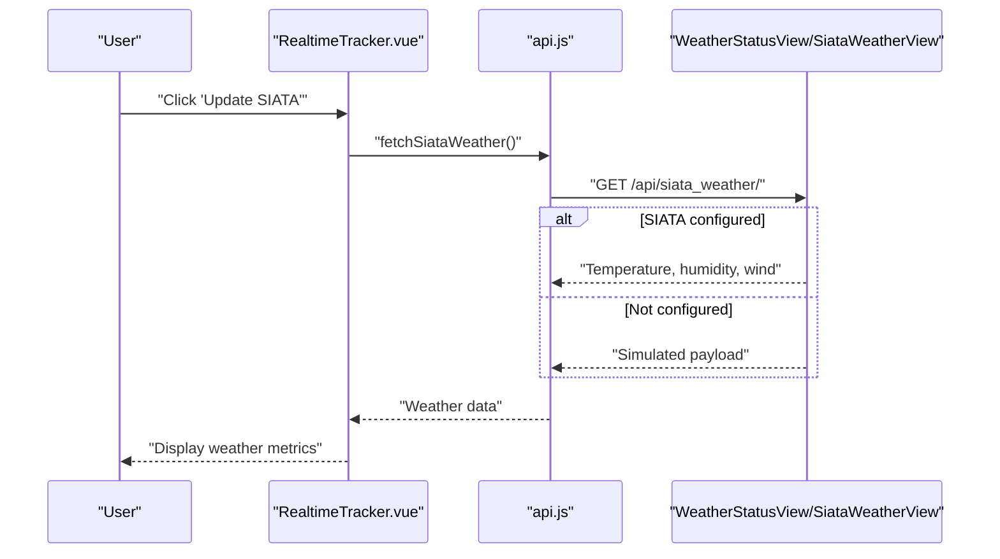
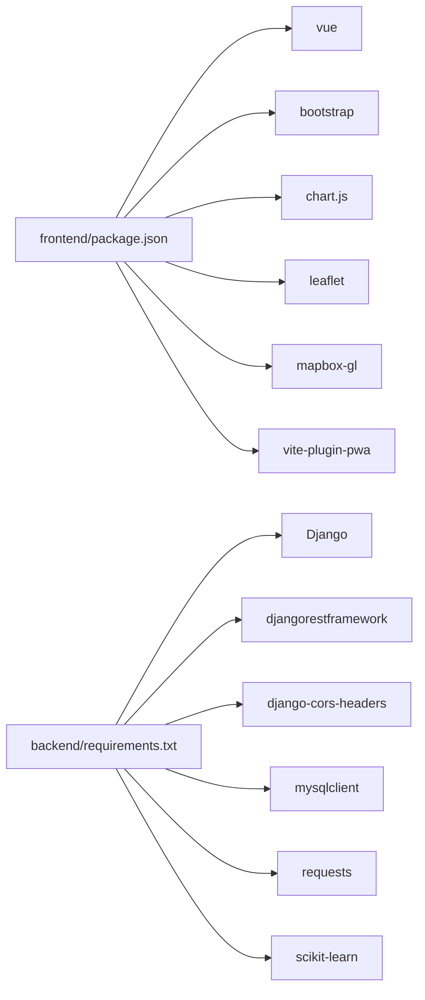

# Project Overview

<cite>
**Referenced Files in This Document**
- [README.md](file://README.md)
- [backend/Urbanlytics/Urbanlytics/settings.py](file://backend/Urbanlytics/Urbanlytics/settings.py)
- [backend/api/models.py](file://backend/api/models.py)
- [backend/api/views.py](file://backend/api/views.py)
- [backend/api/urls.py](file://backend/api/urls.py)
- [backend/requirements.txt](file://backend/requirements.txt)
- [frontend/package.json](file://frontend/package.json)
- [frontend/src/main.js](file://frontend/src/main.js)
- [frontend/src/services/api.js](file://frontend/src/services/api.js)
- [frontend/src/components/RealtimeTracker.vue](file://frontend/src/components/RealtimeTracker.vue)
- [frontend/src/assets/js/trafficFlow.js](file://frontend/src/assets/js/trafficFlow.js)
- [frontend/vite.config.js](file://frontend/vite.config.js)
</cite>

## Table of Contents
1. [Introduction](#introduction)
2. [Project Structure](#project-structure)
3. [Core Components](#core-components)
4. [Architecture Overview](#architecture-overview)
5. [Detailed Component Analysis](#detailed-component-analysis)
6. [Dependency Analysis](#dependency-analysis)
7. [Performance Considerations](#performance-considerations)
8. [Troubleshooting Guide](#troubleshooting-guide)
9. [Conclusion](#conclusion)
10. [Appendices](#appendices)

## Introduction
Urbanlytics is a full-stack Minimum Viable Product (MVP) designed to analyze traffic risks in Medellín, Colombia. It integrates a Django REST API with a Vue 3 frontend to deliver real-time traffic monitoring, accident visualization, risk zone mapping, and weather integration. The system emphasizes practical insights for daily mobility decisions and supports both user and administrative dashboards. It also includes Progressive Web App (PWA) capabilities for offline readiness and installability.

Key capabilities include:
- Risk zones and traffic flow visualization
- Accident visualization and filtering by time windows
- Live weather integration via OpenWeatherMap and SIATA
- Real-time traffic data consumption from TomTom
- Administrative controls for managing zones, accidents, and users
- PWA support for offline usage and device installation

## Project Structure
The project follows a clear separation of concerns:
- Backend: Django REST framework with SQLite in development and optional MySQL migration path
- Frontend: Vue 3 with Vite, Bootstrap 5, Mapbox GL for interactive maps, Leaflet for heatmaps, Chart.js for charts, and PWA via vite-plugin-pwa
- Shared data: JSON fixtures for Medellín roads and sample datasets for accidents and traffic
- Services: API client module encapsulating REST endpoints and authentication flows

**Diagram sources**
- [frontend/src/main.js:1-8](file://frontend/src/main.js#L1-L8)
- [frontend/src/services/api.js:1-177](file://frontend/src/services/api.js#L1-L177)
- [frontend/src/components/RealtimeTracker.vue:1-776](file://frontend/src/components/RealtimeTracker.vue#L1-L776)
- [frontend/src/assets/js/trafficFlow.js:1-106](file://frontend/src/assets/js/trafficFlow.js#L1-L106)
- [frontend/vite.config.js:1-44](file://frontend/vite.config.js#L1-L44)
- [backend/Urbanlytics/Urbanlytics/settings.py:1-141](file://backend/Urbanlytics/Urbanlytics/settings.py#L1-L141)
- [backend/api/views.py:1-574](file://backend/api/views.py#L1-L574)
- [backend/api/models.py:1-50](file://backend/api/models.py#L1-L50)
- [backend/api/urls.py:1-42](file://backend/api/urls.py#L1-L42)
- [backend/requirements.txt:1-7](file://backend/requirements.txt#L1-L7)

**Section sources**
- [README.md:1-82](file://README.md#L1-L82)
- [frontend/package.json:1-25](file://frontend/package.json#L1-L25)
- [backend/requirements.txt:1-7](file://backend/requirements.txt#L1-L7)

## Core Components
- Django REST API
  - Authentication and dashboard endpoints
  - Accident and zone CRUD for admins
  - Weather endpoints supporting OpenWeatherMap and SIATA
  - Congestion prediction service using historical counts
- Vue 3 Frontend
  - RealtimeTracker component for live traffic, vehicle routes, and GPS
  - API service module for backend communication
  - PWA manifest and offline support
- Data models
  - Accident, Zone (with risk levels), and WeatherRecord
- Real-time traffic integration
  - TomTom Flow Segment Data API consumption with concurrency control
- Weather integration
  - OpenWeatherMap and SIATA endpoints with simulated fallback

Practical examples:
- Traffic monitoring: RealtimeTracker consumes TomTom segments and renders a Mapbox-based traffic layer with clickable popups.
- Accident analysis: Filter accidents by hour windows and visualize them on the map and charts.
- Weather integration: Toggle rain simulation or fetch live conditions from SIATA/OpenWeatherMap to influence risk alerts.

**Section sources**
- [backend/api/models.py:1-50](file://backend/api/models.py#L1-L50)
- [backend/api/views.py:27-574](file://backend/api/views.py#L27-L574)
- [backend/api/urls.py:1-42](file://backend/api/urls.py#L1-L42)
- [frontend/src/services/api.js:1-177](file://frontend/src/services/api.js#L1-L177)
- [frontend/src/components/RealtimeTracker.vue:1-776](file://frontend/src/components/RealtimeTracker.vue#L1-L776)
- [frontend/src/assets/js/trafficFlow.js:1-106](file://frontend/src/assets/js/trafficFlow.js#L1-L106)

## Architecture Overview
The system uses a classic client-server architecture:
- Frontend (Vue 3) communicates with the backend (Django REST) via HTTP endpoints
- CORS is configured to allow local development origins
- Authentication uses token-based DRF
- Real-time data is consumed from external APIs (TomTom, OpenWeatherMap, SIATA)
- PWA is enabled for offline readiness and installability

**Diagram sources**
- [backend/Urbanlytics/Urbanlytics/settings.py:130-136](file://backend/Urbanlytics/Urbanlytics/settings.py#L130-L136)
- [backend/api/views.py:89-130](file://backend/api/views.py#L89-L130)
- [frontend/src/services/api.js:1-177](file://frontend/src/services/api.js#L1-L177)
- [frontend/vite.config.js:8-42](file://frontend/vite.config.js#L8-L42)

## Detailed Component Analysis

### Backend: Django REST API
- Settings and middleware
  - CORS configuration allows frontend origins
  - REST framework defaults permit open access for MVP
  - SQLite database configured for development
- Models
  - Accident: spatial coordinates, intensity, hour, date
  - Zone: name, risk level (low/medium/high), serialized GeoJSON polygon
  - WeatherRecord: location, condition, temperature, rain flag, timestamp
- Views and endpoints
  - Authentication: login, logout, current user
  - Dashboard: personalized summaries for admin and regular users
  - Admin CRUD: accidents, zones, users
  - Data endpoints: accidents, zones, weather, SIATA weather, congestion prediction, rain simulation
- URL routing
  - Centralized URL patterns under /api

**Diagram sources**
- [backend/api/models.py:5-50](file://backend/api/models.py#L5-L50)
- [backend/api/views.py:89-574](file://backend/api/views.py#L89-L574)
- [backend/api/urls.py:1-42](file://backend/api/urls.py#L1-L42)

**Section sources**
- [backend/Urbanlytics/Urbanlytics/settings.py:130-136](file://backend/Urbanlytics/Urbanlytics/settings.py#L130-L136)
- [backend/api/models.py:1-50](file://backend/api/models.py#L1-L50)
- [backend/api/views.py:27-574](file://backend/api/views.py#L27-L574)
- [backend/api/urls.py:1-42](file://backend/api/urls.py#L1-L42)

### Frontend: Vue 3 Application
- Application bootstrap
  - Vue app creation, Bootstrap integration, and CSS imports
- API service
  - Centralized fetch wrappers for REST endpoints
  - Token-authenticated requests for admin and dashboard
- RealtimeTracker component
  - Map initialization with Mapbox GL
  - Vehicle route simulation and own GPS tracking
  - Traffic layer rendering from TomTom segments
  - Weather data integration from SIATA/OpenWeatherMap
- PWA configuration
  - Manifest generation and offline fallback

**Diagram sources**
- [frontend/src/components/RealtimeTracker.vue:419-446](file://frontend/src/components/RealtimeTracker.vue#L419-L446)
- [frontend/src/assets/js/trafficFlow.js:87-106](file://frontend/src/assets/js/trafficFlow.js#L87-L106)
- [frontend/src/services/api.js:75-82](file://frontend/src/services/api.js#L75-L82)
- [backend/api/views.py:530-574](file://backend/api/views.py#L530-L574)
- [backend/api/models.py:5-17](file://backend/api/models.py#L5-L17)

**Section sources**
- [frontend/src/main.js:1-8](file://frontend/src/main.js#L1-L8)
- [frontend/src/services/api.js:1-177](file://frontend/src/services/api.js#L1-L177)
- [frontend/src/components/RealtimeTracker.vue:1-776](file://frontend/src/components/RealtimeTracker.vue#L1-L776)
- [frontend/src/assets/js/trafficFlow.js:1-106](file://frontend/src/assets/js/trafficFlow.js#L1-L106)
- [frontend/vite.config.js:1-44](file://frontend/vite.config.js#L1-L44)

### Real-time Traffic Flow and Visualization
- Traffic data retrieval
  - TomTom Flow Segment Data API consumption
  - Concurrency-limited batch processing
  - Speed ratio computation and traffic level classification
- Visualization
  - Mapbox GL layer for traffic segments
  - Clickable popups with segment details
  - Toggle visibility of traffic layer

**Diagram sources**
- [frontend/src/components/RealtimeTracker.vue:419-446](file://frontend/src/components/RealtimeTracker.vue#L419-L446)
- [frontend/src/assets/js/trafficFlow.js:87-106](file://frontend/src/assets/js/trafficFlow.js#L87-L106)

**Section sources**
- [frontend/src/components/RealtimeTracker.vue:157-191](file://frontend/src/components/RealtimeTracker.vue#L157-L191)
- [frontend/src/assets/js/trafficFlow.js:14-34](file://frontend/src/assets/js/trafficFlow.js#L14-L34)

### Weather Integration and Rain Simulation
- OpenWeatherMap integration
  - Optional API key environment variable
  - Fallback to simulated rain when key is missing
- SIATA integration
  - Configurable endpoint and bearer token
  - Graceful fallback when endpoint is not configured
- Rain simulation toggle
  - Endpoint to flip rain state for demonstration

**Diagram sources**
- [frontend/src/components/RealtimeTracker.vue:400-417](file://frontend/src/components/RealtimeTracker.vue#L400-L417)
- [frontend/src/services/api.js:56-58](file://frontend/src/services/api.js#L56-L58)
- [backend/api/views.py:444-509](file://backend/api/views.py#L444-L509)

**Section sources**
- [backend/api/views.py:389-528](file://backend/api/views.py#L389-L528)
- [frontend/src/services/api.js:52-73](file://frontend/src/services/api.js#L52-L73)

## Dependency Analysis
- Frontend dependencies
  - Vue 3, Bootstrap 5, Chart.js, Leaflet, Mapbox GL, vite-plugin-pwa
- Backend dependencies
  - Django, djangorestframework, django-cors-headers, mysqlclient, requests, scikit-learn
- Environment variables
  - OPENWEATHER_API_KEY, VITE_OPENWEATHER_API_KEY, SIATA_WEATHER_API_URL, SIATA_API_KEY, VITE_MAPBOX_ACCESS_TOKEN, VITE_TOMTOM_API_KEY

**Diagram sources**
- [frontend/package.json:11-23](file://frontend/package.json#L11-L23)
- [backend/requirements.txt:1-7](file://backend/requirements.txt#L1-L7)

**Section sources**
- [frontend/package.json:1-25](file://frontend/package.json#L1-L25)
- [backend/requirements.txt:1-7](file://backend/requirements.txt#L1-L7)

## Performance Considerations
- Traffic data batching
  - Concurrency-limited fetching prevents API throttling and improves responsiveness
- Model indexing and queries
  - Ordering and filtering by hour reduce dataset size for visualizations
- Caching and offline support
  - PWA caching reduces repeated network requests and enables offline usage
- Scalability roadmap
  - Migrate to PostgreSQL/PostGIS for advanced geospatial queries
  - Introduce Redis for caching frequently accessed data (zones, weather)
  - Offload predictions to a microservice with queues for training and inference
  - Use Celery for periodic ingestion of traffic and weather data
  - Deploy behind Nginx with environment-specific configurations

[No sources needed since this section provides general guidance]

## Troubleshooting Guide
Common issues and resolutions:
- Missing API keys
  - Without OPENWEATHER_API_KEY, weather endpoints fall back to simulated data
  - Without SIATA_WEATHER_API_URL, SIATA endpoint returns simulated payload
  - Without VITE_TOMTOM_API_KEY, TomTom traffic layer is disabled
- CORS errors
  - Ensure frontend origin is included in CORS_ALLOWED_ORIGINS
- Authentication failures
  - Verify token-based requests include Authorization header
- PWA not installing
  - Confirm manifest generation and offline fallback are present

**Section sources**
- [backend/api/views.py:389-528](file://backend/api/views.py#L389-L528)
- [backend/Urbanlytics/Urbanlytics/settings.py:130-136](file://backend/Urbanlytics/Urbanlytics/settings.py#L130-L136)
- [frontend/vite.config.js:8-42](file://frontend/vite.config.js#L8-L42)

## Conclusion
Urbanlytics delivers a practical, full-stack solution for Medellín’s traffic risk analysis. It combines Django REST, Vue 3, and modern mapping technologies to provide real-time insights, administrative controls, and PWA capabilities. The system is ready for production with clear extension points for scalability and advanced geospatial analytics.

[No sources needed since this section summarizes without analyzing specific files]

## Appendices
- Deployment options
  - Netlify and GitHub Pages for static hosting of the Vue app
  - Backend can be migrated to MySQL and deployed behind Nginx
- Technology stack
  - Frontend: Vue 3, Bootstrap 5, Chart.js, Leaflet, Mapbox GL, vite-plugin-pwa
  - Backend: Django, Django REST Framework, sqlite/mysql, scikit-learn
- Future roadmap
  - PostGIS, Redis, microservices, Celery, Nginx deployment

**Section sources**
- [README.md:60-82](file://README.md#L60-L82)
- [backend/requirements.txt:1-7](file://backend/requirements.txt#L1-L7)
- [frontend/package.json:11-23](file://frontend/package.json#L11-L23)