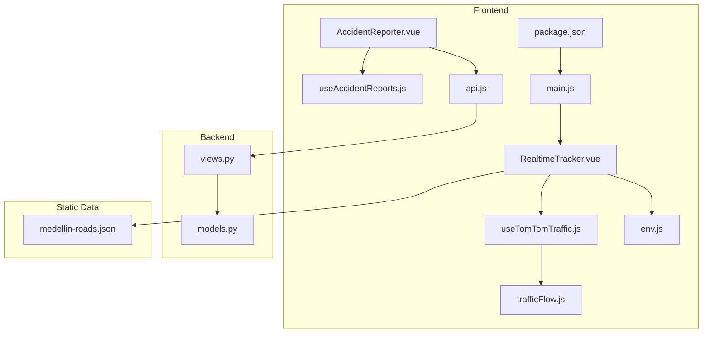
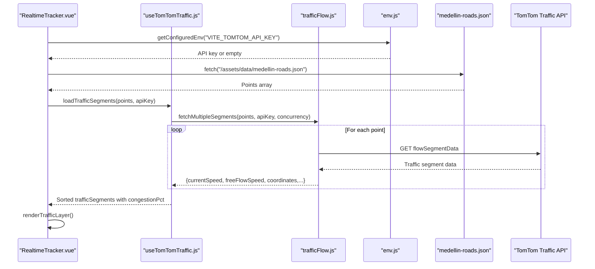
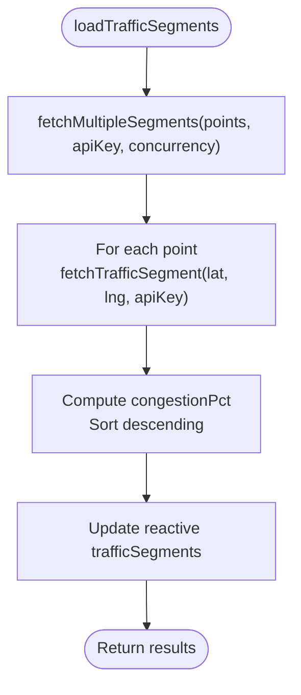
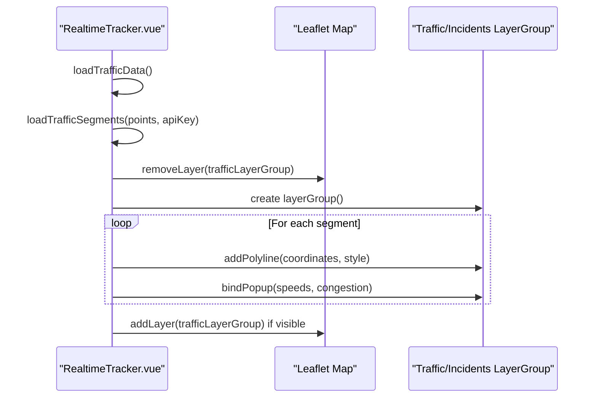
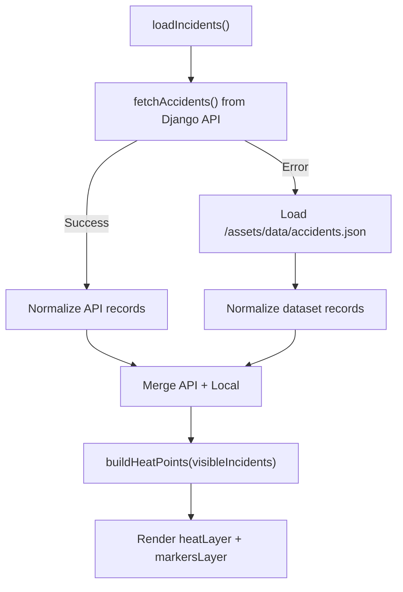
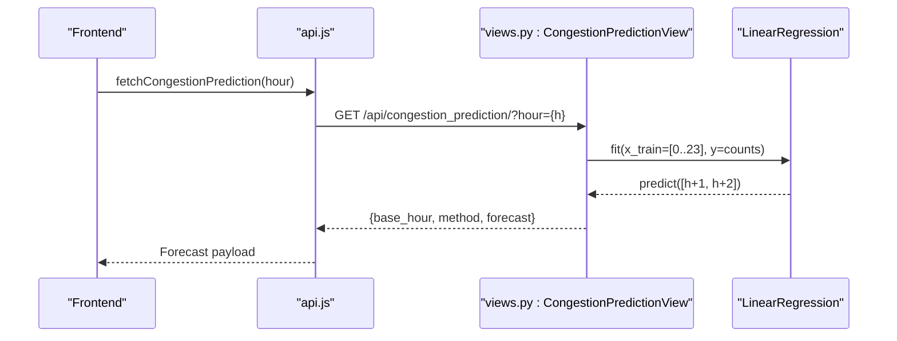
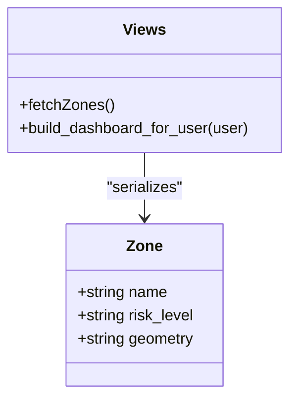
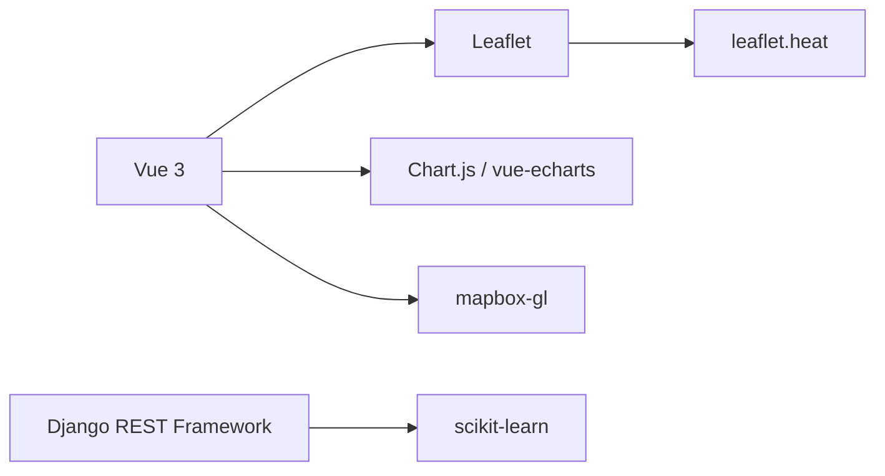

# Traffic Management Features

<cite>
**Referenced Files in This Document**
- [useTomTomTraffic.js](file://src/composables/useTomTomTraffic.js)
- [trafficFlow.js](file://src/assets/js/trafficFlow.js)
- [RealtimeTracker.vue](file://src/components/RealtimeTracker.vue)
- [AccidentReporter.vue](file://src/components/AccidentReporter.vue)
- [useAccidentReports.js](file://src/composables/useAccidentReports.js)
- [api.js](file://frontend/src/services/api.js)
- [views.py](file://backend/api/views.py)
- [models.py](file://backend/api/models.py)
- [medellin-roads.json](file://public/assets/data/medellin-roads.json)
- [env.js](file://src/utils/env.js)
- [main.js](file://src/main.js)
- [package.json](file://package.json)
- [frontend/package.json](file://frontend/package.json)
</cite>

## Table of Contents
1. [Introduction](#introduction)
2. [Project Structure](#project-structure)
3. [Core Components](#core-components)
4. [Architecture Overview](#architecture-overview)
5. [Detailed Component Analysis](#detailed-component-analysis)
6. [Dependency Analysis](#dependency-analysis)
7. [Performance Considerations](#performance-considerations)
8. [Troubleshooting Guide](#troubleshooting-guide)
9. [Conclusion](#conclusion)
10. [Appendices](#appendices)

## Introduction
This document explains the traffic management subsystem with a focus on real-time traffic monitoring and analysis. It covers:
- TomTom API integration for traffic flow data retrieval, speed calculation, and congestion detection
- Vue.js components for traffic visualization, including map overlays, traffic layer management, and dynamic updates
- Accident analysis features including heatmap generation, risk zone identification, and temporal pattern analysis
- Predictive analytics implementation using machine learning models for congestion forecasting
- Concrete examples from the codebase showing data processing workflows, API integration patterns, and visualization techniques
- Configuration options for traffic data sources, parameters for congestion thresholds, and return values for traffic metrics
- Common integration issues with external APIs and their solutions

## Project Structure
The traffic management subsystem spans frontend Vue components, composables for API integration, backend Django REST framework endpoints, and static datasets.

**Diagram sources**
- [RealtimeTracker.vue:1-743](file://src/components/RealtimeTracker.vue#L1-L743)
- [useTomTomTraffic.js:1-130](file://src/composables/useTomTomTraffic.js#L1-L130)
- [trafficFlow.js:1-106](file://src/assets/js/trafficFlow.js#L1-L106)
- [AccidentReporter.vue:1-451](file://src/components/AccidentReporter.vue#L1-L451)
- [useAccidentReports.js:1-73](file://src/composables/useAccidentReports.js#L1-L73)
- [api.js:1-177](file://frontend/src/services/api.js#L1-L177)
- [views.py:1-574](file://backend/api/views.py#L1-L574)
- [models.py:1-50](file://backend/api/models.py#L1-L50)
- [medellin-roads.json:1-23](file://public/assets/data/medellin-roads.json#L1-L23)
- [env.js:1-12](file://src/utils/env.js#L1-L12)
- [main.js:1-20](file://src/main.js#L1-L20)
- [package.json:1-28](file://package.json#L1-L28)

**Section sources**
- [RealtimeTracker.vue:1-743](file://src/components/RealtimeTracker.vue#L1-L743)
- [useTomTomTraffic.js:1-130](file://src/composables/useTomTomTraffic.js#L1-L130)
- [trafficFlow.js:1-106](file://src/assets/js/trafficFlow.js#L1-L106)
- [AccidentReporter.vue:1-451](file://src/components/AccidentReporter.vue#L1-L451)
- [useAccidentReports.js:1-73](file://src/composables/useAccidentReports.js#L1-L73)
- [api.js:1-177](file://frontend/src/services/api.js#L1-L177)
- [views.py:1-574](file://backend/api/views.py#L1-L574)
- [models.py:1-50](file://backend/api/models.py#L1-L50)
- [medellin-roads.json:1-23](file://public/assets/data/medellin-roads.json#L1-L23)
- [env.js:1-12](file://src/utils/env.js#L1-L12)
- [main.js:1-20](file://src/main.js#L1-L20)
- [package.json:1-28](file://package.json#L1-L28)

## Core Components
- TomTom Traffic Integration: Provides traffic segments, congestion percentage, and incident details for Medellín.
- Traffic Visualization: Renders traffic flow as colored polylines and popups with speeds and congestion levels.
- Accident Reporting and Heatmap: Aggregates historical and user-generated reports, generates heatmap and severity markers.
- Predictive Analytics: Forecasts congestion using linear regression on hourly accident counts.
- Environment Configuration: Centralized environment variable validation for API keys.

**Section sources**
- [useTomTomTraffic.js:44-129](file://src/composables/useTomTomTraffic.js#L44-L129)
- [trafficFlow.js:14-105](file://src/assets/js/trafficFlow.js#L14-L105)
- [RealtimeTracker.vue:174-262](file://src/components/RealtimeTracker.vue#L174-L262)
- [AccidentReporter.vue:84-165](file://src/components/AccidentReporter.vue#L84-L165)
- [useAccidentReports.js:48-73](file://src/composables/useAccidentReports.js#L48-L73)
- [views.py:530-574](file://backend/api/views.py#L530-L574)
- [env.js:1-12](file://src/utils/env.js#L1-L12)

## Architecture Overview
The system integrates external APIs and internal datasets to deliver real-time traffic insights and accident analytics.

**Diagram sources**
- [RealtimeTracker.vue:366-382](file://src/components/RealtimeTracker.vue#L366-L382)
- [useTomTomTraffic.js:54-76](file://src/composables/useTomTomTraffic.js#L54-L76)
- [trafficFlow.js:87-105](file://src/assets/js/trafficFlow.js#L87-L105)
- [env.js:1-12](file://src/utils/env.js#L1-L12)
- [medellin-roads.json:1-23](file://public/assets/data/medellin-roads.json#L1-L23)

## Detailed Component Analysis

### TomTom Traffic Integration
- Purpose: Retrieve real-time traffic flow data for selected road points, compute congestion percentage, and normalize geometry for incident overlays.
- Key functions:
  - loadTrafficSegments(points, apiKey, concurrency): orchestrates fetching and transforms results into a structured format with congestion percentage and color.
  - loadTrafficIncidents(apiKey, bbox, options): queries TomTom incident details with configurable filters and language.
  - normalizeIncidentGeometry(geometry): converts TomTom geometry types to Leaflet-compatible coordinates.
  - getIncidentColor(category): maps incident categories to colors for visualization.
  - getIncidentLabel(incident): extracts a human-readable label from incident metadata.

**Diagram sources**
- [useTomTomTraffic.js:54-76](file://src/composables/useTomTomTraffic.js#L54-L76)
- [trafficFlow.js:87-105](file://src/assets/js/trafficFlow.js#L87-L105)

**Section sources**
- [useTomTomTraffic.js:44-129](file://src/composables/useTomTomTraffic.js#L44-L129)
- [trafficFlow.js:14-105](file://src/assets/js/trafficFlow.js#L14-L105)

### Traffic Visualization in RealtimeTracker.vue
- Purpose: Render traffic flow and incidents on a Leaflet map, manage visibility toggles, and simulate vehicle movement.
- Key behaviors:
  - Initializes Leaflet map and tile layer.
  - Renders traffic layer using congestionPct to set line width and color.
  - Renders incidents layer using normalized geometries and category-based colors.
  - Periodically refreshes traffic and incidents data at configured intervals.
  - Manages GPS tracking and simulated vehicle positions.

**Diagram sources**
- [RealtimeTracker.vue:174-208](file://src/components/RealtimeTracker.vue#L174-L208)
- [RealtimeTracker.vue:366-382](file://src/components/RealtimeTracker.vue#L366-L382)

**Section sources**
- [RealtimeTracker.vue:151-262](file://src/components/RealtimeTracker.vue#L151-L262)
- [RealtimeTracker.vue:366-415](file://src/components/RealtimeTracker.vue#L366-L415)

### Accident Analysis and Heatmap
- Purpose: Aggregate historical and user-generated accident reports, generate heatmap intensity, and display severity markers.
- Key functions:
  - buildHeatPoints(incidents): constructs [lat, lng, intensity] tuples for heatmap.
  - severityColor/severityLabel: maps severity levels to colors and labels.
  - loadStoredAccidents/persistStoredAccidents: manages local storage of user reports.
  - renderMapLayers(): creates Leaflet heat layer and severity markers.

**Diagram sources**
- [AccidentReporter.vue:116-165](file://src/components/AccidentReporter.vue#L116-L165)
- [useAccidentReports.js:48-73](file://src/composables/useAccidentReports.js#L48-L73)

**Section sources**
- [AccidentReporter.vue:84-165](file://src/components/AccidentReporter.vue#L84-L165)
- [useAccidentReports.js:16-46](file://src/composables/useAccidentReports.js#L16-L46)

### Predictive Analytics for Congestion Forecasting
- Purpose: Forecast future congestion based on historical accident patterns using linear regression.
- Implementation:
  - Backend endpoint computes hourly counts and fits a linear regression model.
  - Returns predicted accident counts for the next hours and assigns risk levels.

**Diagram sources**
- [api.js:75-82](file://frontend/src/services/api.js#L75-L82)
- [views.py:530-574](file://backend/api/views.py#L530-L574)

**Section sources**
- [api.js:75-82](file://frontend/src/services/api.js#L75-L82)
- [views.py:530-574](file://backend/api/views.py#L530-L574)

### Risk Zone Identification
- Purpose: Provide risk zones with GeoJSON polygons and derive recommended safe routes.
- Data model:
  - Zone model defines name, risk_level, and serialized geometry.
- Frontend consumption:
  - Zones are fetched via API and rendered as GeoJSON features on the map.

**Diagram sources**
- [models.py:19-38](file://backend/api/models.py#L19-L38)
- [views.py:383-386](file://backend/api/views.py#L383-L386)

**Section sources**
- [models.py:19-38](file://backend/api/models.py#L19-L38)
- [views.py:383-386](file://backend/api/views.py#L383-L386)

## Dependency Analysis
- Frontend dependencies include Vue 3, Leaflet, Chart.js, and ECharts. These libraries support interactive maps, charts, and real-time updates.
- Backend depends on Django REST framework and scikit-learn for ML-based forecasting.
- Environment configuration centralizes API key validation to prevent runtime errors from invalid keys.

**Diagram sources**
- [package.json:12-22](file://package.json#L12-L22)
- [frontend/package.json:11-18](file://frontend/package.json#L11-L18)
- [views.py:548-558](file://backend/api/views.py#L548-L558)

**Section sources**
- [package.json:12-22](file://package.json#L12-L22)
- [frontend/package.json:11-18](file://frontend/package.json#L11-L18)
- [views.py:548-558](file://backend/api/views.py#L548-L558)

## Performance Considerations
- Concurrency control: Traffic segment fetching batches requests to limit concurrent calls and avoid rate limits.
- Reactive updates: Vue reactivity triggers minimal DOM updates when traffic layers are toggled or refreshed.
- Visualization optimization: Heatmap radius and blur are tuned for readability and performance.
- Data normalization: Geometry normalization ensures consistent rendering across incident types.

[No sources needed since this section provides general guidance]

## Troubleshooting Guide
Common integration issues and resolutions:
- Missing TomTom API key:
  - Symptom: Traffic layer disabled with warnings.
  - Resolution: Set VITE_TOMTOM_API_KEY in environment; the composable validates and warns when missing.
- HTTP errors from TomTom:
  - Symptom: Incidents or traffic requests fail.
  - Resolution: Check API key validity, region coverage, and network connectivity; the composable surfaces HTTP errors.
- CORS and proxy:
  - Symptom: Cross-origin failures when calling external APIs.
  - Resolution: Configure Vite proxy or backend CORS policies to allow client requests.
- Rate limiting:
  - Symptom: Some traffic segments return null.
  - Resolution: Respect concurrency limits and retry strategies; the utility already batches requests.
- Local storage persistence:
  - Symptom: Reports disappear after reload.
  - Resolution: Ensure browser supports localStorage; the composable persists and loads user reports.

**Section sources**
- [useTomTomTraffic.js:78-114](file://src/composables/useTomTomTraffic.js#L78-L114)
- [env.js:1-12](file://src/utils/env.js#L1-L12)
- [useAccidentReports.js:54-73](file://src/composables/useAccidentReports.js#L54-L73)

## Conclusion
The traffic management subsystem integrates TomTom traffic data with local datasets and backend analytics to provide real-time monitoring, visualization, and predictive insights. The modular design with Vue composables, Leaflet overlays, and Django endpoints enables scalable enhancements for congestion forecasting, risk zone management, and user-driven reporting.

[No sources needed since this section summarizes without analyzing specific files]

## Appendices

### Configuration Options and Parameters
- Traffic data sources:
  - medellin-roads.json: Points used to query TomTom flow segment data.
  - Environment variable: VITE_TOMTOM_API_KEY for TomTom authentication.
- Congestion thresholds:
  - Traffic color and level mapping:
    - Free flow: ratio >= 0.80
    - Moderate: 0.40 <= ratio < 0.80
    - Heavy: ratio < 0.40
- Return values for traffic metrics:
  - Traffic segment includes currentSpeed, freeFlowSpeed, currentTravelTime, freeFlowTravelTime, confidence, roadClosure, ratio, color, level, coordinates.

**Section sources**
- [medellin-roads.json:1-23](file://public/assets/data/medellin-roads.json#L1-L23)
- [env.js:1-12](file://src/utils/env.js#L1-L12)
- [trafficFlow.js:14-34](file://src/assets/js/trafficFlow.js#L14-L34)
- [trafficFlow.js:62-73](file://src/assets/js/trafficFlow.js#L62-L73)

### API Endpoints for Traffic and Analytics
- Traffic incidents: GET /api/traffic/incidents/ (backend endpoint definition).
- Congestion prediction: GET /api/congestion_prediction/?hour={h} (returns base_hour, method, forecast).
- Zones: GET /api/zones/ (returns Zone list).
- Accidents: GET /api/accidents/?hour_from={h}&hour_to={h} (filters by hour range).

**Section sources**
- [views.py:27-45](file://backend/api/views.py#L27-L45)
- [views.py:530-574](file://backend/api/views.py#L530-L574)
- [views.py:383-386](file://backend/api/views.py#L383-L386)
- [views.py:365-381](file://backend/api/views.py#L365-L381)