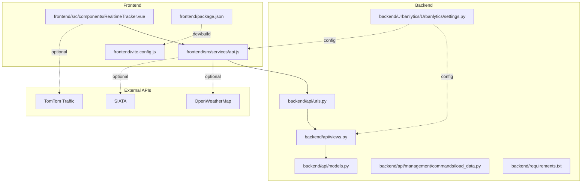
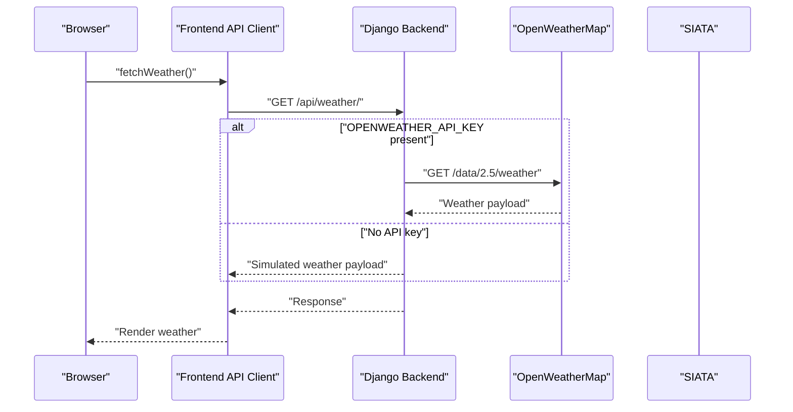
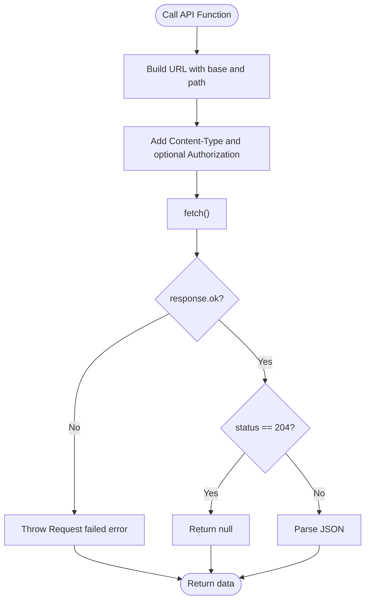
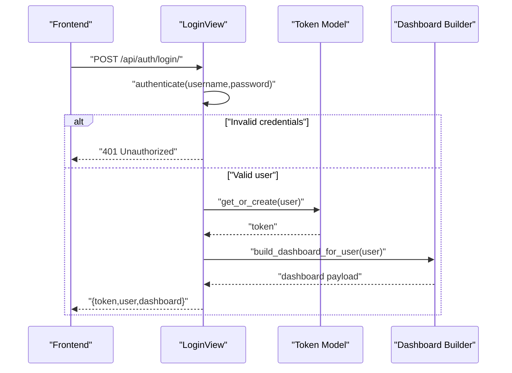
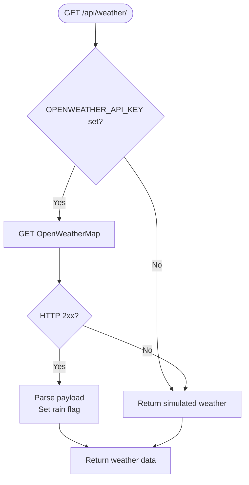
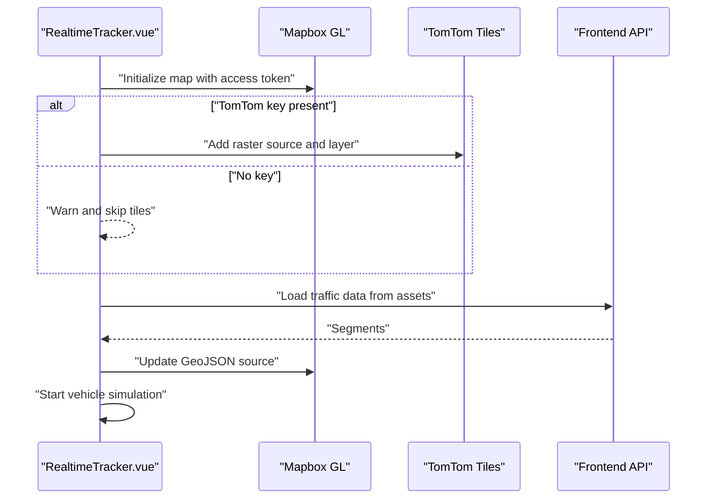
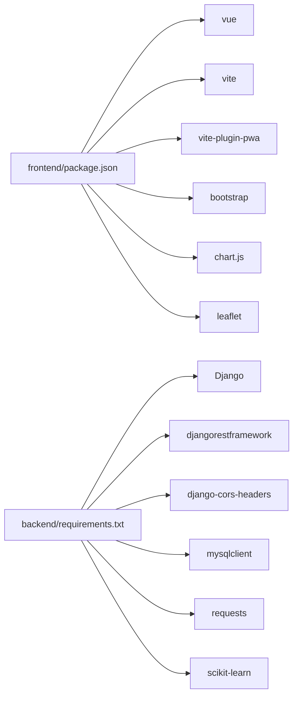

# Troubleshooting and FAQ

<cite>
**Referenced Files in This Document**
- [README.md](file://README.md)
- [backend/requirements.txt](file://backend/requirements.txt)
- [backend/requeriments.txt](file://backend/requeriments.txt)
- [frontend/package.json](file://frontend/package.json)
- [frontend/vite.config.js](file://frontend/vite.config.js)
- [backend/Urbanlytics/Urbanlytics/settings.py](file://backend/Urbanlytics/Urbanlytics/settings.py)
- [backend/api/views.py](file://backend/api/views.py)
- [backend/api/models.py](file://backend/api/models.py)
- [backend/api/urls.py](file://backend/api/urls.py)
- [backend/api/management/commands/load_data.py](file://backend/api/management/commands/load_data.py)
- [frontend/src/services/api.js](file://frontend/src/services/api.js)
- [frontend/src/components/RealtimeTracker.vue](file://frontend/src/components/RealtimeTracker.vue)
- [src/composables/useTomTomTraffic.js](file://src/composables/useTomTomTraffic.js)
</cite>

## Table of Contents
1. [Introduction](#introduction)
2. [Project Structure](#project-structure)
3. [Core Components](#core-components)
4. [Architecture Overview](#architecture-overview)
5. [Detailed Component Analysis](#detailed-component-analysis)
6. [Dependency Analysis](#dependency-analysis)
7. [Performance Considerations](#performance-considerations)
8. [Troubleshooting Guide](#troubleshooting-guide)
9. [Conclusion](#conclusion)
10. [Appendices](#appendices)

## Introduction
This document provides a comprehensive troubleshooting guide for the Urbanlytics system. It focuses on diagnosing and resolving common issues across frontend components, backend services, and external API integrations. It also covers build and deployment challenges, performance tuning, error interpretation, logging, monitoring, and preventive best practices. The content is grounded in the repository’s configuration and source files to ensure accurate, actionable guidance.

## Project Structure
The system comprises:
- Frontend built with Vue 3 and Vite, including PWA capabilities via vite-plugin-pwa.
- Backend built with Django and Django REST Framework, serving static data and optional live weather integrations.
- Optional integrations with OpenWeatherMap, SIATA, and TomTom Traffic APIs.
- Sample datasets under public assets for local development.

**Diagram sources**
- [frontend/src/services/api.js:1-177](file://frontend/src/services/api.js#L1-L177)
- [frontend/src/components/RealtimeTracker.vue:1-776](file://frontend/src/components/RealtimeTracker.vue#L1-L776)
- [frontend/vite.config.js:1-44](file://frontend/vite.config.js#L1-L44)
- [frontend/package.json:1-25](file://frontend/package.json#L1-L25)
- [backend/Urbanlytics/Urbanlytics/settings.py:1-141](file://backend/Urbanlytics/Urbanlytics/settings.py#L1-L141)
- [backend/api/urls.py:1-42](file://backend/api/urls.py#L1-L42)
- [backend/api/views.py:1-574](file://backend/api/views.py#L1-L574)
- [backend/api/models.py:1-50](file://backend/api/models.py#L1-L50)
- [backend/api/management/commands/load_data.py:1-12](file://backend/api/management/commands/load_data.py#L1-L12)
- [backend/requirements.txt:1-7](file://backend/requirements.txt#L1-L7)

**Section sources**
- [README.md:1-82](file://README.md#L1-L82)
- [frontend/package.json:1-25](file://frontend/package.json#L1-L25)
- [frontend/vite.config.js:1-44](file://frontend/vite.config.js#L1-L44)
- [backend/requirements.txt:1-7](file://backend/requirements.txt#L1-L7)
- [backend/Urbanlytics/Urbanlytics/settings.py:1-141](file://backend/Urbanlytics/Urbanlytics/settings.py#L1-L141)

## Core Components
- Frontend API client encapsulates HTTP calls, token handling, and endpoint routing.
- Backend Django app exposes REST endpoints for authentication, dashboards, accidents, zones, weather, and congestion prediction.
- Real-time tracking component integrates Mapbox, optional TomTom raster tiles, and simulated vehicle routes.
- Environment-driven integrations for OpenWeatherMap and SIATA weather; TomTom traffic requires API keys.

Key configuration touchpoints:
- Frontend base URL and PWA manifest generation.
- Backend CORS origins and credentials, REST defaults, and SQLite by default.
- Weather endpoints with fallback behavior when API keys are missing.

**Section sources**
- [frontend/src/services/api.js:1-177](file://frontend/src/services/api.js#L1-L177)
- [backend/api/views.py:1-574](file://backend/api/views.py#L1-L574)
- [backend/Urbanlytics/Urbanlytics/settings.py:130-136](file://backend/Urbanlytics/Urbanlytics/settings.py#L130-L136)
- [frontend/src/components/RealtimeTracker.vue:204-295](file://frontend/src/components/RealtimeTracker.vue#L204-L295)
- [backend/api/urls.py:23-41](file://backend/api/urls.py#L23-L41)

## Architecture Overview
The frontend communicates with the backend via REST endpoints. Weather data can be fetched from OpenWeatherMap or SIATA when configured. The real-time tracking component optionally consumes TomTom Traffic via raster tiles and simulated traffic segments.

**Diagram sources**
- [frontend/src/services/api.js:52-54](file://frontend/src/services/api.js#L52-L54)
- [backend/api/views.py:389-442](file://backend/api/views.py#L389-L442)

**Section sources**
- [frontend/src/services/api.js:1-177](file://frontend/src/services/api.js#L1-L177)
- [backend/api/views.py:389-442](file://backend/api/views.py#L389-L442)

## Detailed Component Analysis

### Frontend API Client
Common issues:
- Incorrect base URL leading to cross-origin errors.
- Missing Authorization header causing 401/403 responses.
- Network timeouts or non-JSON responses.

Diagnostic steps:
- Verify the base URL constant and environment variable override.
- Confirm Authorization header injection for protected endpoints.
- Inspect network tab for request/response payloads and status codes.

**Diagram sources**
- [frontend/src/services/api.js:3-21](file://frontend/src/services/api.js#L3-L21)

**Section sources**
- [frontend/src/services/api.js:1-177](file://frontend/src/services/api.js#L1-L177)

### Backend Authentication and Endpoints
Common issues:
- Invalid credentials returning 401.
- Missing permissions returning 403.
- Misconfigured CORS blocking frontend requests.
- Database initialization issues for seed data.

Diagnostic steps:
- Validate credentials against the User model.
- Confirm token creation and deletion flows.
- Check CORS_ALLOWED_ORIGINS and credentials setting.
- Ensure migrations are applied and seed data loaded.

**Diagram sources**
- [backend/api/views.py:89-113](file://backend/api/views.py#L89-L113)

**Section sources**
- [backend/api/views.py:89-130](file://backend/api/views.py#L89-L130)
- [backend/Urbanlytics/Urbanlytics/settings.py:130-136](file://backend/Urbanlytics/Urbanlytics/settings.py#L130-L136)

### Weather Integrations
Common issues:
- Missing API keys result in fallback responses.
- Network errors or timeouts from external services.
- Parsing differences across weather providers.

Diagnostic steps:
- Check environment variables for OpenWeatherMap and SIATA.
- Inspect fallback behavior and returned detail messages.
- Validate request parameters and response shape expectations.

**Diagram sources**
- [backend/api/views.py:389-442](file://backend/api/views.py#L389-L442)

**Section sources**
- [backend/api/views.py:389-508](file://backend/api/views.py#L389-L508)

### Real-time Tracking Component
Common issues:
- Missing Mapbox or TomTom API keys preventing tile rendering.
- Geolocation permission denied or unsupported.
- Vehicle simulation and traffic layer toggling not working.

Diagnostic steps:
- Verify VITE_MAPBOX_ACCESS_TOKEN and VITE_TOMTOM_API_KEY presence.
- Check geolocation status and error handling.
- Confirm traffic layer visibility toggling and last update timestamps.

**Diagram sources**
- [frontend/src/components/RealtimeTracker.vue:204-295](file://frontend/src/components/RealtimeTracker.vue#L204-L295)
- [frontend/src/components/RealtimeTracker.vue:419-446](file://frontend/src/components/RealtimeTracker.vue#L419-L446)

**Section sources**
- [frontend/src/components/RealtimeTracker.vue:204-295](file://frontend/src/components/RealtimeTracker.vue#L204-L295)
- [frontend/src/components/RealtimeTracker.vue:419-446](file://frontend/src/components/RealtimeTracker.vue#L419-L446)

## Dependency Analysis
- Frontend depends on Vue 3, Vite, and PWA plugin; build and preview scripts are defined.
- Backend depends on Django, REST framework, CORS headers, MySQL client, requests, and scikit-learn.
- Environment variables drive optional integrations and PWA behavior.

**Diagram sources**
- [frontend/package.json:11-23](file://frontend/package.json#L11-L23)
- [backend/requirements.txt:1-7](file://backend/requirements.txt#L1-L7)

**Section sources**
- [frontend/package.json:1-25](file://frontend/package.json#L1-L25)
- [backend/requirements.txt:1-7](file://backend/requirements.txt#L1-L7)

## Performance Considerations
- Network timeouts: External API calls include explicit timeouts; adjust if needed for reliability.
- PWA caching: Workbox configuration increases maximum file size; ensure assets fit within limits.
- Data volume: Weather and traffic endpoints should avoid unnecessary parsing; cache where appropriate.
- Memory leaks: Ensure cleanup of intervals, watchers, and map resources on component unmount.

[No sources needed since this section provides general guidance]

## Troubleshooting Guide

### API Integration Failures
Symptoms:
- Frontend receives 401/403 or CORS errors.
- Weather endpoints return fallback data unexpectedly.

Resolution steps:
- Verify backend CORS settings and credentials.
- Confirm frontend base URL matches backend origin.
- Check environment variables for weather API keys.

**Section sources**
- [backend/Urbanlytics/Urbanlytics/settings.py:130-136](file://backend/Urbanlytics/Urbanlytics/settings.py#L130-L136)
- [frontend/src/services/api.js:1-177](file://frontend/src/services/api.js#L1-L177)
- [backend/api/views.py:389-442](file://backend/api/views.py#L389-L442)

### Database Connection Issues
Symptoms:
- SQLite default works locally; migration to MySQL fails.
- Seed data not available after initial setup.

Resolution steps:
- Review database configuration and environment variables for MySQL.
- Apply migrations and run the seed data command.
- Validate model definitions and relationships.

**Section sources**
- [backend/requirements.txt:4-4](file://backend/requirements.txt#L4-L4)
- [backend/api/models.py:5-50](file://backend/api/models.py#L5-L50)
- [backend/api/management/commands/load_data.py:9-11](file://backend/api/management/commands/load_data.py#L9-L11)

### Build Errors
Symptoms:
- Vite build fails or preview does not serve assets.
- PWA manifest or offline page not generated.

Resolution steps:
- Ensure Node.js and npm versions meet requirements.
- Install dependencies and rebuild.
- Confirm PWA plugin configuration and manifest filename.

**Section sources**
- [README.md:21-34](file://README.md#L21-L34)
- [frontend/package.json:6-10](file://frontend/package.json#L6-L10)
- [frontend/vite.config.js:8-42](file://frontend/vite.config.js#L8-L42)

### Deployment Challenges
Symptoms:
- Netlify/GitHub Pages builds fail or serve stale content.
- PWA offline behavior not working.

Resolution steps:
- Use the documented build and publish commands.
- Verify dist folder contents and base href if applicable.
- Confirm service worker registration and offline fallback.

**Section sources**
- [README.md:60-69](file://README.md#L60-L69)
- [frontend/vite.config.js:8-42](file://frontend/vite.config.js#L8-L42)

### Frontend Component Diagnostics
Symptoms:
- Map does not render or tiles are missing.
- Geolocation shows denied or unsupported.
- Traffic layer not visible.

Resolution steps:
- Check Mapbox and TomTom API keys.
- Validate geolocation permissions and error handling.
- Toggle traffic layer and inspect last update timestamps.

**Section sources**
- [frontend/src/components/RealtimeTracker.vue:204-295](file://frontend/src/components/RealtimeTracker.vue#L204-L295)
- [frontend/src/components/RealtimeTracker.vue:345-398](file://frontend/src/components/RealtimeTracker.vue#L345-L398)
- [frontend/src/components/RealtimeTracker.vue:448-459](file://frontend/src/components/RealtimeTracker.vue#L448-L459)

### Backend Service Diagnostics
Symptoms:
- Authentication fails or tokens not issued.
- Admin endpoints return forbidden.
- Weather endpoints error out.

Resolution steps:
- Validate user credentials and permissions.
- Confirm admin checks and user counts.
- Inspect weather endpoint exceptions and fallback payloads.

**Section sources**
- [backend/api/views.py:89-130](file://backend/api/views.py#L89-L130)
- [backend/api/views.py:140-147](file://backend/api/views.py#L140-L147)
- [backend/api/views.py:389-508](file://backend/api/views.py#L389-L508)

### External API Connections
Symptoms:
- OpenWeatherMap/SIATA calls fail silently.
- TomTom traffic tiles not visible.

Resolution steps:
- Set required environment variables for each provider.
- Inspect response shapes and normalize parsing.
- Confirm raster tile URLs and API key validity.

**Section sources**
- [backend/api/views.py:389-508](file://backend/api/views.py#L389-L508)
- [frontend/src/components/RealtimeTracker.vue:220-236](file://frontend/src/components/RealtimeTracker.vue#L220-L236)

### Performance Issues and Memory Leaks
Symptoms:
- Slow UI updates or excessive re-renders.
- Stutters during traffic data updates.

Resolution steps:
- Debounce or throttle frequent updates.
- Cancel intervals and watchers on unmount.
- Profile network requests and reduce payload sizes.

**Section sources**
- [frontend/src/components/RealtimeTracker.vue:335-343](file://frontend/src/components/RealtimeTracker.vue#L335-L343)
- [frontend/src/components/RealtimeTracker.vue:466-475](file://frontend/src/components/RealtimeTracker.vue#L466-L475)

### Browser Compatibility Problems
Symptoms:
- Geolocation not supported or blocked.
- PWA features unavailable.

Resolution steps:
- Test on supported browsers and enable geolocation permissions.
- Validate PWA manifest and service worker registration.

**Section sources**
- [frontend/src/components/RealtimeTracker.vue:345-398](file://frontend/src/components/RealtimeTracker.vue#L345-L398)
- [frontend/vite.config.js:8-42](file://frontend/vite.config.js#L8-L42)

### Error Message Interpretation
Common backend error patterns:
- 400 Bad Request for invalid parameters (e.g., hour filters).
- 401 Unauthorized for invalid credentials.
- 403 Forbidden for non-admin access attempts.
- 404 Not Found for missing resources.

Frontend error patterns:
- Non-OK responses raise generic request errors.
- 204 No Content indicates empty responses.

**Section sources**
- [backend/api/views.py:376-378](file://backend/api/views.py#L376-L378)
- [backend/api/views.py:102-103](file://backend/api/views.py#L102-L103)
- [backend/api/views.py:144-146](file://backend/api/views.py#L144-L146)
- [backend/api/views.py:178-181](file://backend/api/views.py#L178-L181)
- [frontend/src/services/api.js:12-14](file://frontend/src/services/api.js#L12-L14)

### Log Analysis Techniques
Recommended practices:
- Enable backend DEBUG mode temporarily for detailed logs.
- Capture frontend network logs and console warnings.
- Monitor external API response times and error rates.

**Section sources**
- [backend/Urbanlytics/Urbanlytics/settings.py:26-26](file://backend/Urbanlytics/Urbanlytics/settings.py#L26-L26)

### Monitoring Setup
Recommended practices:
- Track uptime of weather endpoints and external APIs.
- Monitor frontend bundle sizes and PWA cache health.
- Set up alerts for authentication failures and CORS violations.

[No sources needed since this section provides general guidance]

### Development Environment Setup Problems
Common issues:
- Node/npm version mismatch.
- Missing environment variables for weather or PWA.
- Conflicting Python dependencies.

Resolution steps:
- Match Node.js and npm versions per README.
- Create environment files for API keys.
- Use virtual environments and install requirements.

**Section sources**
- [README.md:21-34](file://README.md#L21-L34)
- [backend/requirements.txt:1-7](file://backend/requirements.txt#L1-L7)
- [backend/requeriments.txt:1-1](file://backend/requeriments.txt#L1-L1)

### Step-by-Step Resolution Guides

#### API Key Issues (OpenWeatherMap/SIATA)
Steps:
- Set the required environment variables for the chosen provider.
- Restart backend to reload environment.
- Verify weather endpoints return real data.

**Section sources**
- [README.md:42-51](file://README.md#L42-L51)
- [backend/api/views.py:389-508](file://backend/api/views.py#L389-L508)

#### CORS Problems
Steps:
- Ensure frontend origin is included in CORS_ALLOWED_ORIGINS.
- Confirm credentials are allowed if using cookies/tokens.
- Test preflight requests and headers.

**Section sources**
- [backend/Urbanlytics/Urbanlytics/settings.py:130-136](file://backend/Urbanlytics/Urbanlytics/settings.py#L130-L136)

#### Data Loading Failures
Steps:
- Confirm seed data command runs successfully.
- Verify model fields match expected JSON structure.
- Check database engine and migrations.

**Section sources**
- [backend/api/management/commands/load_data.py:9-11](file://backend/api/management/commands/load_data.py#L9-L11)
- [backend/api/models.py:5-50](file://backend/api/models.py#L5-L50)

#### TomTom Traffic Layer Not Visible
Steps:
- Provide VITE_TOMTOM_API_KEY.
- Confirm raster tile URL and API key validity.
- Check browser console for tile loading errors.

**Section sources**
- [frontend/src/components/RealtimeTracker.vue:220-236](file://frontend/src/components/RealtimeTracker.vue#L220-L236)

#### Mapbox Access Token Issues
Steps:
- Provide VITE_MAPBOX_ACCESS_TOKEN.
- Verify map initialization and navigation controls.
- Check browser console for token-related warnings.

**Section sources**
- [frontend/src/components/RealtimeTracker.vue:204-218](file://frontend/src/components/RealtimeTracker.vue#L204-L218)

### Preventive Measures and Best Practices
- Keep dependencies updated and pinned appropriately.
- Use environment-specific settings and secrets management.
- Implement graceful fallbacks for external services.
- Add unit/integration tests for critical flows.

[No sources needed since this section provides general guidance]

### Maintenance Procedures
- Regularly review and rotate API keys.
- Audit CORS origins and credentials periodically.
- Monitor PWA cache growth and update strategies.

[No sources needed since this section provides general guidance]

### Support Resources, Escalation, and Community
- Use the repository’s README for environment and deployment guidance.
- Report issues with logs, reproduction steps, and environment details.

**Section sources**
- [README.md:1-82](file://README.md#L1-L82)

## Conclusion
This guide consolidates practical troubleshooting steps for Urbanlytics across frontend, backend, and external integrations. By following the diagnostic procedures, resolution guides, and best practices outlined here, teams can quickly identify and resolve common issues while establishing robust operational hygiene for ongoing maintenance and scaling.

[No sources needed since this section summarizes without analyzing specific files]

## Appendices

### API Endpoint Reference
- Authentication: POST /api/auth/login/, POST /api/auth/logout/, GET /api/auth/me/
- Dashboard: GET /api/dashboard/
- Accidents: GET /api/accidents/?hour_from=&hour_to=
- Zones: GET /api/zones/
- Weather: GET /api/weather/, GET /api/siata_weather/
- Simulation: POST /api/simulate_rain/
- Admin: GET/POST/PUT/PATCH/DELETE /api/admin/{accidents,zones,users}/

**Section sources**
- [backend/api/urls.py:23-41](file://backend/api/urls.py#L23-L41)
- [backend/api/views.py:27-45](file://backend/api/views.py#L27-L45)