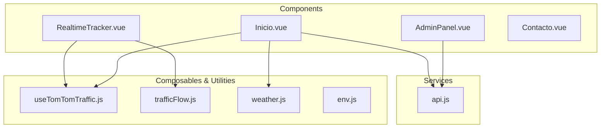
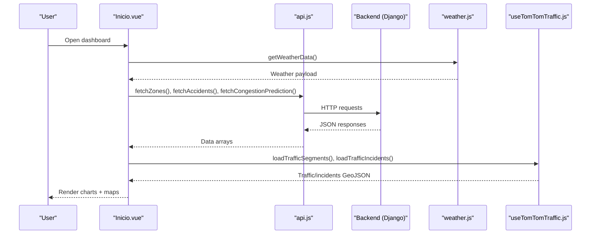
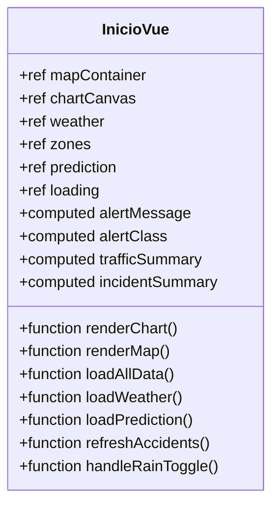
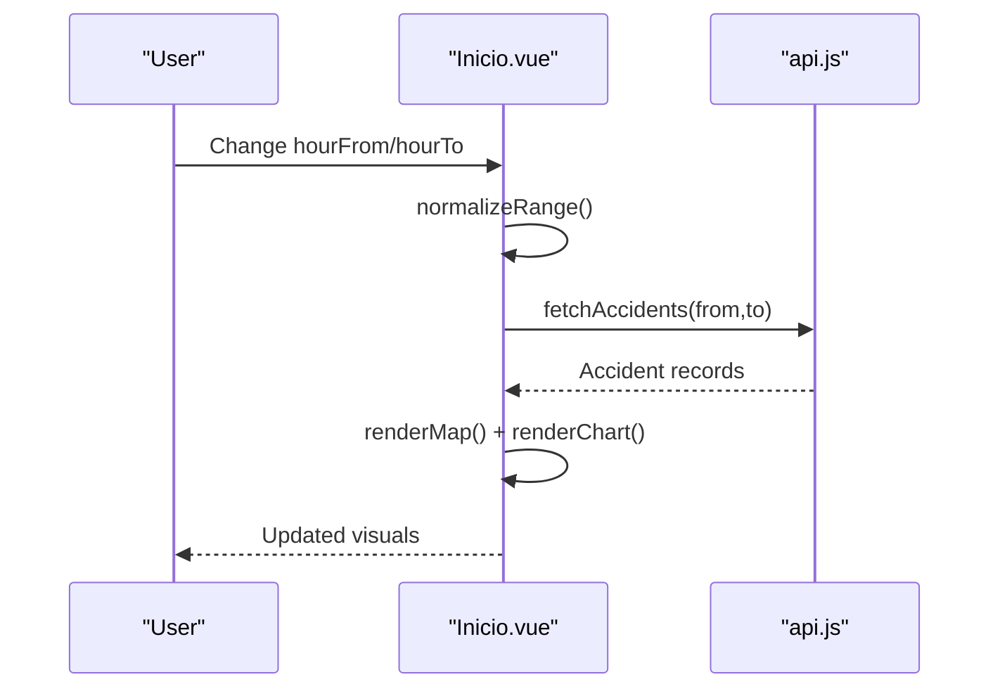
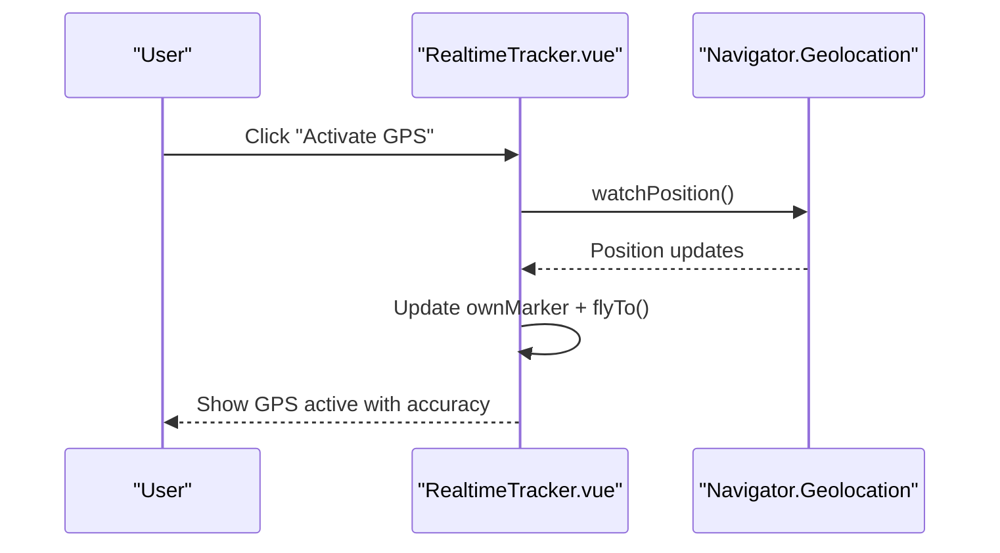
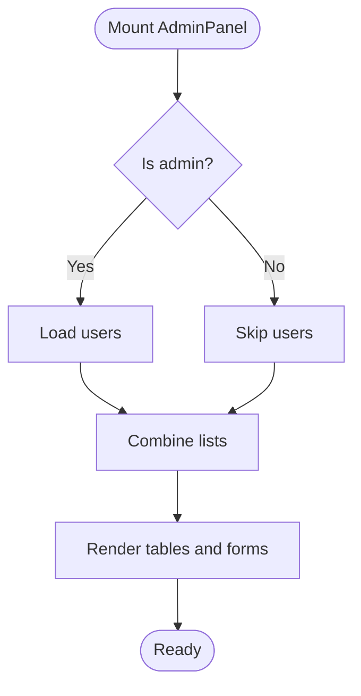
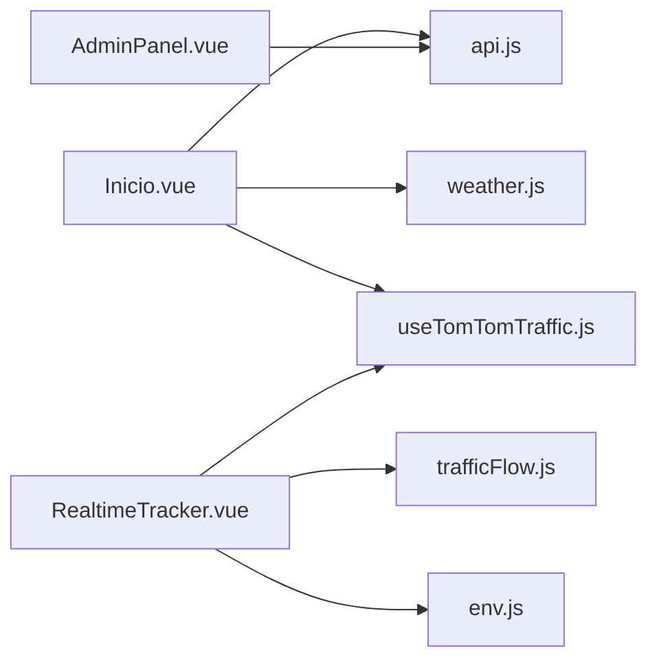

# User Interface Components

<cite>
**Referenced Files in This Document**
- [Inicio.vue](file://frontend/src/components/Inicio.vue)
- [RealtimeTracker.vue](file://frontend/src/components/RealtimeTracker.vue)
- [AdminPanel.vue](file://frontend/src/components/admin/AdminPanel.vue)
- [useTomTomTraffic.js](file://src/composables/useTomTomTraffic.js)
- [trafficFlow.js](file://src/assets/js/trafficFlow.js)
- [weather.js](file://src/assets/js/weather.js)
- [env.js](file://src/utils/env.js)
- [api.js](file://frontend/src/services/api.js)
- [trafficFlow.js (frontend)](file://frontend/src/assets/js/trafficFlow.js)
- [Contacto.vue](file://frontend/src/components/Contacto.vue)
</cite>

## Table of Contents
1. [Introduction](#introduction)
2. [Project Structure](#project-structure)
3. [Core Components](#core-components)
4. [Architecture Overview](#architecture-overview)
5. [Detailed Component Analysis](#detailed-component-analysis)
6. [Dependency Analysis](#dependency-analysis)
7. [Performance Considerations](#performance-considerations)
8. [Troubleshooting Guide](#troubleshooting-guide)
9. [Conclusion](#conclusion)
10. [Appendices](#appendices)

## Introduction
This document describes the Vue.js UI component library focused on interactive dashboards and administrative interfaces for urban mobility in Medellín. It covers:
- The main dashboard component (Inicio.vue) with traffic visualization, weather display, and risk assessment panels
- The real-time tracking interface (RealtimeTracker.vue) for vehicle monitoring, GPS simulation, and traffic layer integration
- The administrative panel (AdminPanel.vue) for user management, data administration, and system monitoring
It also documents component props/events/slots/customization, responsive design, accessibility, cross-browser compatibility, animations/transitions, Bootstrap integration, and extension guidelines.

## Project Structure
The frontend is organized around reusable Vue 3 Single File Components (SFCs) under the src/components directory, with shared composables, utilities, and services:
- Dashboard: Inicio.vue
- Real-time tracking: RealtimeTracker.vue
- Administration: AdminPanel.vue
- Shared utilities: useTomTomTraffic.js, trafficFlow.js, weather.js, env.js
- Services: api.js (frontend)
- Additional pages: Contacto.vue

**Diagram sources**
- [Inicio.vue](file://frontend/src/components/Inicio.vue)
- [RealtimeTracker.vue](file://frontend/src/components/RealtimeTracker.vue)
- [AdminPanel.vue](file://frontend/src/components/admin/AdminPanel.vue)
- [useTomTomTraffic.js](file://src/composables/useTomTomTraffic.js)
- [trafficFlow.js](file://src/assets/js/trafficFlow.js)
- [weather.js](file://src/assets/js/weather.js)
- [env.js](file://src/utils/env.js)
- [api.js](file://frontend/src/services/api.js)

**Section sources**
- [Inicio.vue](file://frontend/src/components/Inicio.vue)
- [RealtimeTracker.vue](file://frontend/src/components/RealtimeTracker.vue)
- [AdminPanel.vue](file://frontend/src/components/admin/AdminPanel.vue)
- [useTomTomTraffic.js](file://src/composables/useTomTomTraffic.js)
- [trafficFlow.js](file://src/assets/js/trafficFlow.js)
- [weather.js](file://src/assets/js/weather.js)
- [env.js](file://src/utils/env.js)
- [api.js](file://frontend/src/services/api.js)

## Core Components
- Inicio.vue: Comprehensive dashboard integrating traffic, weather, risk zones, and congestion forecasting. Uses Chart.js for time-series visualization and Leaflet/Mapbox for maps.
- RealtimeTracker.vue: Live vehicle tracking with simulated routes, GPS device tracking, TomTom traffic/incidents overlays, and toggles for layers.
- AdminPanel.vue: Administrative interface for managing accidents, zones, and users with role-aware sections and token-based authentication.

Key capabilities:
- Real-time data fetching and caching
- Interactive charts and maps
- Role-based UI and permissions
- Responsive design with Bootstrap utilities
- Accessibility-compliant markup and ARIA attributes

**Section sources**
- [Inicio.vue](file://frontend/src/components/Inicio.vue)
- [RealtimeTracker.vue](file://frontend/src/components/RealtimeTracker.vue)
- [AdminPanel.vue](file://frontend/src/components/admin/AdminPanel.vue)

## Architecture Overview
The components rely on:
- Services for backend communication (Django REST)
- Composables for shared traffic logic
- Utility modules for environment configuration and weather normalization
- Third-party libraries for maps and charts

**Diagram sources**
- [Inicio.vue](file://frontend/src/components/Inicio.vue)
- [api.js](file://frontend/src/services/api.js)
- [weather.js](file://src/assets/js/weather.js)
- [useTomTomTraffic.js](file://src/composables/useTomTomTraffic.js)

## Detailed Component Analysis

### Inicio.vue (Main Dashboard)
Purpose:
- Present a unified view of traffic, weather, risk zones, and congestion forecasts for Medellín.
- Provide filtering by hour range and risk visualization.

Key features:
- Weather display with rain alerts and SIATA integration
- Heatmap and risk zones overlay (Leaflet/Mapbox)
- Hourly accident and severity chart (Chart.js)
- Congestion prediction panel
- Responsive layout with hover effects and Bootstrap utilities

Props:
- None (self-contained dashboard)

Events:
- None (no emits defined)

Slots:
- None (no named slots)

State and computations:
- Reactive refs for data, loading, errors, and selections
- Computed values for risk alerts, labels, and summaries

Lifecycle:
- onMounted: loads data, initializes map and chart
- onBeforeUnmount: cleans up intervals and resources

Integration points:
- Backend APIs via api.js
- TomTom traffic/incidents via useTomTomTraffic.js
- Weather via weather.js

Accessibility and responsiveness:
- Bootstrap classes for layout and cards
- Hover transitions and shadows for affordance
- Responsive chart/map containers
- ARIA labels on canvas

Customization:
- Modify colors and thresholds in computed/alert logic
- Adjust chart options and scales
- Swap map providers via environment config

Usage example (integration pattern):
- Mount the component in App.vue router outlet for the dashboard route
- Provide environment variables for Mapbox/TomTom keys
- Handle API base URL via VITE_API_BASE_URL

**Section sources**
- [Inicio.vue](file://frontend/src/components/Inicio.vue)
- [api.js](file://frontend/src/services/api.js)
- [useTomTomTraffic.js](file://src/composables/useTomTomTraffic.js)
- [weather.js](file://src/assets/js/weather.js)

#### Class Diagram: Inicio.vue internals

**Diagram sources**
- [Inicio.vue](file://frontend/src/components/Inicio.vue)

#### Sequence Diagram: Hour filter update

**Diagram sources**
- [Inicio.vue](file://frontend/src/components/Inicio.vue)
- [api.js](file://frontend/src/services/api.js)

### RealtimeTracker.vue (Live Tracking)
Purpose:
- Visualize live units and GPS tracking with TomTom traffic and incidents overlays.

Key features:
- Vehicle simulation along predefined routes
- Own-device GPS tracking with animated marker
- Toggleable traffic and incidents layers
- Metrics cards for units, precision, routes, telemetry status

Props:
- None (self-contained tracker)

Events:
- None (no emits defined)

Slots:
- None (no named slots)

State and lifecycle:
- Initializes Leaflet map and layers
- Starts intervals for periodic updates
- Manages GPS watcher lifecycle
- Cleans up on unmount

Integration points:
- TomTom traffic via trafficFlow.js and useTomTomTraffic.js
- Environment configuration via env.js

Accessibility and responsiveness:
- Badge indicators for GPS status
- Hover effects on cards
- Responsive map heights

Customization:
- Add new vehicle routes in VEHICLE_ROUTES
- Adjust update intervals and animation timing
- Extend popup content builders

Usage example (integration pattern):
- Mount in a route and pass environment variables for TomTom and Mapbox
- Use toggle buttons to show/hide layers
- Call loadTrafficData/loadTrafficIncidents manually if needed

**Section sources**
- [RealtimeTracker.vue](file://frontend/src/components/RealtimeTracker.vue)
- [trafficFlow.js](file://frontend/src/assets/js/trafficFlow.js)
- [useTomTomTraffic.js](file://src/composables/useTomTomTraffic.js)
- [env.js](file://src/utils/env.js)

#### Sequence Diagram: GPS activation

**Diagram sources**
- [RealtimeTracker.vue](file://frontend/src/components/RealtimeTracker.vue)

### AdminPanel.vue (Administrative Interface)
Purpose:
- Manage accidents, zones, and users with role-aware sections and token-based authentication.

Key features:
- Metric cards tailored to roles
- Tabbed sections for overview, accidents, zones, users
- Forms for CRUD operations
- Error handling and loading states

Props:
- token: String (required)
- user: Object (required)
- dashboard: Object (required)

Events:
- logout: emitted on logout button click

Slots:
- None (no named slots)

State and lifecycle:
- Loads data on mount
- Supports editing existing items
- Role-based visibility for admin-only sections

Integration points:
- Backend APIs via api.js

Usage example (integration pattern):
- Wrap with authentication guard
- Pass token and user metadata from login flow
- Emit logout to navigate away

**Section sources**
- [AdminPanel.vue](file://frontend/src/components/admin/AdminPanel.vue)
- [api.js](file://frontend/src/services/api.js)

#### Flowchart: Admin data load

**Diagram sources**
- [AdminPanel.vue](file://frontend/src/components/admin/AdminPanel.vue)

## Dependency Analysis
Component dependencies and external integrations:
- Inicio.vue depends on:
  - api.js for backend data
  - weather.js for SIATA weather
  - useTomTomTraffic.js for TomTom traffic/incidents
- RealtimeTracker.vue depends on:
  - trafficFlow.js for TomTom segment queries
  - useTomTomTraffic.js for composable logic
  - env.js for environment variables
- AdminPanel.vue depends on:
  - api.js for admin endpoints

**Diagram sources**
- [Inicio.vue](file://frontend/src/components/Inicio.vue)
- [RealtimeTracker.vue](file://frontend/src/components/RealtimeTracker.vue)
- [AdminPanel.vue](file://frontend/src/components/admin/AdminPanel.vue)
- [api.js](file://frontend/src/services/api.js)
- [trafficFlow.js](file://frontend/src/assets/js/trafficFlow.js)
- [useTomTomTraffic.js](file://src/composables/useTomTomTraffic.js)
- [weather.js](file://src/assets/js/weather.js)
- [env.js](file://src/utils/env.js)

**Section sources**
- [Inicio.vue](file://frontend/src/components/Inicio.vue)
- [RealtimeTracker.vue](file://frontend/src/components/RealtimeTracker.vue)
- [AdminPanel.vue](file://frontend/src/components/admin/AdminPanel.vue)
- [api.js](file://frontend/src/services/api.js)
- [trafficFlow.js](file://frontend/src/assets/js/trafficFlow.js)
- [useTomTomTraffic.js](file://src/composables/useTomTomTraffic.js)
- [weather.js](file://src/assets/js/weather.js)
- [env.js](file://src/utils/env.js)

## Performance Considerations
- Concurrency control for TomTom requests (trafficFlow.js) prevents overload
- Debounced or interval-based updates for GPS and traffic layers
- Lazy initialization of map and chart instances
- Efficient GeoJSON building and layer updates
- Avoid unnecessary re-renders with computed properties

Recommendations:
- Batch API calls where possible
- Throttle frequent user interactions (e.g., slider updates)
- Use virtualized lists for large admin tables
- Cache frequently accessed static data (e.g., GeoJSON shapes)

[No sources needed since this section provides general guidance]

## Troubleshooting Guide
Common issues and resolutions:
- Missing environment variables:
  - VITE_MAPBOX_ACCESS_TOKEN and VITE_TOMTOM_API_KEY must be configured
  - Use env.js to validate values
- API connectivity:
  - Verify VITE_API_BASE_URL and backend availability
  - Check CORS and authentication headers
- Map rendering:
  - Ensure Mapbox token is valid; fallback to OpenStreetMap raster tiles
- GPS permission denied:
  - Prompt users to enable location services
- Layer visibility:
  - Toggle traffic/incidents layers if unavailable due to missing API key

**Section sources**
- [env.js](file://src/utils/env.js)
- [api.js](file://frontend/src/services/api.js)
- [RealtimeTracker.vue](file://frontend/src/components/RealtimeTracker.vue)
- [Inicio.vue](file://frontend/src/components/Inicio.vue)

## Conclusion
The component library delivers a robust, modular, and extensible UI foundation for Medellín’s mobility platform. It integrates real-time data, interactive maps, and administrative controls while maintaining responsiveness and accessibility. Extending the system involves adding new props, events, and slots, introducing new data sources, and enhancing visualizations with additional layers or metrics.

[No sources needed since this section summarizes without analyzing specific files]

## Appendices

### Props, Events, Slots Reference
- Inicio.vue
  - Props: none
  - Events: none
  - Slots: none
- RealtimeTracker.vue
  - Props: none
  - Events: none
  - Slots: none
- AdminPanel.vue
  - Props:
    - token: String (required)
    - user: Object (required)
    - dashboard: Object (required)
  - Events:
    - logout: emitted on logout
  - Slots: none

**Section sources**
- [AdminPanel.vue](file://frontend/src/components/admin/AdminPanel.vue)
- [Inicio.vue](file://frontend/src/components/Inicio.vue)
- [RealtimeTracker.vue](file://frontend/src/components/RealtimeTracker.vue)

### Usage Examples (Integration Patterns)
- Dashboard route mounting:
  - Import Inicio.vue and register in router
  - Ensure environment variables are set
- Real-time tracking route:
  - Import RealtimeTracker.vue
  - Provide TomTom and Mapbox keys
- Admin route:
  - Import AdminPanel.vue
  - Guard route with authentication
  - Pass token and user metadata

[No sources needed since this section provides general guidance]

### Accessibility and Responsive Design Notes
- Bootstrap utility classes for layout and spacing
- Hover and focus states for interactive elements
- Semantic headings and ARIA labels on charts
- Responsive breakpoints for charts and maps
- Cross-browser compatibility through polyfills if needed

[No sources needed since this section provides general guidance]

### Animation and Transition Effects
- Cards lift on hover with transform and shadow transitions
- Pulse animations for GPS marker and badges
- Fade-in for page transitions
- Animated progress bars for traffic levels

**Section sources**
- [Inicio.vue](file://frontend/src/components/Inicio.vue)
- [RealtimeTracker.vue](file://frontend/src/components/RealtimeTracker.vue)

### Bootstrap Integration
- Grid system, cards, badges, and buttons
- Utility classes for shadows, borders, and spacing
- Responsive breakpoints and alignment helpers

**Section sources**
- [Inicio.vue](file://frontend/src/components/Inicio.vue)
- [RealtimeTracker.vue](file://frontend/src/components/RealtimeTracker.vue)
- [AdminPanel.vue](file://frontend/src/components/admin/AdminPanel.vue)

### Extension Guidelines
- Add new props/events/slots to AdminPanel.vue for extended admin features
- Introduce new tabs or sections for additional data sets
- Create new composables for additional traffic or weather sources
- Add new map overlays by extending layer-building functions
- Integrate new third-party APIs by adding service functions and updating composables

**Section sources**
- [AdminPanel.vue](file://frontend/src/components/admin/AdminPanel.vue)
- [useTomTomTraffic.js](file://src/composables/useTomTomTraffic.js)
- [trafficFlow.js](file://src/assets/js/trafficFlow.js)
- [trafficFlow.js (frontend)](file://frontend/src/assets/js/trafficFlow.js)